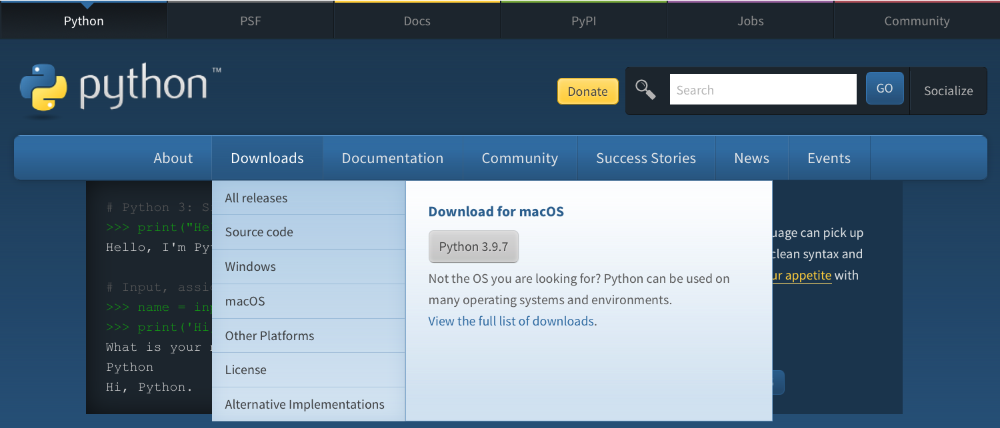
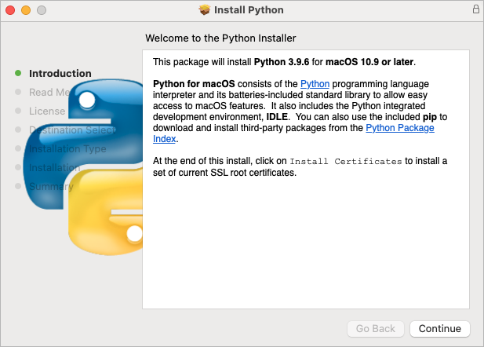
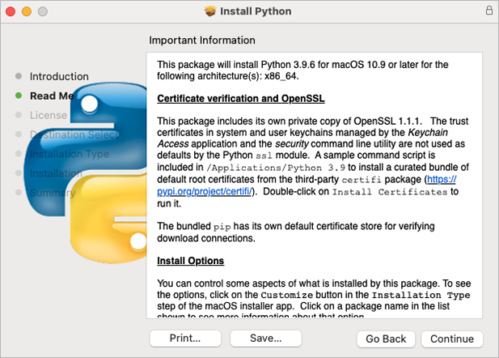
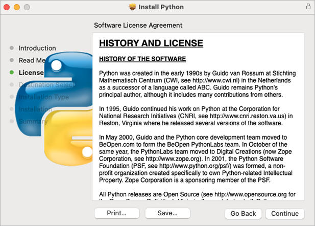
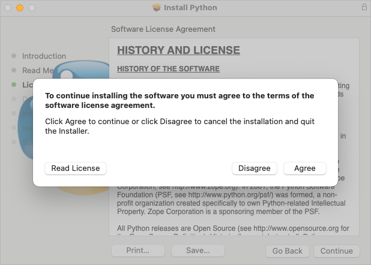
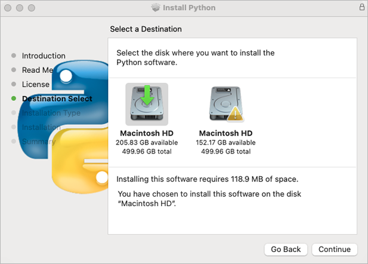
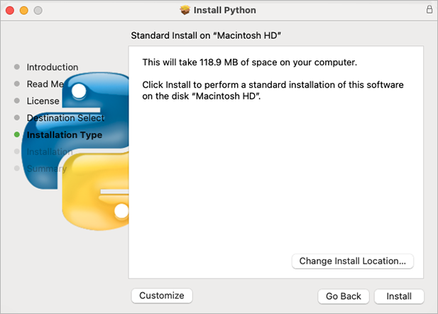
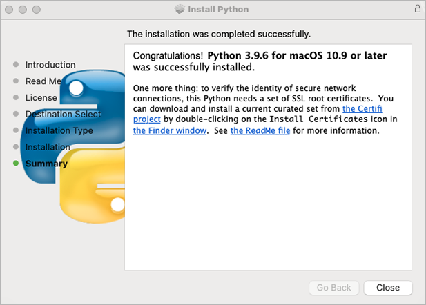
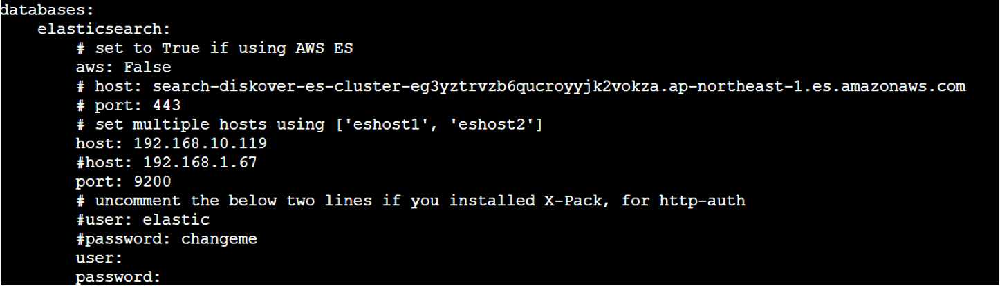

## Install Diskover Indexer(s) for Mac

The following outlines installing the Diskover indexer on MacOS.

### Install Python 3.x on MacOS

➡️ Go to  [**https://www.python.org**](https://www.python.org/)

➡️ Select the **Downloads** menu.

➡️ Click the **Python** **3.x** download button.



➡️ Launch the installer – Welcome Introduction - click **Continue**:



➡️ Read Me - click **Continue**:



➡️ History and License - click **Continue**:



➡️ Python license – click **Agree**:



➡️ Select the destination if prompted – click **Continue**:



➡️ Begin the installation by clicking **Install**:



➡️ Installation successfully completed acknowledgement – click **Close**:



➡️ Open your **Applications** and select **Phython 3.x** folder.

Python will be installed in **/usr/bin/python3**

➡️ A new folder is created under **/Applications/Python 3.x** change that with your exact version number, ex: 3.9:


➡️ As the instructions said in the last installation panel, you need to run the **Install Certificates.command** to install the SSL certificates needed by Python.

➡️ Double-click on **Install Certificates.command** to run:


### Install Diskover Indexer

➡️ Copy **diskover** file to **/tmp**

➡️ Extract **diskover** folder.

➡️ Copy **diskover** folder to **/Applications/Diskover.app/Contents/MacOS/**
```python
cp -R diskover /Applications/Diskover.app/Contents/MacOS/
```

➡️ Change directory to **diskover** location:
```python
cd /Applications/Diskover.app/Contents/MacOS/diskover/
```

➡️ Install Python dependencies required by Diskover indexer:
```python
Python3 -m pip install -r requirements.txt
```

➡️ Copy default/sample configs to **~/.config/**
```python
cd /Applications/Diskover.app/Contents/MacOS/diskover/configs
```
```python
cp -R diskover* ~/.config/
```

➡️ Edit **diskover** config file:
```python
vi  ~/.config/diskover/config.yaml
```

➡️ Configure indexer to create indexes in your Elasticsearch endpoint in the following section of the **config.yaml** file:
```python
databases:
    elasticsearch:
```


### Create Index of File System

➡️ To run the Diskover indexing process from a shell prompt:
```python
cd /Applications/Diskover.app/Contents/MacOS/diskover/
python3 diskover.py -i diskover-<indexname> <storage_top_dir>
```
