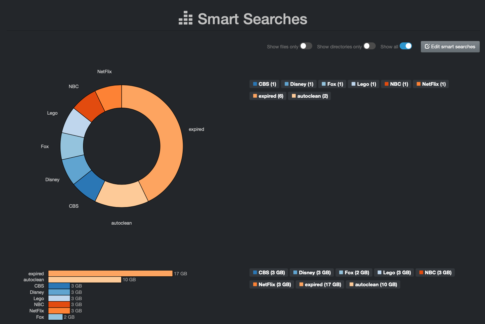
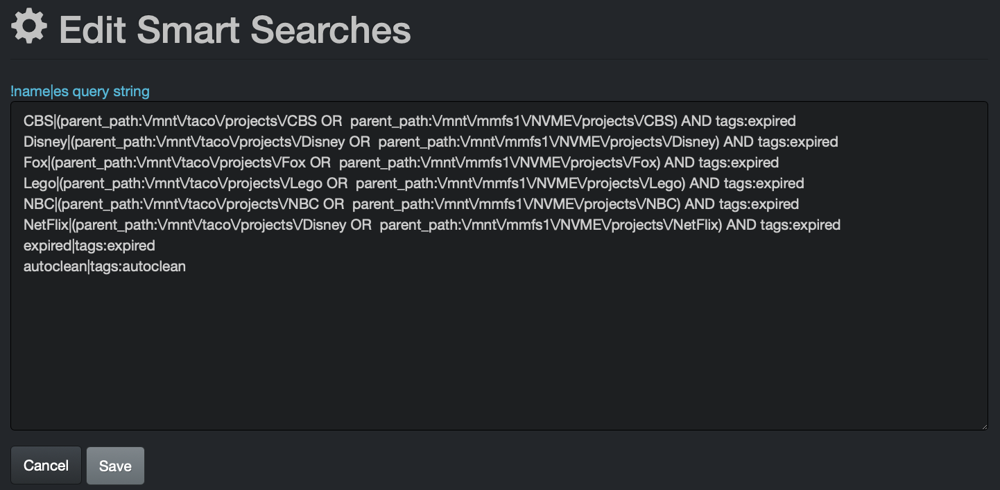

## Analytics

### Overview

Diskover provides powerful reporting capabilities. Reports can be generated to align with business context and can be constructed from any Elasticsearch query. Therefore, any combination of names, tags, metadata fields, etc., can be used to construct business-facing reports.

Below is a summary of the current analytics/reports available. The links will bring you to the [Diskover User Guide](https://docs.diskoverdata.com/diskover_user_guide/) giving detailed information regarding how to use these analytics. In the following sections, we will take a deep dive into the ⚙️ customizable analytics.

| ANALYTIC | DESCRIPTION |
| --- | --- |
| [Search Page Charts](https://docs.diskoverdata.com/diskover_user_guide/#search-page-default-view) | Snapshot of a path (aging, top files, top directories, etc.) refreshing with every click you make. |
| [Dashboard](https://docs.diskoverdata.com/diskover_user_guide/#dashboard) | Snapshot of a repository with multiple clickable links to see the detailed results. |
| [File Tree](https://docs.diskoverdata.com/diskover_user_guide/#file-tree) | Instant profiling of directories by size and aging. |
| [Treemap](https://docs.diskoverdata.com/diskover_user_guide/#treemap) | Displays hierarchical data using rectangles to graphically represent the size of the directories. |
| [Heatmap](https://docs.diskoverdata.com/diskover_user_guide/#heatmap) | Compares 2 indices from 2 points in time, giving an instant visual of data growth or shrinkage. |
| [Tags](https://docs.diskoverdata.com/diskover_user_guide/#tags) | Analyze all your tagged datasets by name, size, and number. |
| ⚙️ [Smart Searches](https://docs.diskoverdata.com/diskover_user_guide/#smart-searches) | Fully customizable reports tailored to meet your specific needs. |
| [User Analysis](https://docs.diskoverdata.com/diskover_user_guide/#user-analysis) | Gives insights into data consumption and cost per user and group. |
| ⚙️ [Cost Analysis](https://docs.diskoverdata.com/diskover_user_guide/#cost-analysis) | Highly customizable report helping you put a price tag on the value of your digital assets. |
| ⚙️ [Reports](https://docs.diskoverdata.com/diskover_user_guide/#reports) | Customizable to help you find your top unknowns. |

The reports explained in this chapter can be found in the **Analytics** drop-down list:

### Smart Searches
&nbsp;&nbsp;&nbsp;&nbsp;&nbsp;&nbsp;

#### Overview

Smart Searches provide a mechanism to create repeatable reports or bookmarks based on search queries. Any combination of names, tags, metadata fields, etc., can be used to construct business-facing reports. Any users can access Smart Searches, but only authorized users can customize by adding, editing, or deleting queries.

#### Examples

Here are a few examples providing business-context insight.

**Example with storage tiers**:

**Example using file kinds**:

**Example using customers**:

#### Smart Searches Customization

🔴 &nbsp;To customize, start by clicking the **Edit Smart Searches** button:

🔴 &nbsp;This page will open in a new tab:

- Read all the instructions at the top for guidance.
- Modify the [search queries](https://docs.diskoverdata.com/diskover_user_guide/#manual-queries-syntax-and-rules) for your use case(s).
- Click **Save Smart Searches** to save your queries once done.

Here is a simple example of queries mostly using customer names + specific paths/repositories + tags:

### Reports
&nbsp;&nbsp;&nbsp;&nbsp;&nbsp;&nbsp;

#### Overview

Reports provide a mechanism to create repeatable analytics by searching for your top unknowns, from simple queries like "which file types occupy the most space" to "who is using the most space". Any users can access Reports, but only authorized users can customize by adding, editing, or deleting queries.

#### Examples

**Example using Xytech project lifecycle status**:

**Example using Xytech production  managers**:

#### Reports Customization

🔴 &nbsp;To customize, start by clicking the **Edit Reports** button:

🔴 &nbsp;This page will open in a new tab:

- Read all the instructions at the top for guidance. This report is a little more complicated to customize, so take the time to read it the instructions and then test your queries.
- Modify the [search queries](https://docs.diskoverdata.com/diskover_user_guide/#manual-queries-syntax-and-rules) for your use case(s).
- Click **Save Reports** to save your queries once done.

Here is a simple example of queries mostly using customer names + specific paths/repositories + tags:

### Cost Analysis
&nbsp;&nbsp;&nbsp;&nbsp;&nbsp;&nbsp;

