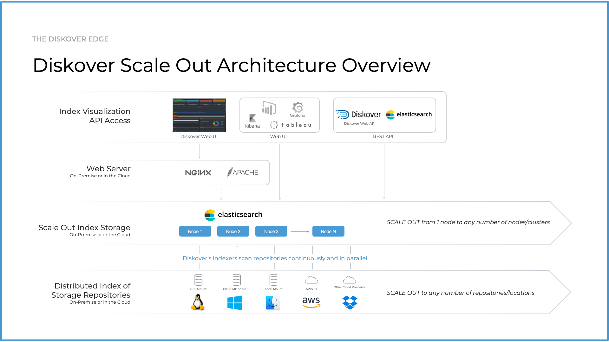
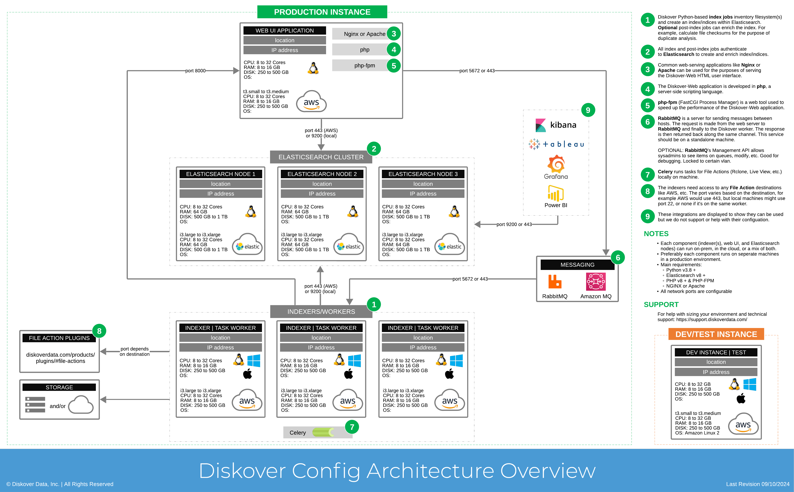

___
## </a>Architecture Overview and Resources Requirements
___
The following provides a high-level overview of the Diskover scale-out architecture. 

Two of the deployment components, Elasticsearch and web server, can be hosted on-premise or in the cloud, and the third component, Diskover indexers, is typically deployed using the customer’s on-premise resources. It is recommended to separate the Elasticsearch node/cluster, web server, and indexing host(s). The indexers should ideally be using SSD. NFS data stores do not usually perform well for indices.

Out of the box, Diskover efficiently scans generic filesystems. However, in today’s complex IT architectures, files are often stored across a variety of repositories. To address this, Diskover offers various [alternate scanners](https://diskoverdata.com/products/indexers/) as well as provides a robust foundation for [building alternate scanners](https://docs.diskoverdata.com/diskover_dev_guide/#develop-your-own-alternate-scanner), enabling comprehensive indexing of any file storage location.

_[Click here for a full screen view of the Diskover Architecture Overview diagram.](images/diskover_architecture_scaleout.png)_

_[Click here for the full screen view of this diagram.](images/diskover_config_template.png)_
