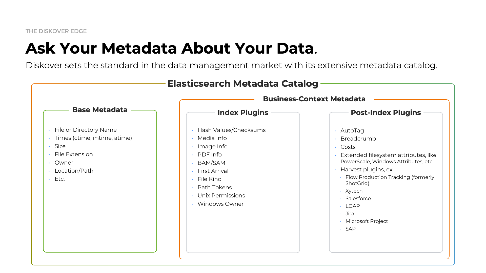

## Architecture Overview

### Diskover's Main Components

Deploying Diskover uses 3 major components:

| COMPONENT | ROLE |
| --- | --- |
| **Elasticsearch** | Elasticsearch is the backbone of Diskover’s indexing and search functionality. It stores and organizes the metadata collected during the indexing process, allowing for fast and efficient querying of large datasets. Elasticsearch is a distributed, RESTful search engine capable of handling vast amounts of data, making it crucial for retrieving information from indexed file systems and directories. |
| **Diskover-Web** | Diskover-Web is the user interface that allows users to interact with the Diskover system. Through this web-based platform, users can search, filter, and visualize the data indexed by Elasticsearch. It provides a streamlined and intuitive experience for managing, analyzing, and curating data. Diskover-Web is where users can explore results, run tasks, and monitor processes. |
| **Diskover Indexers** | The indexers (aka task workers, scanners, crawlers) are the components responsible for scanning file systems and collecting metadata. These indexers feed that metadata into Elasticsearch for storage and later retrieval. Diskover supports various types of indexers, which are optimized for different file systems, ensuring efficient and comprehensive data collection.  Out of the box, Diskover efficiently scans generic filesystems. However, in today’s complex IT architectures, files are often stored across a variety of repositories. To address this, Diskover offers various [alternate scanners](#alt_indexers) as well as provides a robust foundation for [building alternate scanners](https://docs.diskoverdata.com/diskover_dev_guide/#develop-your-own-alternate-scanner), enabling comprehensive indexing of any file storage location. |

 

### Diskover Scale-Out Architecture Overview Diagram

___

_[Click here for a full screen view of the Diskover Architecture Overview diagram.](images/diskover_architecture_overview.png)_
  

### Diskover Config Architecture Overview

It is highly recommended to separate the Elasticsearch node/cluster, web server, and indexing host(s).

___

_[Click here for the full screen view of this diagram.](images/diskover_config_template.png)_

### Metadata Catalog

Diskover is designed to efficiently scan generic filesystems out of the box, but it also supports flexible integration with various repositories through customizable [alternate scanners](#config_alt_indexers). This adaptability allows Diskover to index diverse storage locations and include enhanced metadata for precise data management and analysis.

With a wide range of metadata harvest plugins, Diskover enriches indexed data with valuable business context attributes, supporting workflows that enable targeted data organization, retrieval, analysis, and enhanced workflow. These plugins can run at ^indexing](#config_plugins_index) or [post-indexing](#config_plugins_post_index) intervals, balancing comprehensive metadata capture with high-speed indexing.

___

_[Click here for a full screen view of the Diskover Architecture Overview diagram.](images/metadata_catalog.png)_

