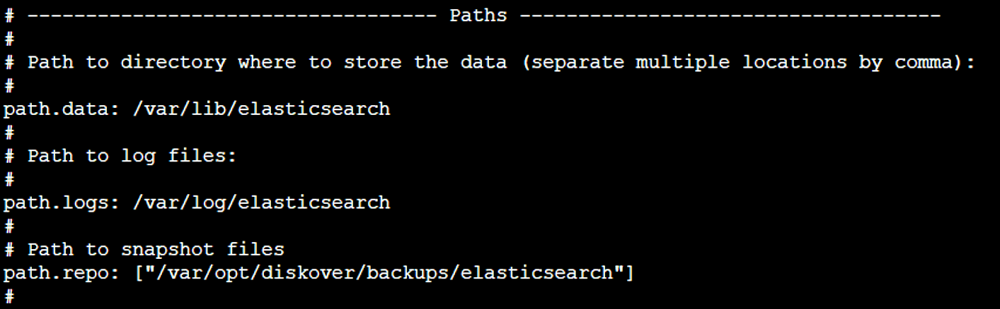
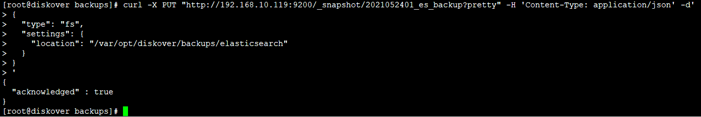
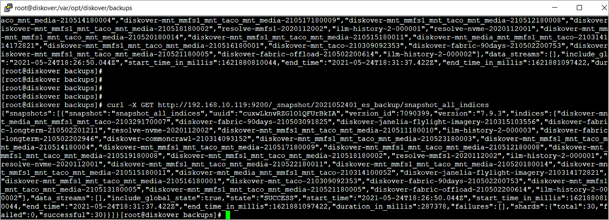

### Elasticsearch Backup

The following explains how to create a snapshot of a single index or multiple indices and how to restore the snapshot. Elasticsearch provides a snapshot and restore API.

The following example will manually walk you through creating an Elasticsearch backup, more information can also be found at the following AWS location:

[https://docs.aws.amazon.com/opensearch-service/latest/developerguide/managedomains-snapshots.html](https://docs.aws.amazon.com/opensearch-service/latest/developerguide/managedomains-snapshots.html)

To create the backup, we need to do the following to configure the location to store the snapshots.

#### Configure Elasticsearch Snapshot Directory Location Settings

Now we need to tell Elasticsearch that this is our snapshot directory location. For that, we need to add the **repo.path** setting in **elasticsearch.yml** file.

🔴 &nbsp;Edit the following file:
```
/etc/elasticsearch/elasticsearch.yml
```

🔴 &nbsp;Add the  **repo path**  setting to the paths section:
```
path.repo: ["/var/opt/diskover/backups/elasticsearch"]
```



🔴 &nbsp;Restart Elasticsearch:
```
systemctl restart elasticsearch
```
#### Configure Elasticsearch File System-Based Snapshot Settings

In this example we are using the local file system directory for storing the snapshot but the same can be stored on the cloud as well. The following is focused on file system-based snapshot only.

🔴 &nbsp;Install the curl utilities:
```
yum install curl
```

🔴 &nbsp;Create the repository which would be used for taking a snapshot and to restore. We can create the repository using the following expression:
```
curl -X PUT "http://192.168.10.119:9200/_snapshot/2021052401_es_backup?pretty" -H 'Content-Type: application/json' -d'
{
  "type": "fs",
  "settings": {
    "location": "/var/opt/diskover/backups/elasticsearch"
  }
}
'
```



🔴 &nbsp;After creating the repository, we can take the snapshot of all indices using the following expression:
```
curl -X PUT http://192.168.10.119:9200/_snapshot/2021052401_es_backup/snapshot_all_indices
```

🔴 &nbsp;Run the following expression to review the details of the above snapshot:
```
curl -X GET http://192.168.10.119:9200/_snapshot/2021052401_es_backup/snapshot_all_indices
```


#### Restoring Indexes from Snapshot

🔴 &nbsp;Indexes can be restored from the snapshot by appending the **\_restore** endpoint after the snapshot name:
```
curl -X POST http://192.168.10.119:9200/_snapshot/2021052401_es_backup/snapshot_all_indices/_restore
```
