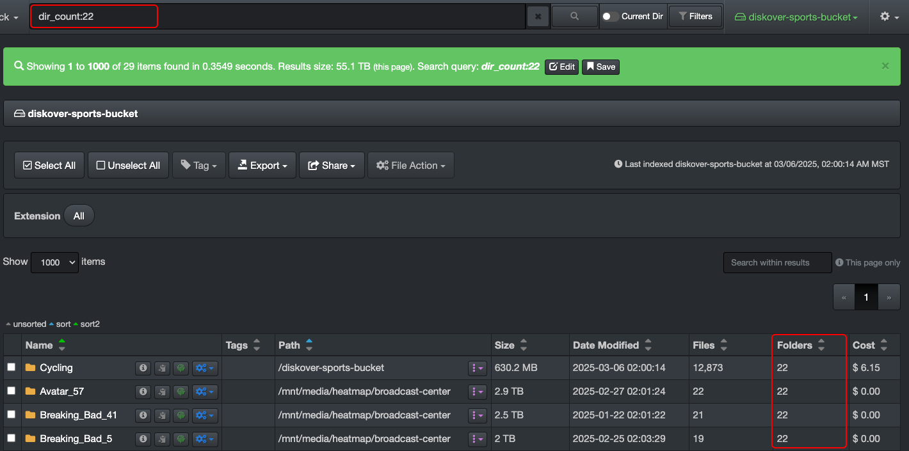
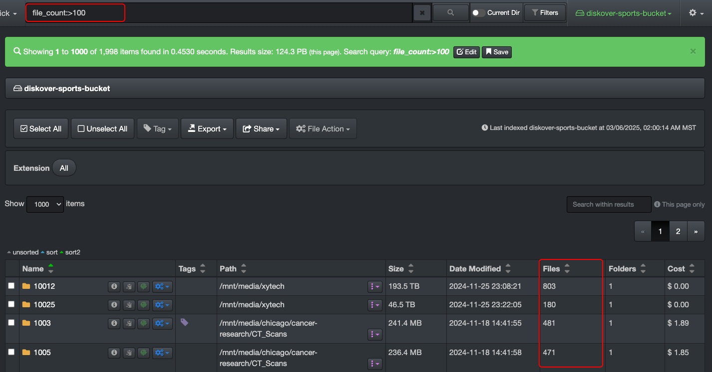

## Base Metadata

This section outlines the fundamental attributes naturally attached to files and directories, harvested by Diskover without the need for special plugins. The fields are listed alphabetically.

| FIELD NAME | DESCRIPTION | HOW TO USE |
| --- | --- | --- |
| **atime** | last accessed time | <ul><li>Learn how to search on time using Diskover [built-in search tools](#builtin_search_tools).</li><li>Learn how to [manually search on time](#search_time).</li></ul> |
| **ctime** | last changed time  | <ul><li>Learn how to search on time using Diskover [built-in search tools](#builtin_search_tools).</li><li>Learn how to [manually search on time](#search_time).</li></ul> |
| **dir_count** | number of [recursive](#recursive) sub-directories in a directory | <ul><li>Sample query → `dir_count:22`</li><li>Results → would list all directories containing exactly 22 sub-directories.</li></ul> |
| **dir_count_norecurs** | number of [non-recursive](#recursive) sub-directories a directory | <ul><li>Represents the number of immediate subdirectories within a given directory, excluding any deeper nested folders. Unlike a recursive directory count, which tallies all subdirectories at every level, `ir_count_norecurs` only counts the first-level subdirectories inside a folder. This makes it useful for analyzing folder structures without unnecessary depth.</li><li>Sample query → `dir_count_norecurs:5`</li><li>Results → directories that contain exactly 5 immediate subdirectories, without counting any deeper nested folders.</li></ul> |
| **dir_depth** | directory depth in a path | <ul><li>Sample query → `dir_depth:2`</li><li>Results → will return all directories that are exactly at depth level 2 in the directory hierarchy.</li></ul> | 
| **extension** | file extension | <ul><li>You can search extension using the [built-in search tools](#builtin_search_tools).</li><li>Manual searches, such as `extension:mov`, help refine results by targeting files with `mov` extension. While a general search for `mov` could return unrelated paths containing those letters (ex: `all_mov_titles_2025.txt`), using `extension:mov` ensures precision by filtering only files with the exact `.mov` extension.</li></ul> |
| **file_count** | number of [recursive](#recursive) files inside a directory | <ul><li>Represents the total number of files within a directory, including all files in its subdirectories. Unlike `file_count_norecurs`, which only counts files directly inside a folder, `file_count` provides a recursive total of all files contained within a directory and all its subfolders.</li><li>Refer to the [syntax for mathematical symbols](#complex_queries) to learn about the equations you can use to build relevant queries.</li><li>Sample queries → `file_count:85`, `file_count:10?`, `file_count:>100`</li><li>Results →  using the last example, `file_count:>100`, we search for recursive file counts greater than 100.</li></ul> | 
| **file_count_norecurs** | number of [non-recursive](#recursive) files within a directory | <ul><li>Is used to retrieve the number of files within a directory without counting files in its subdirectories. This makes it an efficient way to quickly assess folder contents at a single directory level rather than performing a full [recursive](#recursive) count. It’s particularly useful for gaining insights into storage structure and identifying clutter without the overhead of deep indexing.</li><li>Query sample → `file_count_norecurs:<=100`</li><li>Results → will retrieve all directories that contain 100 or fewer files, excluding any files within their subdirectories—this is useful for:<ul><li>Identifying small directories that may be candidates for cleanup or consolidation.</li><li>Finding underutilized folders within a dataset.</li><li>Gaining insights into storage distribution at the directory level without recursive counting.</li></ul><li>Refer to the [syntax for mathematical symbols](#complex_queries) to learn about the equations you can use to build relevant queries.</li></ul> |
| **file_size** | file and/or directory size | <ul><li>We recommend using the [built-in search tools](#builtin_search_tools) as you need to translate the figures in bytes.</li><li>If you want to search manually, please refer to [queries with data size](#search_size) for examples.</li></ul> |
| **file_size_du** | disk usage size, aka allocated size, for files only | <ul><li>We recommend using the [built-in search tools](#builtin_search_tools) as you need to translate the figures in bytes.</li><li>If you want to search manually, please refer to [queries with data size](#search_size) for examples.</li></ul> |
| **group** | group name associated to a file or directory | <ul><li>Sample query → `group:engineering`</li><li>Results → would return all files and directories with the group `engineering`</li><li>Groups vastly vary depending on how Diskover is configured, see [User Analysis Report](#user-analysis) section for more details and/or ask your System Administrator.</li></ul> |
| **ino** | inode number of a file or directory | <ul><li>Is a unique identifier assigned by the filesystem. Searching by `ino` allows you to locate a specific file or directory based on its inode, rather than by name or path.</li><li>Sample query → `ino:8838389885`</li><li>Results → will return the exact file or directory associated with inode `8838389885`.</li><li>This is useful:<ul><li>When a file has been moved or renamed, as the inode remains unchanged while the file’s path might differ.</li><li>It helps in troubleshooting hard links, since multiple files may share the same inode if they point to the same data.</li></ul>How is **inode** and **hash value** different? An inode is a unique ID in the filesystem, while hash value is a unique fingerprint based on content.</ul> |
| **mtime** | last modified time | <ul><li>Learn how to search on time using Diskover [built-in search tools](#builtin_search_tools).</li></ul> |
| **name** | file or directory name | <ul><li>Looks for exact matches or partial matches depending on how the query is formatted.</li><li>Is [case sensitive](#case_sensitivity).</li><li>Sample query → `name:*Jungle*`</li><li>Results → will return all files and directories that contain the word `Jungle` anywhere in their name as it searches for an exact match or wildcard match in the file/directory name.</li></ul> |
| **name.text** | full-text search analysis, enabling [tokenization](#tokenizer), [stemming], and [case-insensitive](#case_sensitivity) matching | <ul><li>Allows for full-text search analysis on file and directory names, making searches more flexible and intuitive compared to the standard `name` field.</li><li>Sample query #1 → `name.text:jungle`</li><li>Results for sample query #1 → files and directories containing `jungle` in the name, regardless of case or word position.</li><li>Sample query #2 → `name.text:Jung`</li><li>Results for sample query #2 → may return results like `JungleBook.mov`, even though `Jung` is only part of the word.</li><li>Sample query #3 → `name.text:Jungle Book`</li><li>Results for sample query #2 → prioritizes phrase matching over scattered words:<ul><li>Woud find → `Jungle Book.mov` or `Jungle_Book.pdf`</li><li>Would possibly find → `The Jungle Book.mp4` (if stop words like “The” are ignored) or `JungleBook_Final.mov` (if tokenization allows for merged words)</li><li>Would likely not find → `The_Book_of_Jungle.mov` (word order is different) or `Jungle Adventure Book.pdf` (words appear separately but not as an exact phrase)</li></ul></ul> |
| **nlink** | number of [hard links](#hardlinks) pointing to a file or directory | <ul><li>Sample query → `nlink:3`</li><li>Results for files → has three different names (or paths) pointing to the same physical data on disk.</li><li>Results for directories → directories with nlink:3 have exactly one immediate subdirectory, since a directory’s link count is always 2 + the number of its subdirectories.</li></ul> |
| **owner** | owner name associated to a file or directory | <ul><li>Sample query → `owner:Chris`</li><li>Results → would return all files and directories with the owner `Chris`</li><li>Owners vastly vary depending on how Diskover is configured, see [User Analysis Report](#user-analysis) section for more details and/or ask your System Administrator.</li></ul> |
| **parent_path** | full directory path where a file or subdirectory is located | <ul><li>Sample query → `parent_path:*game-images*`</li><li>Results → will return all files and directories that are located inside any folder whose path contains `game-images` anywhere in its name, for example:<ul><li>`/projects/game-images/character1.png`</li><li>`/storage/games/thumbnails/game-images/logo.png`</li></ul></ul>

`parent_path:\/Some\/Folder*` > is case sensitive, will search the specified folder and all its sub-folders ([recursive](#recursive)) |

| **parent_path.text** | same as **parent_path** but is not case sensitive | `parent_path:\/some\/folder*` |
| **size** | file and/or directory size | in bytes > see [Queries with Data Size](#search_size) for syntax examples on how to search on size |
| **size_norecurs** | file and/or directory size [non-recursive](#recursive) | in bytes > see [Queries with Data Size](#search_size) for syntax examples on how to search on size |
| **size_du** | disk usage size aka allocated size for files and/or directories | in bytes > see [Queries with Data Size](#search_size) for syntax examples on how to search on sizes |
| **size_du_norecurs** | disk usage size [non-recursive](#recursive) | in bytes > see [Queries with Data Size](#search_size) for syntax examples on how to search on size |
| **type** | file or directory | `type:file` or `type:directory` > is case sensitive, all lowercase needed |

### Stemming

Stemming is primarily applied to `.text` fields in Diskover searches because these fields use Elasticsearch’s full-text search analysis, which includes stemming, tokenization, and case normalization. However, some other analyzed fields in Diskover may also apply stemming, depending on how they are indexed.

| WHAT | EXAMPLES | WHAT THIS MEANS FOR USERS | 
| --- | --- | --- |
| **Stemming helps find more results by matching different word variations**. Instead of searching for an exact word, Diskover looks for related words with the same root. | <ul><li>Searching `name.text:running`</li><li>Will find `running`</li><li>May also return results for `run`, `runner`, or `runs`</li></ul> | <ul><li>Finds more relevant results without guessing the exact form of a word so you don’t need to type every variation of a word—Diskover does it for you.</li><li>Improves search flexibility, especially when dealing with variations of terms—searching feels more natural, like how Google predicts related words.</li><li>Reduces the need for [wildcard searches](#wildcards) while still returning broad results.</li></ul> |
