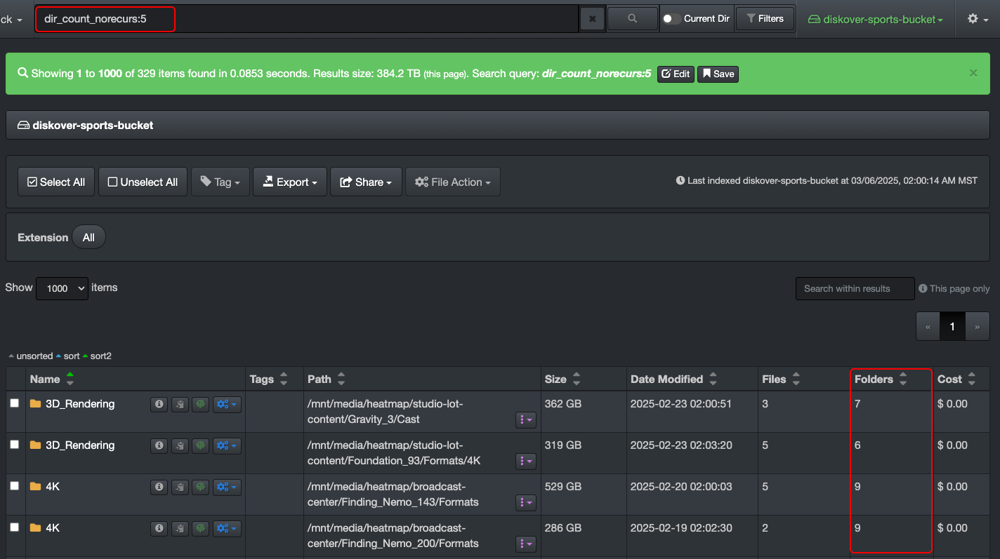

## Base Metadata

This section outlines the fundamental file and directory attributes naturally attached to files and directories, harvested by Diskover without the need for special plugins. The fields are listed alphabetically.

| FIELD NAME | DESCRIPTION | HOW TO USE |
| --- | --- | --- |
| **atime** | last accessed time | <ul><li>Learn how to search on time using Diskover [built-in search tools](https://docs.diskoverdata.com/diskover_user_guide/#built-in-search-tools).</li><li>Learn how to [manually search on time](https://docs.diskoverdata.com/diskover_user_guide/#queries-with-time).</li></ul> |
| **ctime** | last changed time  | <ul><li>Learn how to search on time using Diskover [built-in search tools](https://docs.diskoverdata.com/diskover_user_guide/#built-in-search-tools).</li><li>Learn how to [manually search on time](https://docs.diskoverdata.com/diskover_user_guide/#queries-with-time).</li></ul> |
| **dir_count** | number of [recursive](#recursive) sub-directories in a directory | `dir_count:22` → would list all directories containing exactly 22 sub-directories:  |
| **dir_count_norecurs** | number of [non-recursive](#recursive) sub-directories a directory | `dir_count_norecurs:1` → number of immediate (non-recursive) subdirectories within a given directory—would list directories with at least 1 sub-directory in them:  |
| **dir_depth** | directory depth in a path | `dir_depth:2`→ would search directories at level 2 in the file tree | 
| **extension** | file extension | There are many ways to search on file extensions:<ul><li>Using [built-in search tools](https://docs.diskoverdata.com/diskover_user_guide/#built-in-search-tools)</li><li>Manual searches, for example, `extension:mov`, technically, a search could be launched with only `mov` in the search bar, but that would bring back any directories or files where the letters `mov` would be found isolated in a path, so by using `extension:mov` you make sure to focus precisely on the extension field. |
| **file_count** | number of [recursive](#recursive) files inside a directory | `file_count:85`, `file_count:10?`, `file_count:>100` → refer to the [syntax for mathematical symbols](https://docs.diskoverdata.com/diskover_user_guide/#complex-queries-syntax-and-grouping) to learn about the equations you can use to build relevant queries. In this example, we search for recursive file counts greater than 100.   | 
| **file_count_norecurs** | number of [non-recursive](#recursive) files inside a directory  | `file_count_norecurs:<=100` → refer to the [syntax for mathematical symbols](https://docs.diskoverdata.com/diskover_user_guide/#complex-queries-syntax-and-grouping) to learn about the equations you can use to build relevant queries. In this example, we search for non-recursive file counts equal to or less than 100.   |
| **file_size** | file and/or directory size | We recommend using the [built-in search tools](https://docs.diskoverdata.com/diskover_user_guide/#built-in-search-tools) as you need to translate the figures in bytes, but if you want to search manually, please refer to [Queries with Data Size](https://docs.diskoverdata.com/diskover_user_guide/#queries-with-data-size) for examples. |
| **file_size_du** | disk usage size, aka allocated size, for files only | OPTIONAL TO INDEX?? We recommend using the [built-in search tools](https://docs.diskoverdata.com/diskover_user_guide/#built-in-search-tools) as you need to translate the figures in bytes, but if you want to search manually, please refer to [Queries with Data Size](https://docs.diskoverdata.com/diskover_user_guide/#queries-with-data-size) for examples. |
| **group** | user group name | `group:engineering` > can vary depending on how Diskover was configured, see [User Analysis Report](https://docs.diskoverdata.com/diskover_user_guide/#user-analysis) section for more details and/or ask your System Administrator |

| **ino** | file inode number | `ino:8838389885` or `ino:8838*` > is usually used by System Administrators |
| **mtime** | last modified time | <ul><li>Learn how to search on time using Diskover [built-in search tools](https://docs.diskoverdata.com/diskover_user_guide/#built-in-search-tools).</li><li>Learn how to [manually search on time](https://docs.diskoverdata.com/diskover_user_guide/#queries-with-time).</li></ul> |
| **name** | file name | is case sensitive, ex: `name:*Jungle*` if the file name is TheJungleBook.mov |
| **name.text** | same as **name** but is not case sensitive | `name.text:*jungle*` even if the file name is TheJungleBook.mov |
| **nlink** | number of [hard links](#hardlinks) | `nlink:3` |
| **owner** | owner name | `owner:*Joe*` > can vary depending on how Diskover was configured, see [User Analysis Report](#user_analysis) section for more details and/or ask your System Administrator |
| **parent_path** | path name | `parent_path:\/Some\/Folder*` > is case sensitive, will search the specified folder and all its sub-folders ([recursive](#recursive)) |
| **parent_path.text** | same as **parent_path** but is not case sensitive | `parent_path:\/some\/folder*` |
| **size** | file and/or directory size | in bytes > see [Queries with Data Size](#search_size) for syntax examples on how to search on size |
| **size_norecurs** | file and/or directory size [non-recursive](#recursive) | in bytes > see [Queries with Data Size](#search_size) for syntax examples on how to search on size |
| **size_du** | disk usage size aka allocated size for files and/or directories | in bytes > see [Queries with Data Size](#search_size) for syntax examples on how to search on sizes |
| **size_du_norecurs** | disk usage size [non-recursive](#recursive) | in bytes > see [Queries with Data Size](#search_size) for syntax examples on how to search on size |
| **type** | file or directory | `type:file` or `type:directory` > is case sensitive, all lowercase needed |

### Queries with File Extensions

- Use [quick search](#quick_search) which you can combine with a manual query for max efficiency.
- Type in the search bar the pre-determined field name for file extensions, for example **extension:mov**

>🔆 &nbsp;Note that the file extension letters might be part of the file name and give you misleading results. By searching using the field name **extension** you focus your searches on that field exclusively.

🔎  A few example:

- If only typing **mov** in the search bar, the results would include all files with **.mov** extension, but could also return a file with the name **all_mov_titles_2021.txt**

- If only typing **jpg** in the search bar, the results would include all files with **.jpg** extension, but could also return a file with the name **montage_jpg_png_images.gif**
