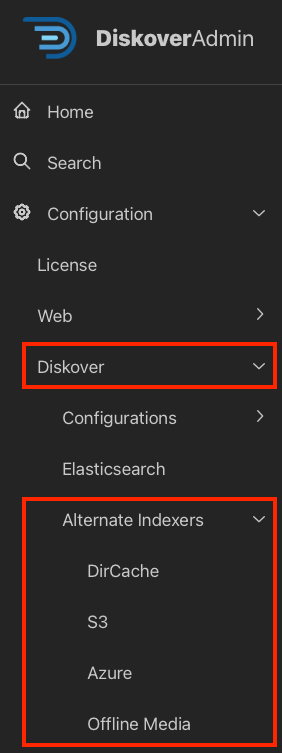

## Alternate Scanners Configuration

&nbsp;&nbsp;&nbsp;&nbsp;&nbsp;&nbsp;&nbsp;&nbsp;&nbsp;&nbsp;&nbsp;&nbsp;&nbsp;&nbsp;

### Overview

Out of the box, Diskover efficiently scans generic filesystems. However, in today’s complex IT architectures, files are often stored across a variety of repositories. To address this, Diskover provides a robust foundation for building alternate scanners, enabling comprehensive scanning of any file storage location.

In addition, Diskover offers a wide range of metadata harvest plugins, enriching indexed data with valuable business context attributes and supporting workflows that enable targeted data organization, retrieval, analysis, and enhanced workflow. These plugins can run at [indexing](#config_plugins_index) or [post-indexing](#config_plugins_post_index) intervals, balancing comprehensive metadata capture with high-speed scanning.

⚠️ &nbsp;**IMPORTANT!** After configuring an [alternate scanner](#create_alt_config), you must create and schedule a task in the [Task Panel](#task_panel) to ensure it runs properly.

| Configurable via DiskoverAdmin | Manually Configurable |
| --- | --- |
| <ul><li>Alternate scanners configurable in the **DiskoverAdmin** panel.</li><li>Help information is available directly within the user interface.</li><li>This section provides additional guidance when applicable.</li></ul>  | <ul><li>A few alternate scanners are still configurable via a terminal.</li><li>[🛟 Open a support ticket](https://support.diskoverdata.com/) if you currently use one of these plugins and need to upgrade to v2.4+.</li></ul> |

### Quick Access List

The plugins in this chapter are listed alphabetically. Here is a quick access list by edition:

| EDITION |  PLUGIN |
| --- | --- |
| **Core Editions** | <ul><li>[Atempo Miria](#alt_scanner_atempo)</li><li>[Azure Blob](#alt_scanner_azure)</li><li>[Dell PowerScale](#alt_scanner_dell_powerscale)</li><li>[DirCache](#alt_scanner_dircache)</li><li>[Dropbox](#alt_scanner_dropbox)</li><li>[FTP](#alt_scanner_ftp)</li><li>[Generic JSON/CSV Text](#alt_scanner_json)</li><li>[Offline Media](#alt_scanner_offline_media)</li><li>[OneDrive and SharePoint](#alt_scanner_onedrive)</li><li>[S3 with AWS or Non-AWS Endpoints](#alt_scanner_s3)</li><li>[Spectra Logic RioBroker/BlackPearl](#alt_scanner_spectra)</li><li>[Develop your own alternate scanner](#alt_scanner_dev_your_own_scanner)</li></ul> |

#### Atempo Miria

| HELP | RESOURCE |
| --- | --- |
| Install/Config | Via a terminal 🛟 &nbsp;[Open a support ticket](https://support.diskoverdata.com/) to request assistance with installing this alternate scanner |
| Learn more | [Visit our website](https://diskoverdata.com/products/indexers/) and/or [contact Diskover](mailto:sales@diskoverdata.com) |
| Purpose | 
Organizations often preserve their assets/intellectual properties within tape-based archive systems like the Atempo Miria platform. The Diskover Atempo Scanner is designed to scan all the files within the Atempo Miria archive system and presents them as a volume within the Diskover user interface.

Additional attributes are added as properties to the file during the indexing process, such as tape number, media type, etc. Therefore, the files and their rich attributes become searchable and reportable, as well as engaged in automated workflows.
 |

#### Azure Blob

| HELP | RESOURCE |
| --- | --- |
| Enable/Config | Via the DiskoverAdmin panel 🛟 &nbsp;[Open a support ticket](https://support.diskoverdata.com/) to request assistance with installing this alternate scanner |
| Learn more | [Visit our website](https://diskoverdata.com/products/indexers/) and/or [contact Diskover](mailto:sales@diskoverdata.com) |
| Purpose | 
While you can cost-effectively store and access unstructured data at scale with Microsoft Azure blob storage, searching through multiple accounts or blob containers is not possible from the Azure interface. The Storage Explorer portal doesn't allow users to search all folders at once, plus you need to know the exact file name you are looking for as wild cards are not permitted either.

Diskover offers the Azure blob storage scanner allowing you to scan petabytes of data at blazing speed. In turn, you can easily find any file with a single query, whether that file is located in an Azure blob or any other volumes indexed with Diskover.

Note that attributes are collected during this process. These extra fields become searchable, reportable for analysis, and actionable, allowing for potential upstream file management, manually or via automated scheduled tasks.
 |

#### Dell PowerScale

| HELP | RESOURCE |
| --- | --- |
| Install/Config | Via a terminal 🛟 &nbsp;[Open a support ticket](https://support.diskoverdata.com/) to request assistance with installing this alternate scanner |
| Learn more | [Visit our website](https://diskoverdata.com/products/dataiq-migration/) and/or [contact Diskover](mailto:sales@diskoverdata.com) |
| Purpose | 
The ability to efficiently collect, store, and analyze data is crucial for making informed decisions and gaining a competitive edge. Dell Technologies recognizes the importance of data management and provides the infrastructure needed to support data-intensive workloads.

The lightweight ps_scan architecture harvests the multiple PowerScale attributes harvested during scanning. Users have the option to only index the attributes that are relevant to their business. All these attributes become searchable, reportable, actionable, and can be engaged in automated workflows allowing for very precise data management and curation.
 |

#### DirCache Alternate Scanner

| HELP | RESOURCE |
| --- | --- |
| Enable/Config | Via the DiskoverAdmin panel 🛟 &nbsp;[Open a support ticket](https://support.diskoverdata.com/) to request assistance with installing this alternate scanner |
| Learn more | [Visit our website](https://diskoverdata.com/products/indexers/) and/or [contact Diskover](mailto:sales@diskoverdata.com) |
| Purpose | The DirCache alternate scanner can be used to speed up subsequent crawls when scanning slower network-mounted storage. DirCache uses an SQLite database to store a local cache of directories' mtimes (modified times), directories' file lists, and file stat attributes. On subsequent crawls, when a directory mtime is the same as in the cache, the directory list and all file stat attributes can be retrieved from the cache rather than over the network mount. |

#### Dropbox

| HELP | RESOURCE |
| --- | --- |
| Install/Config | Via a terminal 🛟 &nbsp;[Open a support ticket](https://support.diskoverdata.com/) to request assistance with installing this alternate scanner |
| Learn more | [Visit our website](https://diskoverdata.com/products/indexers/) and/or [contact Diskover](mailto:sales@diskoverdata.com) |
| Purpose | 
The Dropbox Scanner is a powerful utility designed to integrate with Dropbox accounts for comprehensive file metadata retrieval and management. By leveraging Dropbox's API, this scanner connects securely to your Dropbox account, navigates through your files and folders, and collects detailed information such as file sizes, creation and modification dates, and sharing permissions.

This tool enhances your ability to monitor and organize your Dropbox content, providing valuable insights into your data usage and structure. Perfect for businesses of any size, the Dropbox Scanner ensures efficient file management, improved data organization, and seamless data accessibility.
 |

#### FTP 

| HELP | RESOURCE |
| --- | --- |
| Install/Config | Via a terminal 🛟 &nbsp;[Open a support ticket](https://support.diskoverdata.com/) to request assistance with installing this alternate scanner |
| Learn more | [Visit our website](https://diskoverdata.com/products/indexers/) and/or [contact Diskover](mailto:sales@diskoverdata.com) |
| Purpose | 
The FTP Site Scanner is a robust tool designed to streamline the process of collecting and analyzing file statistics from FTP sites. It efficiently connects to any FTP server, navigates through the directory structure, and retrieves critical file metadata such as size, creation date, modification date, and permissions. By aggregating this data, the scanner provides comprehensive insights into the filesystem's organization and usage patterns.

This tool is ideal for administrators and developers looking to maintain optimal FTP site performance, ensure data integrity, and facilitate audits or compliance checks.
 |

#### Generic JSON/CSV Text

| HELP | RESOURCE |
| --- | --- |
| Install/Config | Via a terminal 🛟 &nbsp;[Open a support ticket](https://support.diskoverdata.com/) to request assistance with installing this alternate scanner |
| Learn more | [Visit our website](https://diskoverdata.com/products/indexers/) and/or [contact Diskover](mailto:sales@diskoverdata.com) |
| Purpose | 
The JSON/CSV Text Scanner is a powerful tool designed for efficient data processing and metadata collection. This versatile scanner seamlessly handles JSON and CSV files, extracting essential metadata such as file structure, field names, data types, and record counts. Whether you’re managing large datasets or integrating diverse data sources, this scanner simplifies your workflow, providing comprehensive insights and enhancing data transparency.

With its robust performance, the JSON/CSV Text Scanner is a go-to solution for streamlined data management and analysis.
 |

#### Offline Media

| HELP | RESOURCE |
| --- | --- |
| Enable/Config | Via the DiskoverAdmin panel 🛟 &nbsp;[Open a support ticket](https://support.diskoverdata.com/) to request assistance with installing this alternate scanner |
| Learn more | [Visit our website](https://diskoverdata.com/products/indexers/) and/or [contact Diskover](mailto:sales@diskoverdata.com) |
| Purpose | 
The Offline Media Scanner offers a simple solution to scan all your offline data devices. During the scanning process, Diskover automatically creates a new OFFLINE MEDIA volume listing all scanned offline devices as a directory. The index of your offline media stays persistent once the drive is disconnected and put back on the shelf.

If your search results point to an offline media, use the reference name or number you attributed to the offline media to locate the device. Then, just reconnect it to retrieve the desired files.

There are several Diskover features you can use with those static indices like tags, export, share, and investigate using our multiple analytical tools. Then, if you decide to fully rehydrate that data, more cool things are available like actions via plugins and scheduled workflow automation.
 |

#### OneDrive and SharePoint

| HELP | RESOURCE |
| --- | --- |
| Install/Config | Via a terminal 🛟 &nbsp;[Open a support ticket](https://support.diskoverdata.com/) to request assistance with installing this alternate scanner |
| Learn more | [Visit our website](https://diskoverdata.com/products/indexers/) and/or [contact Diskover](mailto:sales@diskoverdata.com) |
| Purpose | 
This powerful alternate scanner allows you to seamlessly integrate and manage data from your OneDrive and SharePoint environments, extracting critical metadata and ensuring comprehensive data visibility. With Diskover's flexible and user-friendly scanning options, you can customize your data extraction process to suit your organization's needs.

Enhance your data management strategy with Diskover's OneDrive Alternate Scanner, providing unparalleled insights and efficiency for your Microsoft cloud storage solutions.
 |

#### S3 | AWS or Non-AWS Endpoints

| HELP | RESOURCE |
| --- | --- |
| Enable/Config | Via the DiskoverAdmin panel 🛟 &nbsp;[Open a support ticket](https://support.diskoverdata.com/) to request assistance with installing this alternate scanner |
| Learn more | [Visit our website](https://diskoverdata.com/products/indexers/) and/or [contact Diskover](mailto:sales@diskoverdata.com) |
| Purpose | 
Unlock the full potential of your cloud storage with Diskover's advanced scanning capabilities for S3 buckets and S3-compatible storage with endpoints different than AWS. Seamlessly integrate and manage data across various cloud environments, ensuring comprehensive metadata extraction and efficient data organization. Diskover's robust scanning solution supports diverse storage configurations, providing unparalleled flexibility and control over your data assets.

Enhance your cloud storage strategy with Diskover Data's powerful indexing tools, designed to optimize your data visibility and streamline your workflows across multiple platforms.
 |

#### Spectra Logic RioBroker/BlackPearl

| HELP | RESOURCE |
| --- | --- |
| Install/Config | Via a terminal 🛟 &nbsp;[Open a support ticket](https://support.diskoverdata.com/) to request assistance with installing this alternate scanner |
| Learn more | [Visit our website](https://diskoverdata.com/products/indexers/) and/or [contact Diskover](mailto:sales@diskoverdata.com) |
| Purpose | 
The Spectra RioBroker API Scanner is an advanced solution for seamlessly integrating with BlackPearl systems to retrieve and manage files' metadata. Utilizing the powerful Spectra RioBroker API, this scanner efficiently connects to BlackPearl storage environments, navigating through vast amounts of data to extract detailed file information, including size, timestamps, and lifecycle states.

This tool enhances data management capabilities by providing real-time insights and facilitating the organization and retrieval of critical data. Ideal for enterprises that require robust and scalable storage solutions, the Spectra RioBroker API Scanner ensures optimal performance, data integrity, and streamlined workflows.
 |

#### Develop Your Own Alternate Scanner

| HELP | RESOURCE |
| --- | --- |
| Learn more | 🚧 Docs under review |
| Purpose | 
Empower your data management with Diskover Data's flexible framework, allowing end users to write their own alternate scanners. Tailor your data extraction process to fit unique requirements by developing custom scanners that integrate seamlessly with Diskover Data. Whether you need to handle specialized file formats or implement proprietary metadata collection methods, this capability puts you in control.

Leverage Diskover's robust API and comprehensive documentation to create efficient, reliable scanners that enhance your data insights and streamline your workflows. Embrace the power of customization with Diskover's end-user scanner development feature.
 |
