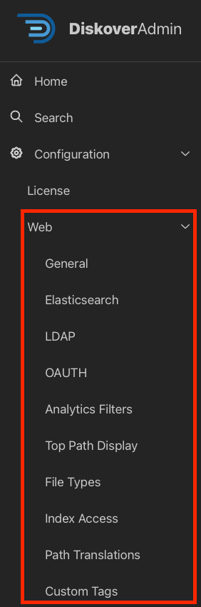
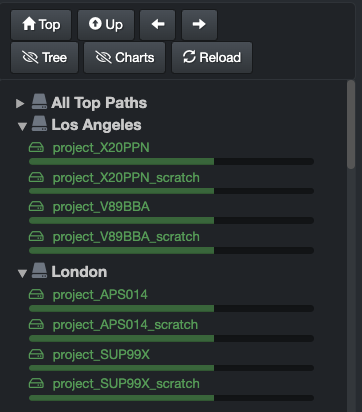
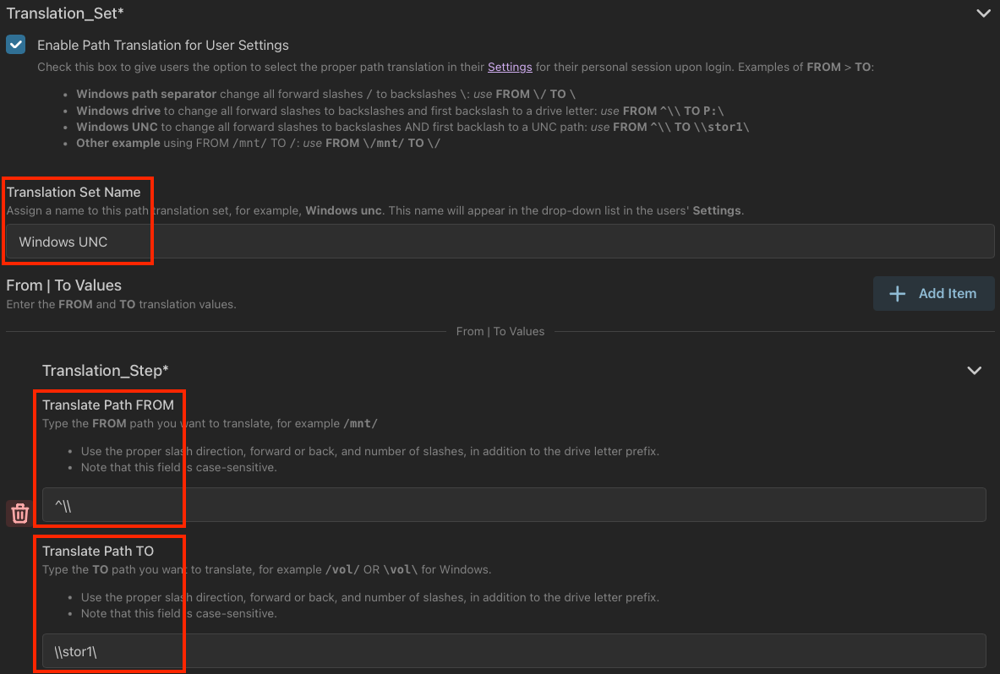
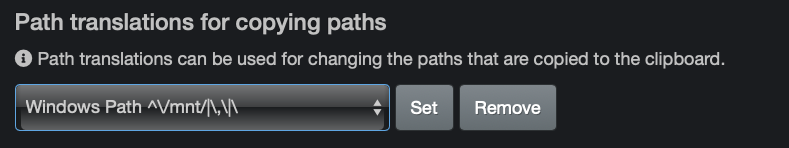
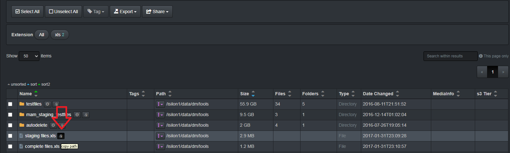
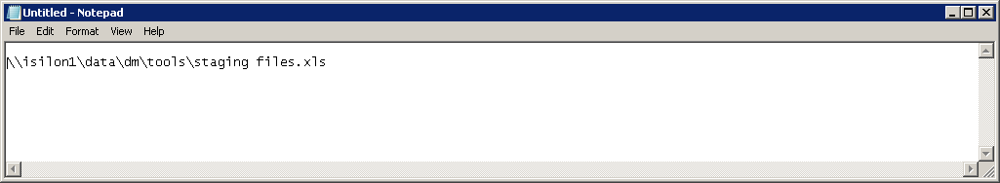
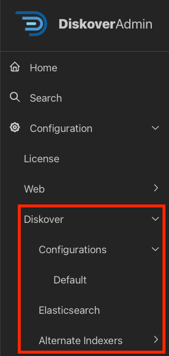
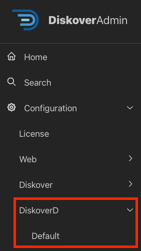
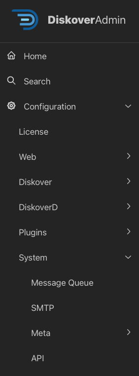

## DiskoverAdmin Configuration | Main Components

### Overview

Most help information is available directly in the user interface. This section offers additional guidance when applicable to support you during the configuration process.

🟨 &nbsp;**IMPORTANT!**

- Although specified throughout **DiskoverAdmin**, always assume that the fields are case-sensitive.
- For more information about [Python re.search](https://docs.python.org/3.7/library/re.html) whenever mentioned in the help text in DiskoverAdmin.

___
### Diskover-Web

#### Top Paths
&nbsp;&nbsp;&nbsp;&nbsp;&nbsp;&nbsp;

By default, users will see a list of all volumes indexed by Diskover in the left pane of the user interface. You can however create Top Paths to organize your volumes (by location, project, etc.). In this example, note that the first collapsible option will always be **All Top Paths** and will list all your repositories.

#### Path Translation

##### Path Translation | Example 1

Here is an example of path translations. If you set the following path translation sets in DiskoverAdmin:

This is what users will see in their ⛭ → **Settings** and be able to select:

##### Path Translation | Example 2

Let's say that this is the choice offered to a user in their ⛭ → **Settings**:

And that this is the path structure they see in their results, then if they copy to the 📋 clipboard:

This is the resulting path that would be copied:

___
### Diskover Indexers/Workers & Elasticsearch

#### AutoTags
&nbsp;&nbsp;&nbsp;&nbsp;&nbsp;&nbsp;

Given the importance of tagging in data management, we dedicated an [entire chapter to **tags**](#tags).

#### Costs
&nbsp;&nbsp;&nbsp;&nbsp;&nbsp;&nbsp;

Besides the help text in DiskoverAdmin, you can find [more information here regarding **cost** configuration](#analytics_costs) as well as some use cases.

___
### Diskover Alternate Ingestors

All [alternate ingestors](#config_alt_ingestors) will eventually be  in the DiskoverAdmin panel. Please go to the [Alternate Ingestors Configuration](#config_alt_ingestors) section for the complete list of current alternate indexers. Meanwhile, all alternate indexers configurable in DiskoverAdmin can be found here:

___
### DiskoverD

___
### System

