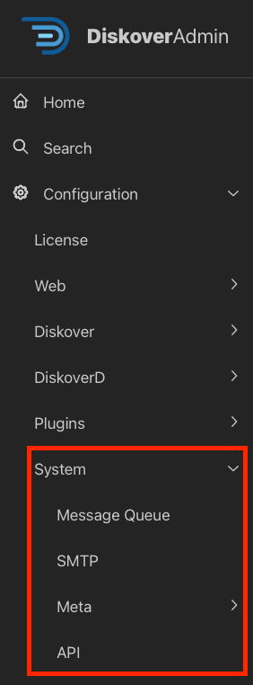

## DiskoverAdmin Configuration | Main Components

        

### Overview

Most help information is available directly within the user interface. This section provides additional guidance to assist you during the configuration phase.

🚧 **The Order of what to configure and in which order will change - placeholders for now.**

### Diskover-Web

___
### x

| HELP | RESOURCE |
| --- | --- |
| Availability | &nbsp;&nbsp;&nbsp;&nbsp;&nbsp;&nbsp;&nbsp;&nbsp; |
| To learn more | [Visit our website]() and/or [contact Diskover](mailto:sales@diskoverdata.com) |
| User Guide | [AJA Diskover Media Edition Companion Guide]() |
| Demo | [🍿 Watch Demo Video](https://vimeo.com/660789118) |

📂 <strong>Open plugin overview details.</strong>

text

### Diskover Indexers/Workers and Alternate Indexers

___
### x

| HELP | RESOURCE |
| --- | --- |
| Availability | &nbsp;&nbsp;&nbsp;&nbsp;&nbsp;&nbsp;&nbsp;&nbsp; |
| To learn more | [Visit our website]() and/or [contact Diskover](mailto:sales@diskoverdata.com) |
| User Guide | [AJA Diskover Media Edition Companion Guide]() |
| Demo | [🍿 Watch Demo Video](https://vimeo.com/660789118) |

📂 <strong>Open plugin overview details.</strong>

text

_The DirCache alternate scanner can be used to speed up subsequent crawls when indexing slower network-mounted storage. DirCache uses an SQLite database to store a local cache of directories' mtimes (modified times), directories' file lists, and file stat attributes. On subsequent crawls, when a directory mtime is the same as in the cache, the directory list and all file stat attributes can be retrieved from the cache rather than over the network mount._

### DiskoverD

___
### x

| HELP | RESOURCE |
| --- | --- |
| Availability | &nbsp;&nbsp;&nbsp;&nbsp;&nbsp;&nbsp;&nbsp;&nbsp; |
| To learn more | [Visit our website]() and/or [contact Diskover](mailto:sales@diskoverdata.com) |
| User Guide | [AJA Diskover Media Edition Companion Guide]() |
| Demo | [🍿 Watch Demo Video](https://vimeo.com/660789118) |

📂 <strong>Open plugin overview details.</strong>

text

### System

___
### x

| HELP | RESOURCE |
| --- | --- |
| Availability | &nbsp;&nbsp;&nbsp;&nbsp;&nbsp;&nbsp;&nbsp;&nbsp; |
| To learn more | [Visit our website]() and/or [contact Diskover](mailto:sales@diskoverdata.com) |
| User Guide | [AJA Diskover Media Edition Companion Guide]() |
| Demo | [🍿 Watch Demo Video](https://vimeo.com/660789118) |

📂 <strong>Open plugin overview details.</strong>

text

