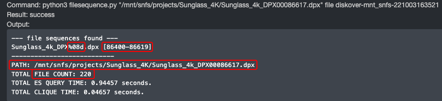

## Plugins Configuration | File Actions

### Overview

Most help information is available directly within the user interface. This section provides additional information and guidance to assist you during the configuration phase.

🟨 &nbsp;Note that some plugins are not currently available in DiskoverAdmin and still require manual installation for now. Please refer to the [Manual Plugins Configuration]() section for the list and details.

  - All plugins will eventually be included in the [DiskoverAdmin](#config_diskoveradmin) panel, but a few are still only configurable manually.
  - Please [open a support ticket](https://support.diskoverdata.com/) if you currently use one of these plugins and need to upgrade to v2.3+.
  - Visit our [Plugins Ecosystem](https://diskoverdata.com/products/plugins/) webpage for a complete list of all our plugins.
  - The plugins in this chapter are listed alphabetically within each edition group. Here is a quick access list by category:

| EDITION |  PLUGIN |
| --- | --- |
| **Core Editions** | <ul><li>[Fix Permissions]()</li><li>[Export]()</li><li>[Hash Differential Checksums File Action](#plugin_hash_diff)</li><li>[Live View]()</li><li>[Make Links]()</li><li>[Ngenea Data Orchestrator File Action by PixtiMedia](#plugin_ngenea)</li><li>[PDF Viewer]()</li><li>[Rclone]()</li><li>[Vcinity High-Speed Data Transfer File Action](#plugin_vcinity)</li></ul> |
| **Media** | <ul><li>[CineViewer Player File Action](#plugin_cineviewer)</li><li>[EDL Check]()</li><li>[EDL Download]()</li><li>[Find File Sequences File Action](#plugin_find_file_sequences)</li><li>[IMF Change Report]()</li><li>[IMF Validator File action by Oxagile](#plugin_imf_validator)</li><li>[GLIM File Action](#plugin_glim)</li><li>[Vantage]() </li></ul> |
| **Life Science** | <ul><li>[Grant File Action](#plugin_grant)</li></ul> |

#### CineViewer Player by CineSys | File Action Plugin

| HELP | RESOURCE |
| --- | --- |
| Availability |  |
| Installation | 🛟 &nbsp;[Click here to open a support ticket](https://support.diskoverdata.com/) to request assistance with installing this plugin, whether you want to test or deploy it in your production environment. |
| Learn more | [Visit our website](https://diskoverdata.com/products/products-aja-media-edition/#cineviewer) and/or [contact AJA Video Systems](mailto:sales@aja.com) |
| User Guide | [AJA Diskover Media Edition Companion Guide](https://docs.diskoverdata.com/diskover_user_guide_companion_aja_media_edition/#cineviewer-player) |
| Demo | [🍿 Watch Demo Video](https://vimeo.com/765285042?share=copy) |

##### Overview

CineViewer is a video playback and management system designed for video and broadcast professionals. It is designed to securely view high-resolution media from a remote browser, without giving users access to the source files, as well as play content that may not be supported by standard web browsers, including file formats such as ProRes and MXF. Additionally, Cineviewer allows users to play back image sequences in formats such as DPX and EXR. The player can be launched in one click from the AJA Diskover Media Edition user interface, allowing for seamless validation of media assets, therefore increasing productivity, while safeguarding your production network.

With its timecode-accurate playback and seeking capabilities, CineViewer enables users to navigate through content with precision. The system also supports up to 16 channels of audio, providing a variety of audio configuration options to accommodate different projects. Furthermore, Cineviewer includes closed captioning functionality, ensuring an accessible experience for all users.

The following sections will guide you through the installation and configuration of CineViewer, helping you utilize this tool effectively for your video and broadcast needs.

The CineViewer Player is developed by [CineSys LLC](https://cinesys.io/), a major technological and channel partner working with both Diskover Data and [AJA Video Systems](https://www.aja.com/). For more information, support, or to purchase the CineViewer Player, please contact [CineSys.io](https://cinesys.io/contact-us/).

___
### EDL Check

| HELP | RESOURCE |
| --- | --- |
| Availability | &nbsp;&nbsp;&nbsp;&nbsp;&nbsp;&nbsp;&nbsp;&nbsp; |
| To learn more | [Visit our website]() and/or [contact Diskover](mailto:sales@diskoverdata.com) |
| User Guide | [x]() |
| Demo | [🍿 Watch Demo Video](x) |

___
### EDL Download

| HELP | RESOURCE |
| --- | --- |
| Availability | &nbsp;&nbsp;&nbsp;&nbsp;&nbsp;&nbsp;&nbsp;&nbsp; |
| To learn more | [Visit our website]() and/or [contact Diskover](mailto:sales@diskoverdata.com) |
| User Guide | [x]() |
| Demo | [🍿 Watch Demo Video](x) |

___
### Export

| HELP | RESOURCE |
| --- | --- |
| Availability | &nbsp;&nbsp;&nbsp;&nbsp;&nbsp;&nbsp;&nbsp;&nbsp; |
| To learn more | [Visit our website]() and/or [contact Diskover](mailto:sales@diskoverdata.com) |
| User Guide | [x]() |
| Demo | [🍿 Watch Demo Video](x) |

#### Find File Sequences | File Action Plugin

| HELP | RESOURCE |
| --- | --- |
| Availability |  |
| Installation | 🛟 &nbsp;[Click here to open a support ticket](https://support.diskoverdata.com/) to request assistance with installing this plugin, whether you want to test or deploy it in your production environment. |
| Learn more | [Visit our website](https://diskoverdata.com/products/products-aja-media-edition/#file-sequences) and/or [contact Diskover](mailto:sales@diskoverdata.com) |
| User Guide | [AJA Diskover Media Edition Companion Guide](https://docs.diskoverdata.com/diskover_user_guide_companion_aja_media_edition/#find-file-sequences) |

The File Sequence web plugin File Action is designed to list out any file sequences in a directory or from a single file in a sequence. File sequences are printed out with `%08d` to show the 0 padding and number of digits in the sequence. Each sequence, whole or broken, are put into a [ ] list. [Learn more about this plugin](https://docs.diskoverdata.com/diskover_user_guide_companion_aja_media_edition/#find-file-sequences).

___
### Fix Permissions

| HELP | RESOURCE |
| --- | --- |
| Availability | &nbsp;&nbsp;&nbsp;&nbsp;&nbsp;&nbsp;&nbsp;&nbsp; |
| To learn more | [Visit our website]() and/or [contact Diskover](mailto:sales@diskoverdata.com) |
| User Guide | [x]() |
| Demo | [🍿 Watch Demo Video](x) |

#### GLIM | File Action Plugin

| HELP | RESOURCE |
| --- | --- |
| Availability |  |
| Installation | 🛟 &nbsp;[Click here to open a support ticket](https://support.diskoverdata.com/) to request assistance with installing this plugin, whether you want to test or deploy it in your production environment. |
| Learn more | [Visit our website](https://diskoverdata.com/products/products-aja-media-edition/#glim) and/or [contact Diskover](mailto:sales@diskoverdata.com) |
| User Guide | [AJA Diskover Media Edition Companion Guide](https://docs.diskoverdata.com/diskover_user_guide_companion_aja_media_edition/#glim-previewvalidate-media-files) |
| Demo | [🍿 Watch Demo Video](https://vimeo.com/665037937) |

This plugin results in a seamless integration with GLIM, allowing end-users to safely view and validate media files, while safeguarding your source assets and production network. Diskover allows users to do advanced searches of media assets, and then launch GLIM in one click via our File Actions. You need to have a GLIM account and be logged in previously to launch the GLIM preview plugin within Diskover.

#### Grant Research | File Action Plugin

| HELP | RESOURCE |
| --- | --- |
| Availability |  |
| Installation | 🛟 &nbsp;[Click here to open a support ticket](https://support.diskoverdata.com/) to request assistance with installing this plugin, whether you want to test or deploy it in your production environment. |
| Learn more | [Visit our website](https://diskoverdata.com/products/life-science-edition/#grant-plugin) and/or [contact Diskover](mailto:sales@diskoverdata.com) |

The Grant Plugin has a dual purpose 1) assisting research institutes in managing their grants/members/storage costs internally, and 2) fulfilling the requirements for the new NIH DMS Policy.

The Grant Plugin collects and parses grants’ metadata (grant number, group ID, etc.) to curated datasets. In turn, staff associated with a specific grant has visibility/searchability of their limited data/grant without access to the source files or other grants. That extra metadata is also available to use for further workflow automation if needed.

_[Click here for a full-screen view of this image.](images/diagram_diskover_plugin_grant.png)_

#### Hash Differential Checksums | File Action Plugin

| HELP | RESOURCE |
| --- | --- |
| Availability | &nbsp;&nbsp;&nbsp;&nbsp;&nbsp;&nbsp; |
| Installation | 🛟 &nbsp;[Click here to open a support ticket](https://support.diskoverdata.com/) to request assistance with installing this plugin, whether you want to test or deploy it in your production environment. |
| Learn more | [Visit our website](https://diskoverdata.com/products/plugins/#data-integrity) and/or [contact Diskover](mailto:sales@diskoverdata.com) |
| Demo | [🍿 Watch Demo Video](https://vimeo.com/768967081) |

The Xytech Media Operations Platform order status plugin is designed to automate the correlation of the order management system and the storage system, by harvesting key business context from Xytech and applying that context within the AJA Diskover Media Edition. In turn, this business context metadata can be used to automate workflows, curate data, monitor costs, create highly customized reports, and search granularly.

Facilities often manually correlate the order management system with the storage repositories. However, manual processes are subject to human errors and difficult to scale as the volume of media orders and data turnover increases constantly.

Therefore, the lack of integration for file-based workflows between the order management system and the underlying storage repositories, makes data management decisions difficult as they are solely based on attributes of files or objects on storage. Additional business context is needed from the order management system to increase precision and accuracy of data management decisions.

An instance of key information might be the invoice date for a work order. A status change for a work order can be aa key indicator for data management, for example, once a Xytech media order has been “invoiced”, then the data associated with that media order can be a candidate for archival.

___
### IMF Change Report

| HELP | RESOURCE |
| --- | --- |
| Availability | &nbsp;&nbsp;&nbsp;&nbsp;&nbsp;&nbsp;&nbsp;&nbsp; |
| To learn more | [Visit our website]() and/or [contact Diskover](mailto:sales@diskoverdata.com) |
| User Guide | [x]() |
| Demo | [🍿 Watch Demo Video](x) |

#### IMF Package Validator by Oxagile | File Action Plugin

| HELP | RESOURCE |
| --- | --- |
| Availability |  |
| Installation | 🛟 &nbsp;[Click here to open a support ticket](https://support.diskoverdata.com/) to request assistance with installing this plugin, whether you want to test or deploy it in your production environment. |
| Learn more | [Visit our website](https://diskoverdata.com/products/products-aja-media-edition/#imf-package-validator) and/or [contact Oxagile](mailto:IMF@Oxagile.com) |
| User Guide | [AJA Diskover Media Edition Companion Guide](https://docs.diskoverdata.com/diskover_user_guide_companion_aja_media_edition/#imf-package-validator) |
| Demo | [🍿 Watch Demo Video](https://vimeo.com/828166808) |

##### Overview

The IMF package validator plugin allows organizations to validate IMF packages before delivery from a remote platform, saving immense amounts of man-hours over the course of a business year.

Oxagile’s IMF Package Validator Plugin, exclusively designed for the AJA Diskover Media Edition, allows users to scan and validate IMF packages before delivery from any location, regardless of the location of the IMF package data.

IMF stands for Interoperable Master Format, which is a technical standard used in the Media and Entertainment industry for the exchange of digital content between different platforms and systems. The IMF format is used by content creators, distributors, and broadcasters to deliver high-quality video content to a variety of devices, including TVs, mobile devices, and web browsers.

Netflix, for example, requires all their content to be delivered in IMF format, which undergoes rigorous validation to ensure compliance with industry standards. The validation process involves extensive testing of the content's video, audio, and metadata to ensure that it meets the technical specifications and can be delivered to viewers in the highest quality possible.

Once the content has been validated, it is then encoded into various formats, including 4K and HDR, and made available for streaming on various platforms. The IMF validation process is a critical step in the content delivery pipeline.

##### Trial and Purchase of the Plugin

The IMF Package Validator plugin is developed and sold exclusively by [Oxagile](https://www.oxagile.com/), a major technological partner working with both Diskover Data and [AJA Video Systems](https://www.aja.com/). For more information, to start a 30 day trial, or to purchase the IMF Package Validator plugin, please contact [Oxagile](mailto:IMF@Oxagile.com).

##### Functional Limitations

The following are the limitations of the current plugin version:

1.	Verification capabilities are limited with those of the latest version of Netflix Photon tool.
2.	Validation by schedule is not supported.
3.	Cloud storage is not supported.
4.	Archives are not supported.
5.	DCP packages are not supported.

___
### Live View

| HELP | RESOURCE |
| --- | --- |
| Availability | &nbsp;&nbsp;&nbsp;&nbsp;&nbsp;&nbsp;&nbsp;&nbsp; |
| To learn more | [Visit our website]() and/or [contact Diskover](mailto:sales@diskoverdata.com) |
| User Guide | [x]() |
| Demo | [🍿 Watch Demo Video](x) |

___
### Make Links

| HELP | RESOURCE |
| --- | --- |
| Availability | &nbsp;&nbsp;&nbsp;&nbsp;&nbsp;&nbsp;&nbsp;&nbsp; |
| To learn more | [Visit our website]() and/or [contact Diskover](mailto:sales@diskoverdata.com) |
| User Guide | [x]() |
| Demo | [🍿 Watch Demo Video](x) |

#### Ngenea Data Orchestrator by PixitMedia | File Action Plugin

| HELP | RESOURCE |
| --- | --- |
| Availability | &nbsp;&nbsp;&nbsp;&nbsp;&nbsp;&nbsp; |
| Installation | 🛟 &nbsp;[Click here to open a support ticket](https://support.diskoverdata.com/) to request assistance with installing this plugin, whether you want to test or deploy it in your production environment. |
| Learn more | Download this [Solution Brief](https://diskoverdata.com/wp-content/uploads/2024/08/diskover_pixitmedia_ngenea_solution_brief.pdf) and/or [contact Diskover](mailto:sales@diskoverdata.com) |
| Demo | [🍿 Watch Demo Video](https://vimeo.com/833500176?share=copy) |

With the Ngenea Data Orchestrator File Action, authorized users can quickly and securely transport data, directly from the Diskover UI, to and from globally distributed cloud, object storage, traditional NAS files, and tape resources, automatically moving data into the ‘right cost’ resource according to value and usage as your work teams and business needs demand.

___
### PDF Viewer

| HELP | RESOURCE |
| --- | --- |
| Availability | &nbsp;&nbsp;&nbsp;&nbsp;&nbsp;&nbsp;&nbsp;&nbsp; |
| To learn more | [Visit our website]() and/or [contact Diskover](mailto:sales@diskoverdata.com) |
| User Guide | [x]() |
| Demo | [🍿 Watch Demo Video](x) |

___
### Rclone

| HELP | RESOURCE |
| --- | --- |
| Availability | &nbsp;&nbsp;&nbsp;&nbsp;&nbsp;&nbsp;&nbsp;&nbsp; |
| To learn more | [Visit our website]() and/or [contact Diskover](mailto:sales@diskoverdata.com) |
| User Guide | [x]() |
| Demo | [🍿 Watch Demo Video](x) |

___
### Vantage

| HELP | RESOURCE |
| --- | --- |
| Availability | &nbsp;&nbsp;&nbsp;&nbsp;&nbsp;&nbsp;&nbsp;&nbsp; |
| To learn more | [Visit our website]() and/or [contact Diskover](mailto:sales@diskoverdata.com) |
| User Guide | [x]() |
| Demo | [🍿 Watch Demo Video](x) |

#### Vcinity High-Speed Data Transfer | File Action Plugin

| HELP | RESOURCE |
| --- | --- |
| Availability | &nbsp;&nbsp;&nbsp;&nbsp;&nbsp;&nbsp; |
| Installation | 🛟 &nbsp;[Click here to open a support ticket](https://support.diskoverdata.com/) to request assistance with installing this plugin, whether you want to test or deploy it in your production environment. |
| Learn more | Download this [Solution Brief](https://diskoverdata.com/wp-content/uploads/2024/05/Diskover_Data_SB.pdf) and/or [contact Diskover](mailto:sales@diskoverdata.com) |
| Demo | [🍿 Watch Demo Video](https://youtu.be/l1XZoe-ZtEI) |

Regardless of distance and latency, the high-speed data transfer Vcinity Plugin provides the framework for reliable and fast data movement based on pre-configured source and destination profiles. 

The plugin can move NFS, SMB, and S3 to any NFS, SMB, and S3 vendor, no matter the brand, ex: Dell, NetApp, HPE, etc.

The Vcinity High-Speed Data Transfer Plugin provides two mechanisms within Diskover to trigger data movement: 1) on-demand user-initiated file action directly from the Diskover interface, and 2) scheduled automated workflow based on file attributes meeting predetermined criteria.

