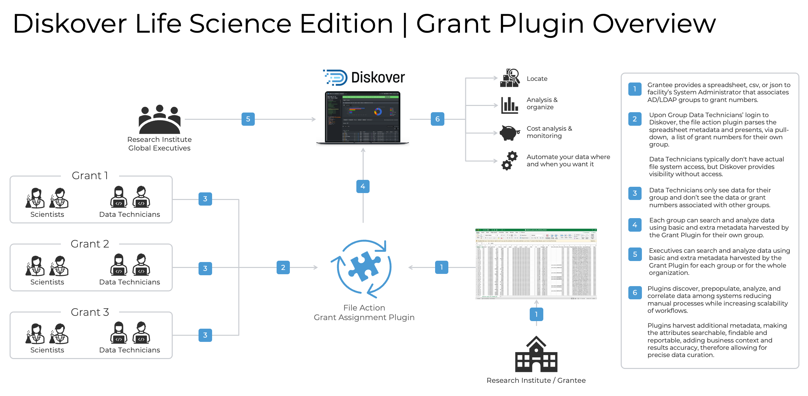

<p id="config_diskoveradmin_plugins_index"></p>

## Plugins Configuration | Index

### Overview

Most help information is available directly within the user interface. This section provides additional guidance to assist you during the configuration phase.


  - All plugins will eventually be included in the [DiskoverAdmin](#config_diskoveradmin) panel, but a few are still only configurable manually.
  - Please [open a support ticket](https://support.diskoverdata.com/) if you currently use one of these plugins and need to upgrade to v2.3+.
  - Visit our [Plugins Ecosystem](https://diskoverdata.com/products/plugins/) webpage for a complete list of all our plugins.
  - The plugins in this chapter are listed alphabetically within each edition group. Here is a quick access list by category:

| EDITION |  PLUGIN |
| --- | --- |
| **Core Editions** | <ul><li>[Checksums]()</li><li>[File Kind]()</li><li>[First Index/Arrival Time]()</li><li>[Grafana]()</li><li>[Grafana Cloud]()</li><li>[Path Tokens]()</li><li>[Tag Copier]()</li><li>[Unix Perms]()</li><li>[Windows Owner]()</li></ul> |
| **Media** | <ul><li>[Media Info]()</li><li>[Xytec Asset Creation Index Plugin](#plugin_xytech_asset_creation)</li><li>[Xytec Order Status Index Plugin](#plugin_xytech_order_status)</li></ul> |
| **Life Science** | <ul><li>[BAM Index Plugin](#plugin_bam)</li></ul> |


### Index Plugins

<p id="plugin_bam"></p>

#### BAM Info | Index Plugin

| HELP | RESOURCE |
| --- | --- |
| Availability |  |
| Installation | 🛟 &nbsp;[Click here to open a support ticket](https://support.diskoverdata.com/) to request assistance with installing this plugin, whether you want to test or deploy it in your production environment. |
| Learn more | [Visit our website](https://diskoverdata.com/products/life-science-edition/#bam-plugin) and/or [contact Diskover](mailto:sales@diskoverdata.com) |
| User Guide | [Diskover Life Science Edition Companion Guide](https://docs.diskoverdata.com/diskover_user_guide_companion_life_science_edition/#bam-harvest-plugin) |
| Demo | [🍿 Watch Demo Video](https://vimeo.com/678914314?share=copy) |

##### Overview

The BAM info plugin is designed to enable additional metadata collection for BAM (Binary Alignment Map) and SAM (Sequence Alignment Map) about a file without granting the Diskover user any read/write file system access. The BAM info plugin enables additional metadata for the SAM and BAM file formats to be harvested at time of index, and are therefore searchable, reportable, actionable, and can be engaged in workflows within Diskover.

- The specification for the SAM file format can be found here:
  [https://samtools.github.io/hts-specs/SAMv1.pdf](https://samtools.github.io/hts-specs/SAMv1.pdf)
- The BAM info plugin uses the Python **pysam** to harvest attributes about the BAM and SAM files:
  [https://pysam.readthedocs.io/en/latest/](https://pysam.readthedocs.io/en/latest/)

New indices will use the plugin, and any SAM or BAM file will get additional info added to the Elasticsearch index’s **bam_info** field. The attributes provide the ability to view storage and file system content from a workflow perspective, for example, all the frame rates on any given storage.



_[Click here for a full-screen view of this image.](images/diagram_diskover_plugin_grant.png)_

##### BAM Info Fields in Diskover-Web

Please refer to the [Diskover User Guide Companion | Life Science Edition](https://docs.diskoverdata.com/diskover_user_guide_companion_life_science_edition/) for more details, including how to search using the BAM info fields.

The BAM info attributes in Diskover-Web:
```
bam_info.co_cmd:
bam_info.co_cmd_checksum:
bam_info.co.key:
bam_info.co.value:
bam_info.pg.id:
bam_info.pg.vn:
```


<p id="config_index_checksums"></p>

___
### Checksums

| HELP | RESOURCE |
| --- | --- |
| Availability | &nbsp;&nbsp;&nbsp;&nbsp;&nbsp;&nbsp;&nbsp;&nbsp; |
| To learn more | [Visit our website]() and/or [contact Diskover](mailto:sales@diskoverdata.com) |
| User Guide | [x]() |
| Demo | [🍿 Watch Demo Video](x) |

<p id="config_index_file_kind"></p>

___
### File Kind

| HELP | RESOURCE |
| --- | --- |
| Availability | &nbsp;&nbsp;&nbsp;&nbsp;&nbsp;&nbsp;&nbsp;&nbsp; |
| To learn more | [Visit our website]() and/or [contact Diskover](mailto:sales@diskoverdata.com) |
| User Guide | [x]() |
| Demo | [🍿 Watch Demo Video](x) |

<p id="config_index_first_index"></p>

___
### First Index/Arrival Time

| HELP | RESOURCE |
| --- | --- |
| Availability | &nbsp;&nbsp;&nbsp;&nbsp;&nbsp;&nbsp;&nbsp;&nbsp; |
| To learn more | [Visit our website]() and/or [contact Diskover](mailto:sales@diskoverdata.com) |
| User Guide | [x]() |
| Demo | [🍿 Watch Demo Video](x) |


<p id="config_index_grafana"></p>

___
### Grafana

| HELP | RESOURCE |
| --- | --- |
| Availability | &nbsp;&nbsp;&nbsp;&nbsp;&nbsp;&nbsp;&nbsp;&nbsp; |
| To learn more | [Visit our website]() and/or [contact Diskover](mailto:sales@diskoverdata.com) |
| User Guide | [x]() |
| Demo | [🍿 Watch Demo Video](x) |

<p id="config_index_grafana_cloud"></p>

___
### Grafana Cloud

| HELP | RESOURCE |
| --- | --- |
| Availability | &nbsp;&nbsp;&nbsp;&nbsp;&nbsp;&nbsp;&nbsp;&nbsp; |
| To learn more | [Visit our website]() and/or [contact Diskover](mailto:sales@diskoverdata.com) |
| User Guide | [x]() |
| Demo | [🍿 Watch Demo Video](x) |


<p id="config_index_mediainfo"></p>

___
### Media Info

| HELP | RESOURCE |
| --- | --- |
| Availability | &nbsp;&nbsp;&nbsp;&nbsp;&nbsp;&nbsp;&nbsp;&nbsp; |
| To learn more | [Visit our website]() and/or [contact Diskover](mailto:sales@diskoverdata.com) |
| User Guide | [x]() |
| Demo | [🍿 Watch Demo Video](x) |

<p id="config_index_path_tokens"></p>

___
### Path Tokens

| HELP | RESOURCE |
| --- | --- |
| Availability | &nbsp;&nbsp;&nbsp;&nbsp;&nbsp;&nbsp;&nbsp;&nbsp; |
| To learn more | [Visit our website]() and/or [contact Diskover](mailto:sales@diskoverdata.com) |
| User Guide | [x]() |
| Demo | [🍿 Watch Demo Video](x) |

<p id="config_index_tag_copier"></p>

___
### Tag Copier

| HELP | RESOURCE |
| --- | --- |
| Availability | &nbsp;&nbsp;&nbsp;&nbsp;&nbsp;&nbsp;&nbsp;&nbsp; |
| To learn more | [Visit our website]() and/or [contact Diskover](mailto:sales@diskoverdata.com) |
| User Guide | [x]() |
| Demo | [🍿 Watch Demo Video](x) |

<p id="config_index_unix_perms"></p>

___
### Unix Perms

| HELP | RESOURCE |
| --- | --- |
| Availability | &nbsp;&nbsp;&nbsp;&nbsp;&nbsp;&nbsp;&nbsp;&nbsp; |
| To learn more | [Visit our website]() and/or [contact Diskover](mailto:sales@diskoverdata.com) |
| User Guide | [x]() |
| Demo | [🍿 Watch Demo Video](x) |

<p id="config_index_windows_owner"></p>

___
### Windows Owner

| HELP | RESOURCE |
| --- | --- |
| Availability | &nbsp;&nbsp;&nbsp;&nbsp;&nbsp;&nbsp;&nbsp;&nbsp; |
| To learn more | [Visit our website]() and/or [contact Diskover](mailto:sales@diskoverdata.com) |
| User Guide | [x]() |
| Demo | [🍿 Watch Demo Video](x) |


<p id="plugin_xytech_asset_creation"></p>

#### Xytech Asset Creation | Index Plugin

| HELP | RESOURCE |
| --- | --- |
| Availability |  |
| Installation | 🛟 &nbsp;[Click here to open a support ticket](https://support.diskoverdata.com/) to request assistance with installing this plugin, whether you want to test or deploy it in your production environment. |
| Learn more | [Visit our website](https://diskoverdata.com/products/products-aja-media-edition/#xytech-asset-creation) and/or [contact Diskover](mailto:sales@diskoverdata.com) |
| User Guide | [AJA Diskover Media Edition Companion Guide](https://docs.diskoverdata.com/diskover_user_guide_companion_aja_media_edition/#xytech-asset-creation-plugin-overview) |
| Demo | [🍿 Watch Demo Video](https://vimeo.com/660789118) |

Post facilities often have customers’ assets that have been archived and lack findability, visibility, and searchability, and therefore, the opaque nature of these assets makes them difficult to reuse or repurpose. Companies with years of such archived assets have often stored these on tape media or removable hard drives, which are often stored in a physical vault.

Assets were often stored on such “offline” media due to costs; however, with the advent of cloud and object storage, the economics are now making it viable to store such vaulted assets on more “online media”. Although, simply putting these assets onto online media does not necessarily make these assets findable in context or within the facility’s order management system.

The Xytech asset creation tool is designed to find and index newly restored online assets from LTO tapes, removable hard drives, etc., making them available, findable, and searchable within the Xytech order management system, as well as Diskover.

The plugin operates on the assumption that the assets restored to online media are placed into a folder with the following naming convention: **CustomerID_CustomerName**

The path location is added to the asset within Xytech and the asset number is assigned to the file via a tag within the Diskover Index.


<p id="plugin_xytech_order_status"></p>

#### Xytech Order Status | Index Plugin

| HELP | RESOURCE |
| --- | --- |
| Availability |  |
| Installation | 🛟 &nbsp;[Click here to open a support ticket](https://support.diskoverdata.com/) to request assistance with installing this plugin, whether you want to test or deploy it in your production environment.
| Learn more | [Visit our website](https://diskoverdata.com/products/products-aja-media-edition/#xytech-order-status) and/or [contact Diskover](mailto:sales@diskoverdata.com) |
| User Guide | [AJA Diskover Media Edition Companion Guide](https://docs.diskoverdata.com/diskover_user_guide_companion_aja_media_edition/#xytech-order-status-plugin-overview) |
| Demo | [🍿 Watch Demo Video](https://vimeo.com/768967081) |

The Xytech Media Operations Platform order status plugin is designed to automate the correlation of the order management system and the storage system, by harvesting key business context from Xytech and applying that context within the AJA Diskover Media Edition. In turn, this business context metadata can be used to automate workflows, curate data, monitor costs, create highly customized reports, and search granularly.

Facilities often manually correlate the order management system with the storage repositories. However, manual processes are subject to human errors and difficult to scale as the volume of media orders and data turnover increases constantly.

Therefore, the lack of integration for file-based workflows between the order management system and the underlying storage repositories, makes data management decisions difficult as they are solely based on attributes of files or objects on storage. Additional business context is needed from the order management system to increase precision and accuracy of data management decisions.

An instance of key information might be the invoice date for a work order. A status change for a work order can be aa key indicator for data management, for example, once a Xytech media order has been “invoiced”, then the data associated with that media order can be a candidate for archival.

