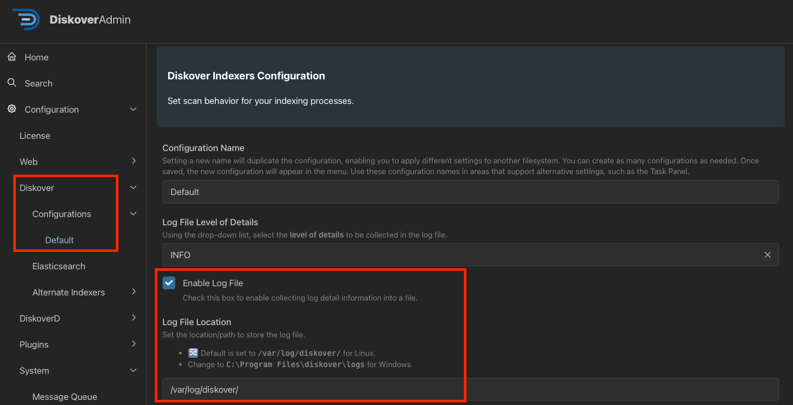
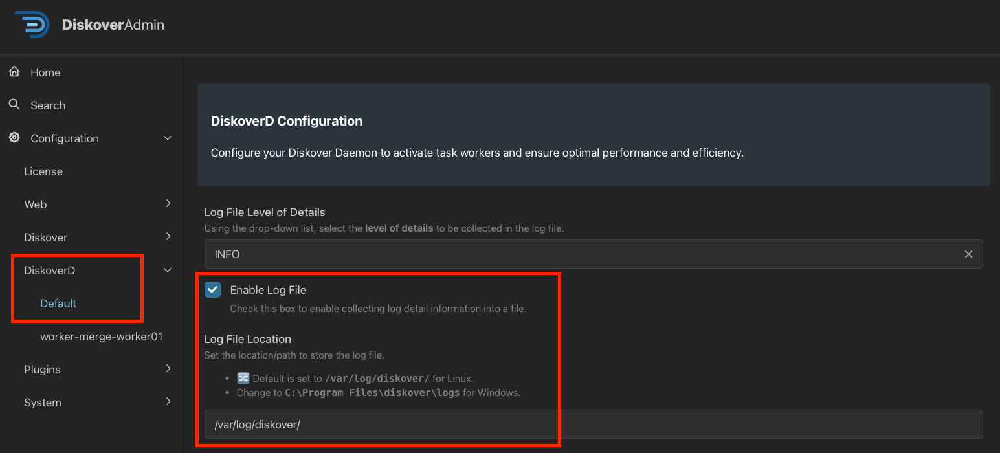

## Initial Configuration

### Overview

This section describes the foundational setup to get things running without much complexity. Keep in mind that you can always go back and adjust any of your settings at any time.

### Access DiskoverAdmin

You have reached THE big moment. Paste this link in a browser to access DiskoverAdmin and complete the configuration process for all Diskover's components and plugins.

[http://diskover-web:8000/diskover_admin/config/](http://diskover-web:8000/diskover_admin/config/)

### DiskoverAdmin Wizard

The DiskoverAdmin service allows for the fine-tuning of Diskover's core components and plugins. The setup wizard will guide you through the first part of the initial configuration of the DiskoverAdmin services, which can be further customized later.

🔴 &nbsp;Access the Wizard by selecting **System** → **Meta** → **Wizard** → **Setup**:

 

#### Elasticsearch Connection for Diskover-Web

🟨 &nbsp;Note that Diskover-Web and the indexer(s) can point to two different Elasticsearch hosts, hence the next steps.

🔴 &nbsp;Input the **IP/AWS endpoint** where your Elasticsearch is running in the **host** field. If you have a clustered ES setup, click **+ Add Item** to list your other IPs.

🔴 &nbsp;Keep the port at **9200**.

🔴 &nbsp;Enable **HTTPS** if your Elasticsearch uses an encrypted protocol. Otherwise, keep it unchecked for **HTTP**.

🔴 &nbsp;If you select **HTTPS**, enter your Elasticsearch username & password.

🔴 &nbsp;Click **Test** to see if Diskover can connect to your Elasticsearch system. The page will refresh and output the health of your cluster at the top of the page (number of shards, nodes, etc.):

 

🔴 &nbsp;If the test is successful, click **Save & Continue**, otherwise review the information you entered.

#### Elasticsearch Connection for Indexers

🔴 &nbsp;**Copy connection settings from Diskover-Web?**:
- If your Diskover-Web and indexer(s) point to the same ES host, click **Yes**.
- If your Diskover-Web and indexer(s) point to different ES hosts, click **No**, go through each field, and click:
    - **Test** to test your connection.
    - **Save & Continue** once done.

#### License

This is the point where you need to send your license request and the wizard partially automates this task for you. Note that if you skip this part for now, you can always send a [license request]() manually at any time.

🔴 &nbsp;The wizard will prompt you through the steps to collect the information for your license request: email, Diskover edition, number of nodes, and your hardware ID which will be automatically generated during this process.

 

🔴 &nbsp;You should receive your license within 24 hours, usually much less than 24 hours. You have 2 choices at this point:

- Pause and wait to receive the license to continue.
- Click **Skip** and come back once you receive the license.

🔴 &nbsp;Once you receive the license, copy/paste the keys as instructed on the License Configuration page.

🔴 &nbsp;Click **Test** if you want to validate your license, example below, then click **Save & Continue**.

 

#### Time Zone

🔴 &nbsp;Using the dropdown list, select your **Time Zone**. More customization can be done later regarding time zones, click **Save & Continue**.

🔴 &nbsp;Click the box to enable your time zone selection, click **Save & Continue**.

#### RabbitMQ or Amazon MQ

This section is only needed if you are planning to use [File Action](https://diskoverdata.com/products/plugins/#file-actions) plugins.

🔴 &nbsp;Follow the instructions on this page, click **Test** to check the connection, and then **Save & Continue**, or click **Skip**. You can configure or edit your entries at any time.

🟨 &nbsp;The basic setup using the wizard is not completed. CONGRATS!

### API

🔴 &nbsp;Now navigate to **System** → **API**.

 

🔴 &nbsp;The **API Host** needs to be the IP address where Diskover-Web is running.

🔴 &nbsp;Specify an **API Port** if different than the default of **8000**.

### Diskover Indexers/Workers

🔴 &nbsp;Navigate to **Diskover** → **Configurations** → **Default**.

🔴 &nbsp;Check **Enable Log File** and modify the **Log File Location** as needed:

 

### DiskoverD

🔴 &nbsp;Navigate to **DiskoverD** → **Default**.

🔴 &nbsp;Check **Enable Log File** and modify the **Log File Location** as needed:

 

### Schedule Your First Scan

You are now ready to schedule and then run your first scan! Go to the next section, [Tasks Management via Task Panel](#task_panel), for the details.
