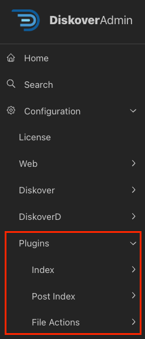
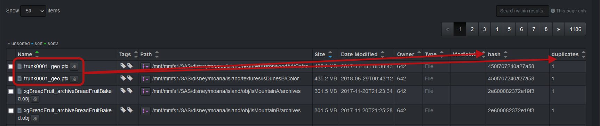
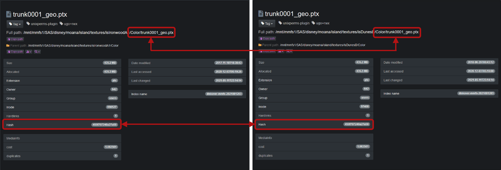
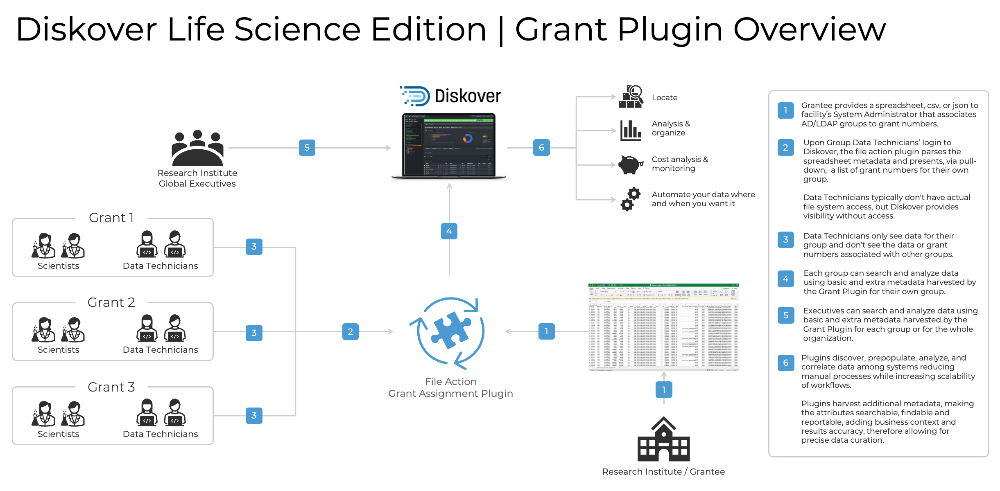

## Plugins Configuration

### Overview

Whether indexing extra metadata, automating workflows, or customizing actions on data for your own environment, Diskover’s flexible architecture empowers you to extend its functionality and unlock greater value from your digital assets. Diskover currently offers 3 categories of plugins:

- Plugins that run **at time of index** → Mostly metadata enrichment.
- Plugins that run as a **post-index process** → Metadata enrichment, data curation, and more.
- **File Action** plugins → Enable workflow automation by triggering actions on selected files.

⚠️ &nbsp;**IMPORTANT!** Once the plugin is configured, a task needs to be created and scheduled in the [**Task Panel**](#task_panel).

| Plugins Configurable via DiskoverAdmin | Plugins Manually Configurable |
| --- | --- |
| <ul><li>Most plugins are now configurable directly in the **DiskoverAdmin** panel.</li><li>Help information is available directly within the user interface.</li><li>This chapter provides additional guidance when applicable.</li></ul>  | <ul><li>A few plugins are still configurable via a terminal.</li><li>[🛟 Open a support ticket](https://support.diskoverdata.com/) if you currently use one of these plugins and need to upgrade to the latest version.</li></ul> |

### Quick Access List

The plugins are listed alphabetically.

| APPLICATION |  PLUGIN | INDEX | POST-INDEX | FILE ACTION |
| --- | --- | :---: | :---: | :---: |
| Core | [AutoClean/Orchestrate](#plugin_post_index_autoclean) | | ✅ | |
| Core | [AutoTag](#plugin_post_index_autotag) | | ✅ | |
| Life Science | [BAM Index Plugin](#plugin_index_bam) | ✅ | | |
| Core | [Breadcrumb](#plugin_post_index_breadcrumb) | | ✅ | |
| Core | [Checksums](#plugin_index_checksums) | ✅ | | |
| Core | [Checksums](#plugin_post_index_checksums) | | ✅ | |
| Core | [Checksums S3](#plugin_post_index_checksums_s3) | | ✅ | |
| Media | [CineViewer Player](#plugin_file_action_cineviewer) | | | ✅ |
| Core | [Costs](#plugin_post_index_costs) | | ✅ | |
| Core | [Dupes Finder](#plugin_post_index_dupes) | | ✅ | |
| Media | [EDL Check](#plugin_file_action_edl_check) | | | ✅ |
| Media | [EDL Download](#plugin_file_action_edl_download) | | | ✅ |
| Core | [ES Field Copier](#plugin_post_index_es_field_copier) | | ✅ | |
| Core | [ES Query Report](#plugin_post_index_es_query_report) | | ✅ | |
| Core | [Export](#plugin_file_action_export) | | | ✅ |
| Core | [File Kind](#plugin_index_file_kind) | ✅ | | |
| Media | [Find File Sequences](#plugin_file_action_find_file_sequences) | | | ✅ |
| Core | [First Index/Arrival Time](#plugin_index_first_index) | ✅ | | |
| Core | [Fix Permissions](#plugin_file_action_fix_permissions) | | | ✅ |
| Core | [Grafana](#plugin_index_grafana) | ✅ | | |
| Core | [Grafana Cloud](#plugin_index_grafana_cloud) | ✅ | | |
| Life Science | [Grant](#plugin_file_action_grant) | | | ✅ |
| Core | [Hash Differential](#plugin_file_action_hash_diff) | | | ✅ |
| Core | [Illegal Filename](#plugin_post_index_illegal_filename) | | ✅ | |
| Core | [Image Info](#plugin_index_image_info) | ✅ | | |
| Media | [IMF Change Report](#plugin_file_action_imf_change_report) | | | ✅ |
| Core | [Index Diff](#plugin_post_index_index_diff) | | ✅ | |
| Core | [Live View](#plugin_file_action_live_view) | | | ✅ |
| Core | [Make Links](#plugin_file_action_make_links) | | | ✅ |
| Media | [Media Info](#plugin_index_mediainfo) | ✅ | | |
| Core | [Ngenea Data Orchestrator](#plugin_file_action_ngenea) | | | ✅ |
| Media | [OpenEXR Info](#plugin_index_openexr_info) | | | ✅ |
| Core | [Path Tokens](#plugin_index_path_tokens) | ✅ | | |
| Core | [PDF Info](#plugin_index_pdf_info) | ✅ | | |
| Core | [PDF Viewer](#plugin_file_action_pdf_viewer) | | | ✅ |
| Core | [PowerScale](#plugin_post_index_powerscale) | | ✅ | |
| Core | [Rclone Data Mover](#plugin_file_action_rclone) | | | ✅ |
| Media | [ShotGrid/Flow Production Tracking](#plugin_post_index_shotgrid) | | ✅ | |
| Core | [Spectra](#plugin_file_action_spectra) | | | ✅ |
| Core | [Spectra MediaEngine](#plugin_file_action_spectra_mediaengine) | | | ✅ |
| Core | [Tag Copier](#plugin_index_tag_copier) | ✅ | | |
| Core | [Tag Copier](#plugin_post_index_tag_copier) | | ✅ | |
| Media | [Telestream GLIM File Action](#plugin_file_action_glim) | | | ✅ |
| Media | [Telestream Vantage](#plugin_file_action_vantage) | | | ✅ |
| Core | [Unix Perms](#plugin_index_unix_perms) | ✅ | | |
| Core | [Vcinity High-Speed Data Transfer](#plugin_file_action_vcinity) | | | ✅ |
| Core | [Windows Attributes](#plugin_post_index_windows_attributes) | | ✅ | |
| Core | [Windows Owner](#plugin_index_windows_owner) | ✅ | | |
| Media | [Xytec Asset Creation Index Plugin](#plugin_post_index_xytech_asset_creation) | | ✅ | |
| Media | [Xytec Order Status Index Plugin](#plugin_post_index_xytech_order_status) | | ✅ | |

### Plugins

The plugins are listed alphabetically.

#### AutoClean/Orchestrate

| HELP | RESOURCE |
| --- | --- |
| Availability | &nbsp;&nbsp; |
| Enable/Config | Via the DiskoverAdmin panel |
| Learn More | [Visit our website](https://diskoverdata.com/platform/orchestrate/) | [Contact Diskover](mailto:sales@diskoverdata.com) |
| Purpose | Designed to move, copy, delete, rename, or run custom commands on files and directories based on a set of highly configurable criteria. With the use of tags, the AutoClean plugin can be used to implement a RACI model or approval process for archive and deletion (approved_archive, approved_delete, etc.) tag application. The plugin criteria can then be set to meet the desired set of tags (times, etc.) to invoke action. |
| Need Pro Services? | Diskover offers professional services to assist with setting up data flows and workflows → [contact us](mailto:sales@diskoverdata.com) for details |

#### AutoTag

| HELP | RESOURCE |
| --- | --- |
| Availability | &nbsp;&nbsp;&nbsp;&nbsp; |
| Enable/Config | Via the DiskoverAdmin panel |
| Learn More | [Visit our website](https://diskoverdata.com/platform/enrich/#tags) | [Contact Diskover](mailto:sales@diskoverdata.com) |
| Purpose | Allows for automated tags to be applied/added to the Elasticsearch index as a post-index process. Tags can be applied automatically via a series of rules applied to directories or files. The criteria can be very powerful based on a combination of base and business-context metadata. |

#### BAM Info

| HELP | RESOURCE |
| --- | --- |
| Availability |  |
| Enable/Config | Via a terminal 🛟 &nbsp;[Open a support ticket](https://support.diskoverdata.com/) to request assistance with installing this plugin |
| Learn More | [Visit our website](https://diskoverdata.com//solutions/life-science/#bam) \| [Contact Diskover](mailto:sales@diskoverdata.com) |
| User Guide | [Diskover User Guide Companion for Life Science Solutions](https://docs.diskoverdata.com/diskover_user_guide_companion_life_science_solutions/#bam-harvest-plugin) |
| Demo | [🍿 Watch Demo Video](https://vimeo.com/678914314?share=copy) |
| Purpose | The BAM info plugin is designed to enable additional metadata collection for BAM (Binary Alignment Map) and SAM (Sequence Alignment Map) about a file without granting the Diskover user any read/write file system access. The BAM info plugin enables additional metadata for the SAM and BAM file formats to be harvested at time of index, and are therefore searchable, reportable, actionable, and can be engaged in workflows within Diskover.  [Learn more about the specification for the SAM file format.](https://samtools.github.io/hts-specs/SAMv1.pdf)  [Learn more about how the BAM info plugin uses the Python **pysam** to harvest attributes about the BAM and SAM files.](https://pysam.readthedocs.io/en/latest/)  New indices will use the plugin, and any SAM or BAM file will get additional info added to the Elasticsearch index’s **bam_info** field. The attributes provide the ability to view storage and file system content from a workflow perspective, for example, all the frame rates on any given storage. |

#### Breadcrumb

| HELP | RESOURCE |
| --- | --- |
| Availability | &nbsp;&nbsp;&nbsp;&nbsp; |
| Enable/Config | Via the DiskoverAdmin panel |
| Learn More | [Contact Diskover](mailto:sales@diskoverdata.com) |
| Purpose | Designed to extract/add metadata from files’ breadcrumbs to the Elasticsearch index as a post-index process. |

#### Checksums | Index

| HELP | RESOURCE |
| --- | --- |
| Availability | &nbsp;&nbsp;&nbsp;&nbsp;&nbsp;&nbsp; |
| Enable/Config | Via the DiskoverAdmin panel |
| To learn more | [Contact Diskover](mailto:sales@diskoverdata.com) |
| Demo | [🍿 Watch a video](https://vimeo.com/828166808) showing one way hash values can be used |
| Purpose | Adds xxhash, md5, sha1, and sha256 hash values to files in Elasticsearch indices to use for checksums/data integrity. Hash values are like fingerprints; they are unique to each file. They are the results of a cryptographic algorithm, which is a mathematical equation with different complexities and security levels, used to scramble the plaintext and make it unreadable. They are used for data encryption, authentication, and digital signatures. |

#### Checksums | Post-Index

| HELP | RESOURCE |
| --- | --- |
| Availability | &nbsp;&nbsp;&nbsp;&nbsp;&nbsp;&nbsp; |
| Enable/Config | Via the DiskoverAdmin panel |
| Learn More | [Contact Diskover](mailto:sales@diskoverdata.com) |
| Purpose | Allows for hash values to be added for files and directories to the Elasticsearch index as a post-index process and can be used for multiple checksums/data integrity tasks. |

#### Checksums S3

| HELP | RESOURCE |
| --- | --- |
| Availability | &nbsp;&nbsp;&nbsp;&nbsp;&nbsp;&nbsp; |
| Enable/Config | Via the DiskoverAdmin panel |
| Learn More | [Contact Diskover](mailto:sales@diskoverdata.com) |
| Purpose | Adds md5 and sha1 hash values for files and directories to the Elasticsearch index as a post-index process, using AWS Lambda/Fixity when using the Diskover S3 alternate indexer. |

#### CineViewer Player by CineSys

| HELP | RESOURCE |
| --- | --- |
| Availability |  |
| Enable/Config | Via a terminal 🛟 &nbsp;[Open a support ticket](https://support.diskoverdata.com/) to request assistance with installing this plugin |
| Learn More | [Visit our website](https://diskoverdata.com/solutions/media/#cineviewer) \| [Contact Diskover](mailto:sales@diskoverdata.com) |
| User Guide | [Diskover User Guide Companion for Media Solutions](https://docs.diskoverdata.com/diskover_user_guide_companion_media_solutions/#cineviewer-player) |
| Demo | [🍿 Watch Demo Video](https://vimeo.com/765285042?share=copy) |
| Purpose | 
CineViewer is a video playback and management system designed for video and broadcast professionals. It is designed to securely view high-resolution media from a remote browser without giving users access to the source files, as well as play content that may not be supported by standard web browsers, including file formats such as ProRes and MXF. Additionally, Cineviewer allows users to play back image sequences in formats such as DPX and EXR. The player can be launched in one click from the user interface, allowing for seamless validation of media assets, therefore increasing productivity while safeguarding your production network.

With its timecode-accurate playback and seeking capabilities, CineViewer enables users to navigate through content with precision. The system also supports up to 16 channels of audio, providing a variety of audio configuration options to accommodate different projects. Furthermore, Cineviewer includes closed captioning functionality, ensuring an accessible experience for all users.

The following sections will guide you through the installation and configuration of CineViewer, helping you utilize this tool effectively for your video and broadcast needs.

The CineViewer Player is developed by [CineSys LLC](https://cinesys.io/). For more information, support, or to purchase the CineViewer Player, please contact [CineSys.io](https://cinesys.io/contact-us/).
 |

#### Costs

| HELP | RESOURCE |
| --- | --- |
| Availability | &nbsp;&nbsp;&nbsp;&nbsp;&nbsp;&nbsp; |
| Enable/Config | Via the DiskoverAdmin panel |
| Learn More | Refer to our [Analytics](#analytics_costs) \| [Contact Diskover](mailto:sales@diskoverdata.com) |
| Purpose | Adds costs per GB for files and directories to the Elasticsearch index as a post-index process. Note that this feature can also be configured to apply at time of index under **DiskoverAdmin → Configuration → Diskover → Configurations** |

#### Dupes/Duplicates Finder

| HELP | RESOURCE |
| --- | --- |
| Availability | &nbsp;&nbsp;&nbsp;&nbsp;&nbsp;&nbsp; |
| Enable/Config | Via the DiskoverAdmin panel |
| Learn More | [Contact Diskover](mailto:sales@diskoverdata.com) |
| Purpose | Designed to add hash values, check and report on duplicate files/directories across single or multiple indices as a post-index process. The plugin supports **xxhash**, **md5**, **sha1**, and **sha256** checksums. The plugin is designed for multiple use cases:<ul><li>To check for duplicate files across a single or all file systems (single or multiple indices) and indexing the file docs in the index that are dupes.</li><li>Calculating file checksums/hashes for all duplicate files or all files and indexing hashes to file docs in the index.</li></ul>Calculating file **hash checksums** is an expensive CPU/disk operation. The dupes finder provides configuration options to control what files in the index get a hash calculated and marked as **is_dupe**. In addition, the dupes finder provides additional optimization mechanisms:<ul><li>The diskover-cache sqlite3 db can be used to store file hashes (-u cli option).</li><li>An existing index can be used to lookup file hashes (-U cli option).</li><li>The Elasticsearch fields for file type that get updated are `hash` and `is_dupe`. `hash` is an object field type, and each hash type is stored in a sub-field: `hash.xxhash`, `hash.md5`, `hash.sha1`, `hash.sha256`. `is_dupe` is a boolean field and only gets added and set to `true` if the file is a duplicate file.</li></ul>
The dupes-finder can also be used to add file hashes to all the files in the index, not just the duplicates found.
_[Click here for a full-screen view of this image.](images/plugin_dupes_finder_diskover_ui_results_pane.png)_    
The duplicates plugin will store hash values that can be stored only for duplicates or for all files.
_[Click here for a full-screen view of this image.](images/image_plugins_dupes_finder_hash_values_in_file_attributes.png)_ |

#### EDL Check

| HELP | RESOURCE |
| --- | --- |
| Availability |  |
| Enable/Config | Via the DiskoverAdmin panel |
| Learn More | [Visit our website](https://diskoverdata.com/solutions/media/#edl) \| [Contact Diskover](mailto:sales@diskoverdata.com) |
| Purpose | Allows authorized users without read/write access to production storage to verify the validity of EDL (Edit Decision List) files. |

#### EDL Download

| HELP | RESOURCE |
| --- | --- |
| Availability |  |
| Enable/Config | Via the DiskoverAdmin panel |
| Learn More | [Visit our website](https://diskoverdata.com/solutions/media/#edl) \| [Contact Diskover](mailto:sales@diskoverdata.com) |
| Purpose | Allows authorized users without read/write access to production storage to upload or download specific lists of pre-defined file types and sizes, eliminating the need for data management group involvement. |

#### ES Field Copier

| HELP | RESOURCE |
| --- | --- |
| Availability | &nbsp;&nbsp;&nbsp;&nbsp;&nbsp;&nbsp; |
| Enable/Config | Via the DiskoverAdmin panel |
| Learn More | [Contact Diskover](mailto:sales@diskoverdata.com) |
| Purpose | Migrates Elasticsearch field data from one index to another as a post-index process. |

#### ES Query Report

| HELP | RESOURCE |
| --- | --- |
| Availability | &nbsp;&nbsp;&nbsp;&nbsp;&nbsp;&nbsp; |
| Enable/Config | Via the DiskoverAdmin panel |
| Learn More | [Contact Diskover](mailto:sales@diskoverdata.com) |
| Purpose | The index Elasticsearch (ES) query report plugin is designed to search for Elasticsearch query strings in an existing completed index and create a CSV report with the ability to send the report to one or more email recipients. |

#### Export

| HELP | RESOURCE |
| --- | --- |
| Availability | &nbsp;&nbsp;&nbsp;&nbsp; |
| Enable/Config | Via the DiskoverAdmin panel |
| Learn More | [Contact Diskover](mailto:sales@diskoverdata.com) |
| Purpose | Allows authorized users to preview and create a formatted CSV file, enabling integration with other applications that monitor and trigger workflows based on the file's arrival. |

#### File Kind

| HELP | RESOURCE |
| --- | --- |
| Availability | &nbsp;&nbsp;&nbsp;&nbsp; |
| Enable/Config | Via the DiskoverAdmin panel |
| Learn More | [Contact Diskover](mailto:sales@diskoverdata.com) |
| Purpose | Allows users to categorize file types by groups and adds extra metadata to the Elasticsearch index during the scanning process, useful for reporting purposes. |

#### Find File Sequences

| HELP | RESOURCE |
| --- | --- |
| Availability |  |
| Enable/Config | Via a terminal 🛟 &nbsp;[Open a support ticket](https://support.diskoverdata.com/) to request assistance with installing this plugin |
| Learn More | [Visit our website](https://diskoverdata.com/solutions/media/#find-file-sequences) \| [Contact Diskover](mailto:sales@diskoverdata.com) |
| User Guide | [Diskover User Guide Companion for Media Solutions](https://docs.diskoverdata.com/diskover_user_guide_companion_media_solutions/#find-file-sequences) |
| Purpose | The File Sequence web plugin File Action is designed to list out any file sequences in a directory or from a single file in a sequence. File sequences are printed out with `%08d` to show the 0 padding and number of digits in the sequence. Each sequence, whole or broken, is put into a [ ] list.  |

#### First Index/Arrival Time

| HELP | RESOURCE |
| --- | --- |
| Availability | &nbsp;&nbsp;&nbsp;&nbsp; |
| Enable/Config | Via the DiskoverAdmin panel |
| Learn More | [Contact Diskover](mailto:sales@diskoverdata.com) |
| Purpose | Triggers the creation of an additional attribute when Diskover first detects a new file in a given location and adds the extra metadata to the Elasticsearch index during the scanning process. |

#### Fix Permissions

| HELP | RESOURCE |
| --- | --- |
| Availability | &nbsp;&nbsp;&nbsp;&nbsp; |
| Enable/Config | Via the DiskoverAdmin panel |
| Learn More | [Contact Diskover](mailto:sales@diskoverdata.com) |
| Purpose | Enables authorized users to change the Unix permissions of selected files or folders to a configured value. |

#### Grafana

| HELP | RESOURCE |
| --- | --- |
| Availability | &nbsp;&nbsp;&nbsp;&nbsp;&nbsp;&nbsp; |
| Enable/Config | Via the DiskoverAdmin panel |
| Learn More | [Contact Diskover](mailto:sales@diskoverdata.com) |
| Purpose | Provides the ability to visualize and trend data metrics over time using Grafana. The plugin rolls up summary data and creates Grafana-specific indices within Elasticsearch. These indices use time series @timestamp metrics to separate logstash- indices, indexes directory size, counts up to N dir depths (default 2). Elasticsearch can then use these summary indexes as a data source for viewing these logstash indices from Grafana. |

#### Grafana Cloud

| HELP | RESOURCE |
| --- | --- |
| Availability | &nbsp;&nbsp;&nbsp;&nbsp;&nbsp;&nbsp; |
| Enable/Config | Via the DiskoverAdmin panel |
| Learn More | [Contact Diskover](mailto:sales@diskoverdata.com) |
| Purpose | Provides the ability to visualize and trend data metrics over time using Grafana Cloud. The plugin rolls up summary data and creates Grafana-specific indices within Elasticsearch. These indices use time series @timestamp metrics to separate logstash- indices, indexes directory size, counts up to N dir depths (default 2). Elasticsearch can then use these summary indexes as a data source for viewing these logstash indices from Grafana. |

#### Grant Research

| HELP | RESOURCE |
| --- | --- |
| Availability |  |
| Enable/Config | Via a terminal 🛟 &nbsp;[Open a support ticket](https://support.diskoverdata.com/) to request assistance with installing this plugin |
| Learn More | [Visit our website](https://diskoverdata.com/solutions/life-science/#grant) \| [Contact Diskover](mailto:sales@diskoverdata.com) |
| User Guide | [Diskover User Guide Companion for Life Science Solutions](https://docs.diskoverdata.com/diskover_user_guide_companion_life_science_solutions/#grant-plugin) |
| Purpose | 
The Grant Plugin has a dual purpose 1) assisting research institutes in managing their grants/members/storage costs internally, and 2) fulfilling the requirements for the new NIH DMS Policy.

The Grant Plugin collects and parses grants’ metadata (grant number, group ID, etc.) to curated datasets. In turn, staff associated with a specific grant has visibility/searchability of their limited data/grant without access to the source files or other grants. That extra metadata is also available to use for further workflow automation if needed.
 _[Click here for a full-screen view of this image.](images/diagram_diskover_plugin_grant.png)_ |

#### Hash Differential Checksums

| HELP | RESOURCE |
| --- | --- |
| Availability | &nbsp;&nbsp;&nbsp;&nbsp; |
| Enable/Config | Via a terminal 🛟 &nbsp;[Open a support ticket](https://support.diskoverdata.com/) to request assistance with installing this plugin |
| Learn More | [Contact Diskover](mailto:sales@diskoverdata.com) |
| Demo | [🍿 Watch Demo Video](https://vimeo.com/828166808) |
| Purpose | Designed for precise data movement monitoring, the plugin checksums xxhash, md5, sha1, and sha256 hash values between the original file and the resulting file once it reaches its transfer destination, catching any possible file corruption in the process. The plugin alerts on areas where the file checksum of the source location does not match the file checksum of the destination location, which would then require a retransfer of these suspect files. A manifest is generated to provide insurance upon completion that all files arrived uncorrupted. |

#### Illegal Filename

| HELP | RESOURCE |
| --- | --- |
| Availability | &nbsp;&nbsp; |
| Enable/Config | Via the DiskoverAdmin panel |
| Learn More | [Contact Diskover](mailto:sales@diskoverdata.com) |
| Demo | [🍿 Watch Demo Video](https://vimeo.com/851931510) |
| Purpose | Analyzes the index of all directories and file names for illegal characters, and long filenames or file paths to proactively find potential files with names that can break applications. Offending filenames are tagged with the corresponding non-conformance, and the list of illegal filenames can then be sent via email reports. The plugin can be configured to remediate these issues with automatic renaming or character replacement. |

#### Image Info

| HELP | RESOURCE |
| --- | --- |
| Availability | &nbsp;&nbsp;&nbsp;&nbsp; |
| Enable/Config | Via the DiskoverAdmin panel |
| Learn More | [Contact Diskover](mailto:sales@diskoverdata.com) |
| Purpose | Designed to add Image EXIF info metadata from your image files to the Elasticsearch index during the scanning process. Exchangeable Image File Format is a standardized way of storing useful metadata in digital image files. It holds a wealth of technical information about how the image was created, including the time and date it was taken, the camera and lens that were used, and the shooting settings. |

#### IMF Change Report

| HELP | RESOURCE |
| --- | --- |
| Availability |  |
| Enable/Config | Via the DiskoverAdmin panel |
| Learn More | [Visit our website](https://diskoverdata.com/solutions/media/#imf-change-report) \| [Contact Diskover](mailto:sales@diskoverdata.com) |
| Purpose | Generates a list of IMF image changes in both human-readable format and machine-readable EDL, referencing the updated media. |

#### Index Diff

| HELP | RESOURCE |
| --- | --- |
| Availability | &nbsp;&nbsp;&nbsp;&nbsp;&nbsp;&nbsp; |
| Enable/Config | Via the DiskoverAdmin panel |
| Learn More | [Contact Diskover](mailto:sales@diskoverdata.com) |
| Purpose | The index differential plugin is designed to provide a list of file differences between two indices or points in time. The differential list can be used to feed synchronization tools (i.e. rsync) or identify deltas where two repositories should be identical. The plugin outputs a CSV file containing the differences between the two indices. It can also be used to compare checksums/hashes of files between two indices. |

#### Live View

| HELP | RESOURCE |
| --- | --- |
| Availability | &nbsp;&nbsp;&nbsp;&nbsp;&nbsp;&nbsp; |
| Enable/Config | Via the DiskoverAdmin panel |
| Learn More | [Contact Diskover](mailto:sales@diskoverdata.com) |
| Purpose | Provides authorized users with a live view of a filesystem between scanning intervals in real-time, without giving access to the source files. |

#### Make Links

| HELP | RESOURCE |
| --- | --- |
| Availability | &nbsp;&nbsp;&nbsp;&nbsp; |
| Enable/Config | Via the DiskoverAdmin panel |
| Learn More | [Contact Diskover](mailto:sales@diskoverdata.com) |
| Purpose | Allows authorized users to create symlinks and hard links for selected files and directories. |

#### Media Info

| HELP | RESOURCE |
| --- | --- |
| Availability |  |
| Enable/Config | Via the DiskoverAdmin panel |
| Learn More | [Visit our website](https://diskoverdata.com/solutions/media/#media-info) \| [Contact Diskover](mailto:sales@diskoverdata.com) |
| User Guide | [Diskover User Guide Companion for Media Solutions](https://docs.diskoverdata.com/diskover_user_guide_companion_media_solutions/#media-info) |
| Purpose | Adds business context and searchability via additional media file attributes (resolution, codec, pixel format, etc.). The enriched metadata is key for granular analysis, workflow automation, and overall data curation.   The media info harvest plugin is designed to provide media metadata attributes about a file without granting the Diskover user any read/write file system access. New indices will use the plugin and any video file will get additional media info added to the Elasticsearch index’s **media_info field**. The attributes provide the ability to view storage and file system content from a workflow perspective, for example, all the frame rates on any given storage. |

#### Ngenea Data Orchestrator by PixitMedia

| HELP | RESOURCE |
| --- | --- |
| Availability | &nbsp;&nbsp; |
| Enable/Config | Via a terminal 🛟 &nbsp;[Open a support ticket](https://support.diskoverdata.com/) to request assistance with installing this plugin |
| Learn More | Download this [Solution Brief](https://diskoverdata.com/wp-content/uploads/2024/08/diskover_pixitmedia_ngenea_solution_brief.pdf) \| [Contact Diskover](mailto:sales@diskoverdata.com) |
| Demo | [🍿 Watch Demo Video](https://vimeo.com/833500176?share=copy) |
| Purpose | With the Ngenea Data Orchestrator File Action, authorized users can quickly and securely transport data, directly from the Diskover UI, to and from globally distributed cloud, object storage, traditional NAS files, and tape resources, automatically moving data into the ‘right cost’ resource according to value and usage as your work teams and business needs demand. |

#### OpenEXR Info

| HELP | RESOURCE |
| --- | --- |
| Availability |  |
| Enable/Config | Via the DiskoverAdmin panel |
| Learn More | [Contact Diskover](mailto:sales@diskoverdata.com) |
| Purpose | Designed to add OpenEXR info metadata from your EXR image files to the Elasticsearch index during the indexing process. |

#### Path Tokens

| HELP | RESOURCE |
| --- | --- |
| Availability | &nbsp;&nbsp;&nbsp;&nbsp; |
| Enable/Config | Via the DiskoverAdmin panel |
| Learn More | [Contact Diskover](mailto:sales@diskoverdata.com) |
| Purpose | Designed to break down concatenated directory/file names and add the tokenized metadata to the Elasticsearch index during the scanning process. |

#### PDF Info

| HELP | RESOURCE |
| --- | --- |
| Availability | &nbsp;&nbsp;&nbsp;&nbsp; |
| Enable/Config | Via the DiskoverAdmin panel |
| Learn More | [Contact Diskover](mailto:sales@diskoverdata.com) |
| Purpose | Designed to add several metadata fields from your PDF files to the Elasticsearch index during the scanning process. |

#### PDF Viewer

| HELP | RESOURCE |
| --- | --- |
| Availability | &nbsp;&nbsp;&nbsp;&nbsp; |
| Enable/Config | Via the DiskoverAdmin panel |
| Learn More | [Contact Diskover](mailto:sales@diskoverdata.com) |
| Purpose | Enables authorized users to view and validate PDF files without accessing the source files. |

#### PowerScale

| HELP | RESOURCE |
| --- | --- |
| Availability | &nbsp;&nbsp;&nbsp;&nbsp; |
| Enable/Config | Via the DiskoverAdmin panel |
| Learn More | [Visit our website](https://diskoverdata.com/solutions/dell-dataiq-migration/) \| [Contact Diskover](mailto:sales@diskoverdata.com) |
| Purpose | Adds dozens of Dell PowerScale metadata attributes to the Elasticsearch index as a post-index process. |

#### Rclone

| HELP | RESOURCE |
| --- | --- |
| Availability | &nbsp;&nbsp; |
| Enable/Config | Via the DiskoverAdmin panel |
| Learn More | [Contact Diskover](mailto:sales@diskoverdata.com) |
| Purpose | Provides authorized users with the framework for data movement based on pre-configured source and destination profiles. |

#### ShotGrid/Flow Production Tracking 

| HELP | RESOURCE |
| --- | --- |
| Availability |  |
| Enable/Config | Via a terminal 🛟 &nbsp;[Open a support ticket](https://support.diskoverdata.com/) to request assistance with installing this plugin |
| Learn More | [Visit our website](https://diskoverdata.com/solutions/media/#shotgrid) \| [Contact Diskover](mailto:sales@diskoverdata.com) |
| User Guide | [Diskover User Guide Companion for Media Solutions](https://docs.diskoverdata.com/diskover_user_guide_companion_media_solutions/#flow-production-tracking-plugin) |
| Purpose | Designed to enhance basic metadata with detailed production status information, aligning data management with production schedules. The Diskover Flow Production Tracking Plugin harvests additional attributes from the [Autodesk Flow Production Tracking platform](https://www.autodesk.com/products/flow-production-tracking/) for every shot directory located on storage. These attributes become properties of the shot directories and include status information such as finaled, out-of-picture, multiple project tracking dates, and many more, totaling around one hundred indexable fields. Note that users can opt to only index the fields that are relevant to their business. |

#### Spectra

| HELP | RESOURCE |
| --- | --- |
| Availability | &nbsp;&nbsp;&nbsp;&nbsp; |
| Enable/Config | Via the DiskoverAdmin panel |
| Learn More | [Contact Diskover](mailto:sales@diskoverdata.com) |
| Purpose | On-demand menu option that queries the Spectra API to verify additional status, such as whether the desired tape is in the library or on the shelf. |

#### Spectra MediaEngine

| HELP | RESOURCE |
| --- | --- |
| Availability | &nbsp;&nbsp; |
| Enable/Config | Via a terminal 🛟 &nbsp;[Open a support ticket](https://support.diskoverdata.com/) to request assistance with installing this plugin |
| Learn More | [Contact Diskover](mailto:sales@diskoverdata.com) |
| Purpose | On-demand data mover. |

#### Tag Copier | Index

| HELP | RESOURCE |
| --- | --- |
| Availability | &nbsp;&nbsp;&nbsp;&nbsp; |
| Enable/Config | Via the DiskoverAdmin panel |
| Learn More | [Visit our website](https://diskoverdata.com/platform/enrich/#tags) | [Contact Diskover](mailto:sales@diskoverdata.com) |
| Purppose | Designed to migrate tags from one index to the next. Generally, these tags are applied post index through manual tag application or plugin tag application. Note that there is also a [post-index Tag Copier plugin](#plugin_post_index_tag_copier). |

#### Tag Copier | Post-Index

| HELP | RESOURCE |
| --- | --- |
| Availability | &nbsp;&nbsp;&nbsp;&nbsp; |
| Enable/Config | Via the DiskoverAdmin panel |
| Learn More | [Visit our website](https://diskoverdata.com/platform/enrich/#tags) | [Contact Diskover](mailto:sales@diskoverdata.com) |
| Purpose | Migrates tags from one index to the next as a post-index process. Note that there is also an [index Tag Copier plugin](#plugin_index_tag_copier).|

#### Telestream GLIM 

| HELP | RESOURCE |
| --- | --- |
| Availability |  |
| Enable/Config | Via a terminal 🛟 &nbsp;[Open a support ticket](https://support.diskoverdata.com/) to request assistance with installing this plugin |
| Learn More | [Visit our website](https://diskoverdata.com/solutions/media/#glim) \| [Contact Diskover](mailto:sales@diskoverdata.com) |
| User Guide | [Diskover User Guide Companion for Media Solutions](https://docs.diskoverdata.com/diskover_user_guide_companion_media_solutions/#glim-previewvalidate-media-files) |
| Demo | [🍿 Watch Demo Video](https://vimeo.com/665037937) |
| Purpose | This plugin results in a seamless integration with GLIM, allowing end-users to safely view and validate media files while safeguarding your source assets and production network. Diskover allows users to do advanced searches of media assets and then launch GLIM in one click via our File Actions. You need to have a GLIM account and be logged in previously to launch the GLIM preview plugin within Diskover. |

#### Telestream Vantage

| HELP | RESOURCE |
| --- | --- |
| Availability |  |
| Enable/Config | Via the DiskoverAdmin panel |
| Learn More | [Visit our website](https://diskoverdata.com/solutions/media/#vantage) \| [Contact Diskover](mailto:sales@diskoverdata.com) |
| User Guide | [Diskover User Guide Companion for Media Solutions](https://docs.diskoverdata.com/diskover_user_guide_companion_media_solutions/#vantage-submit-transcoding-jobs-directly-from-diskover) |
| Demo | [🍿 Watch Demo Video](https://vimeo.com/669672933) |
| Purpose | Enables authorized users to submit media workflow job processing to Telestream Vantage directly from the Diskover user interface. |

#### Unix Perms

| HELP | RESOURCE |
| --- | --- |
| Availability | &nbsp;&nbsp;&nbsp;&nbsp;&nbsp;&nbsp; |
| Enable/Config | Via the DiskoverAdmin panel |
| Learn More | [Contact Diskover](mailto:sales@diskoverdata.com) |
| Purpose | Adds the Unix permission attributes of each file and directory to the Elasticsearch data catalog during indexing. Two tags are added, **unixperms-plugin** and **ugo+rwx**, if a file or directory is found with fully open permissions (777 or 666). |

#### Vcinity High-Speed Data Transfer

| HELP | RESOURCE |
| --- | --- |
| Availability | &nbsp;&nbsp; |
| Enable/Config | Via a terminal 🛟 &nbsp;[Open a support ticket](https://support.diskoverdata.com/) to request assistance with installing this plugin |
| Learn More | Download this [Solution Brief](https://diskoverdata.com/wp-content/uploads/2024/05/Diskover_Data_SB.pdf) \| [Contact Diskover](mailto:sales@diskoverdata.com) |
| Demo | [🍿 Watch Demo Video](https://youtu.be/l1XZoe-ZtEI) |
| Purpose | 
Regardless of distance and latency, the high-speed data transfer Vcinity Plugin provides the framework for reliable and fast data movement based on pre-configured source and destination profiles.

The plugin can move NFS, SMB, and S3 to any NFS, SMB, and S3 vendor, no matter the brand, ex: Dell, NetApp, HPE, etc.

The Vcinity High-Speed Data Transfer Plugin provides two mechanisms within Diskover to trigger data movement: 1) on-demand user-initiated file action directly from the Diskover interface, and 2) scheduled automated workflow based on file attributes meeting predetermined criteria.
 |

#### Windows Attributes

| HELP | RESOURCE |
| --- | --- |
| Availability | &nbsp;&nbsp;&nbsp;&nbsp;&nbsp;&nbsp; |
| Enable/Config | Via the DiskoverAdmin panel |
| Learn More | [Contact Diskover](mailto:sales@diskoverdata.com) |
| Purpose | 
The Windows Attributes plugin adds the Windows file owner, primary group and ACE's of each file and directory to the Diskover index after scanning is complete. It replaces all docs showing owner 0 and group 0 with the Windows file/directory owner name and primary group. It updates `owner`, `group` and `windacls` fields metadata of each file or directory to diskover index after indexing with the Windows owner, primary group, and ACL info. The plugin can take a long time to run due to name/sid lookups.
Requirements:<ul><li>This plugin works in Windows only.</li><li>[Enable long path support in Windows](https://docs.microsoft.com/en-us/windows/win32/fileio/maximum-file-path-limitation?tabs=cmd) if long paths are being scanned.</li></ul> |

#### Windows Owner

| HELP | RESOURCE |
| --- | --- |
| Availability | &nbsp;&nbsp;&nbsp;&nbsp;&nbsp;&nbsp; |
| Enable/Config | Via the DiskoverAdmin panel |
| Learn More | [Contact Diskover](mailto:sales@diskoverdata.com) |
| Purpose | Adds the Windows file owner and primary group of each file and directory to the Diskover index at time of indexing. It replaces all docs showing username 0 with the Windows file/directory owner name. |

#### Xytech Asset Creation

| HELP | RESOURCE |
| --- | --- |
| Availability |  |
| Enable/Config | Via a terminal 🛟 &nbsp;[Open a support ticket](https://support.diskoverdata.com/) to request assistance with installing this plugin |
| Learn More | [Visit our website](https://diskoverdata.com/solutions/media/#xytech-asset-creation) \| [Contact Diskover](mailto:sales@diskoverdata.com) |
| User Guide | [Diskover User Guide Companion for Media Solutions](https://docs.diskoverdata.com/diskover_user_guide_companion_media_solutions/#xytech-asset-creation-plugin-overview) |
| Demo | [🍿 Watch Demo Video](https://vimeo.com/660789118) |
| Purpose | 
Post facilities often have customers’ assets that have been archived and lack findability, visibility, and searchability, and therefore, the opaque nature of these assets makes them difficult to reuse or repurpose. Companies with years of such archived assets have often stored these on tape media or removable hard drives, which are often stored in a physical vault.

Assets were often stored on such “offline” media due to costs; however, with the advent of cloud and object storage, the economics are now making it viable to store such vaulted assets on more “online media”. However, simply putting these assets onto online media does not necessarily make these assets findable in context or within the facility’s order management system.

The Xytech asset creation tool is designed to find and index newly restored online assets from LTO tapes, removable hard drives, etc., making them available, findable, and searchable within the Xytech order management system, as well as Diskover.

The plugin operates on the assumption that the assets restored to online media are placed into a folder with the following naming convention: **CustomerID_CustomerName**

The path location is added to the asset within Xytech and the asset number is assigned to the file via a tag within the Diskover Index.
 |

#### Xytech Order Status

| HELP | RESOURCE |
| --- | --- |
| Availability |  |
| Enable/Config | Via a terminal 🛟 &nbsp;[Open a support ticket](https://support.diskoverdata.com/) to request assistance with installing this plugin |
| Learn More | [Visit our website](https://diskoverdata.com/solutions/media/#xytech-order-status) \| [Contact Diskover](mailto:sales@diskoverdata.com) |
| User Guide | [Diskover User Guide Companion for Media Solutions](https://docs.diskoverdata.com/diskover_user_guide_companion_media_solutions/#xytech-order-status-plugin-overview) |
| Demo | [🍿 Watch Demo Video](https://vimeo.com/768967081) |
| Purpose | 
The Xytech Media Operations Platform order status plugin is designed to automate the correlation of the order management system and the storage system by harvesting key business context from Xytech and applying that context within Diskover. In turn, this business context metadata can be used to automate workflows, curate data, monitor costs, create highly customized reports, and search granularly.

Facilities often manually correlate the order management system with the storage repositories. However, manual processes are subject to human errors and difficult to scale as the volume of media orders and data turnover constantly increases.

Therefore, the lack of integration for file-based workflows between the order management system and the underlying storage repositories, makes data management decisions difficult as they are solely based on attributes of files or objects on storage. Additional business context is needed from the order management system to increase precision and accuracy of data management decisions.

An instance of key information might be the invoice date for a work order. A status change for a work order can be a key indicator for data management, for example, once a Xytech media order has been “invoiced”, then the data associated with that media order can be a candidate for archival.
 |

