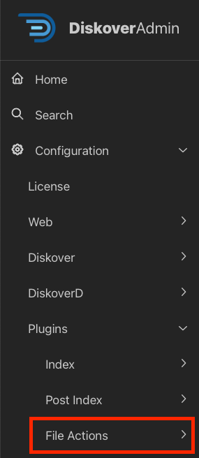

## File Action Plugins Configuration

### Overview

Authorized users, following role-based access controls, can initiate File Actions directly from the Diskover interface, providing a versatile range of use cases.

| Plugins Configurable via DiskoverAdmin | Plugins Manually Configurable |
| --- | --- |
| <ul><li>Many plugins are now configurable directly in the **DiskoverAdmin** panel.</li><li>Help information is available directly within the user interface.</li><li>This section provides additional guidance when applicable.</li></ul>  | <ul><li>Note that a few plugins are still configurable via a terminal.</li><li>[Open a support ticket](https://support.diskoverdata.com/) if you currently use one of these plugins and need to upgrade to v2.3+.</li></ul> |

### Quick Access List

The plugins in this chapter are listed alphabetically. Here is a quick access list by category:

| EDITION |  PLUGIN |
| --- | --- |
| **Core Editions** | <ul><li>[Export](#plugin_file_action_export)</li><li>[Fix Permissions](#plugin_file_action_fix_permissions)</li><li>[Hash Differential](#plugin_file_action_hash_diff)</li><li>[Live View](#plugin_file_action_live_view)</li><li>[Make Links](#plugin_file_action_make_links)</li><li>[Ngenea Data Orchestrator](#plugin_file_action_ngenea)</li><li>[PDF Viewer](#plugin_file_action_pdf_viewer)</li><li>[Rclone Data Mover](#plugin_file_action_rclone)</li><li>[Spectra](#plugin_file_action_spectra)</li><li>[Vcinity High-Speed Data Transfer](#plugin_file_action_vcinity)</li></ul> |
| **Media** | <ul><li>[CineViewer Player](#plugin_file_action_cineviewer)</li><li>[EDL Check](#plugin_file_action_edl_check)</li><li>[EDL Download](#plugin_file_action_edl_download)</li><li>[Find File Sequences](#plugin_file_action_find_file_sequences)</li><li>[GLIM File Action](#plugin_file_action_glim)</li><li>[IMF Change Report](#plugin_file_action_imf_change_report)</li><li>[IMF Validator](#plugin_file_action_imf_validator)</li><li>[Vantage](#plugin_file_action_vantage) </li></ul> |
| **Life Science** | <ul><li>[Grant](#plugin_file_action_grant)</li></ul> |

#### CineViewer Player by CineSys

| HELP | RESOURCE |
| --- | --- |
| Availability |  |
| Enable/Config | Via a terminal 🛟 &nbsp;[Open a support ticket](https://support.diskoverdata.com/) to request assistance with installing this plugin |
| Learn More | [Visit our website](https://diskoverdata.com/products/products-aja-media-edition/#cineviewer) \| [Contact AJA Video Systems](mailto:sales@aja.com) |
| User Guide | [AJA Diskover Media Edition Companion Guide](https://docs.diskoverdata.com/diskover_user_guide_companion_aja_media_edition/#cineviewer-player) |
| Demo | [🍿 Watch Demo Video](https://vimeo.com/765285042?share=copy) |
| Purpose | 
CineViewer is a video playback and management system designed for video and broadcast professionals. It is designed to securely view high-resolution media from a remote browser without giving users access to the source files, as well as play content that may not be supported by standard web browsers, including file formats such as ProRes and MXF. Additionally, Cineviewer allows users to play back image sequences in formats such as DPX and EXR. The player can be launched in one click from the AJA Diskover Media Edition user interface, allowing for seamless validation of media assets, therefore increasing productivity while safeguarding your production network.

With its timecode-accurate playback and seeking capabilities, CineViewer enables users to navigate through content with precision. The system also supports up to 16 channels of audio, providing a variety of audio configuration options to accommodate different projects. Furthermore, Cineviewer includes closed captioning functionality, ensuring an accessible experience for all users.

The following sections will guide you through the installation and configuration of CineViewer, helping you utilize this tool effectively for your video and broadcast needs.

The CineViewer Player is developed by [CineSys LLC](https://cinesys.io/), a major technological and channel partner working with both Diskover Data and [AJA Video Systems](https://www.aja.com/). For more information, support, or to purchase the CineViewer Player, please contact [CineSys.io](https://cinesys.io/contact-us/).
 |

#### EDL Check

| HELP | RESOURCE |
| --- | --- |
| Availability |  |
| Enable/Config | Via the DiskoverAdmin panel |
| Learn More | [Contact AJA Video Systems](mailto:sales@aja.com) |
| Purpose | Allows authorized users without read/write access to production storage to verify the validity of EDL (Edit Decision List) files. |

#### EDL Download

| HELP | RESOURCE |
| --- | --- |
| Availability |  |
| Enable/Config | Via the DiskoverAdmin panel |
| Learn More | [Contact AJA Video Systems](mailto:sales@aja.com) |
| Purpose | Allows authorized users without read/write access to production storage to upload or download specific lists of pre-defined file types and sizes, eliminating the need for data management group involvement. |

#### Export

| HELP | RESOURCE |
| --- | --- |
| Availability | &nbsp;&nbsp;&nbsp;&nbsp; |
| Enable/Config | Via the DiskoverAdmin panel |
| Learn More | [Contact Diskover](mailto:sales@diskoverdata.com) |
| Purpose | Allows authorized users to preview and create a formatted CSV file, enabling integration with other applications that monitor and trigger workflows based on the file's arrival. |

#### Find File Sequences

| HELP | RESOURCE |
| --- | --- |
| Availability |  |
| Enable/Config | Via a terminal 🛟 &nbsp;[Open a support ticket](https://support.diskoverdata.com/) to request assistance with installing this plugin |
| Learn More | [Visit our website](https://diskoverdata.com/products/products-aja-media-edition/#file-sequences) \| [Contact AJA Video Systems](mailto:sales@aja.com) |
| User Guide | [AJA Diskover Media Edition Companion Guide](https://docs.diskoverdata.com/diskover_user_guide_companion_aja_media_edition/#find-file-sequences) |
| Purpose | The File Sequence web plugin File Action is designed to list out any file sequences in a directory or from a single file in a sequence. File sequences are printed out with `%08d` to show the 0 padding and number of digits in the sequence. Each sequence, whole or broken, is put into a [ ] list.  |

#### Fix Permissions

| HELP | RESOURCE |
| --- | --- |
| Availability | &nbsp;&nbsp;&nbsp;&nbsp; |
| Enable/Config | Via the DiskoverAdmin panel |
| Learn More | [Contact Diskover](mailto:sales@diskoverdata.com) |
| Purpose | Enables authorized users to change the Unix permissions of selected files or folders to a configured value. |

#### GLIM | File Action Plugin

| HELP | RESOURCE |
| --- | --- |
| Availability |  |
| Enable/Config | Via a terminal 🛟 &nbsp;[Open a support ticket](https://support.diskoverdata.com/) to request assistance with installing this plugin |
| Learn More | [Visit our website](https://diskoverdata.com/products/products-aja-media-edition/#glim) \| [Contact AJA Video Systems](mailto:sales@aja.com) |
| User Guide | [AJA Diskover Media Edition Companion Guide](https://docs.diskoverdata.com/diskover_user_guide_companion_aja_media_edition/#glim-previewvalidate-media-files) |
| Demo | [🍿 Watch Demo Video](https://vimeo.com/665037937) |
| Purpose | This plugin results in a seamless integration with GLIM, allowing end-users to safely view and validate media files while safeguarding your source assets and production network. Diskover allows users to do advanced searches of media assets and then launch GLIM in one click via our File Actions. You need to have a GLIM account and be logged in previously to launch the GLIM preview plugin within Diskover. |

#### Grant Research

| HELP | RESOURCE |
| --- | --- |
| Availability |  |
| Enable/Config | Via a terminal 🛟 &nbsp;[Open a support ticket](https://support.diskoverdata.com/) to request assistance with installing this plugin |
| Learn More | [Visit our website](https://diskoverdata.com/products/life-science-edition/#grant-plugin) \| [Contact Diskover](mailto:sales@diskoverdata.com) |
| Purpose | 
The Grant Plugin has a dual purpose 1) assisting research institutes in managing their grants/members/storage costs internally, and 2) fulfilling the requirements for the new NIH DMS Policy.

The Grant Plugin collects and parses grants’ metadata (grant number, group ID, etc.) to curated datasets. In turn, staff associated with a specific grant has visibility/searchability of their limited data/grant without access to the source files or other grants. That extra metadata is also available to use for further workflow automation if needed.
 _[Click here for a full-screen view of this image.](images/diagram_diskover_plugin_grant.png)_ |

#### Hash Differential Checksums

| HELP | RESOURCE |
| --- | --- |
| Availability | &nbsp;&nbsp;&nbsp;&nbsp;&nbsp;&nbsp; |
| Enable/Config | Via a terminal 🛟 &nbsp;[Open a support ticket](https://support.diskoverdata.com/) to request assistance with installing this plugin |
| Learn More | [Contact Diskover](mailto:sales@diskoverdata.com) |
| Demo | [🍿 Watch Demo Video](https://vimeo.com/828166808) |
| Purpose | Designed for precise data movement monitoring, the plugin checksums xxhash, md5, sha1, and sha256 hash values between the original file and the resulting file once it reaches its transfer destination, catching any possible file corruption in the process. The plugin alerts on areas where the file checksum of the source location does not match the file checksum of the destination location, which would then require a retransfer of these suspect files. A manifest is generated to provide insurance upon completion that all files arrived uncorrupted. |

#### IMF Change Report

| HELP | RESOURCE |
| --- | --- |
| Availability |  |
| Enable/Config | Via the DiskoverAdmin panel |
| Learn More | [Contact AJA Video Systems](mailto:sales@aja.com) |
| Purpose | Generates a list of IMF image changes in both human-readable format and machine-readable EDL, referencing the updated media. |

#### IMF Package Validator by Oxagile 

| HELP | RESOURCE |
| --- | --- |
| Availability |  |
| Enable/Config | Via a terminal 🛟 &nbsp;[Open a support ticket](https://support.diskoverdata.com/) to request assistance with installing this plugin |
| Learn More | [Visit our website](https://diskoverdata.com/products/products-aja-media-edition/#imf-package-validator) \| [Contact AJA Video Systems](mailto:sales@aja.com) |
| User Guide | [AJA Diskover Media Edition Companion Guide](https://docs.diskoverdata.com/diskover_user_guide_companion_aja_media_edition/#imf-package-validator) |
| Demo | [🍿 Watch Demo Video](https://vimeo.com/828166808) |
| Purpose | 
The IMF package validator plugin allows organizations to validate IMF packages before delivery from a remote platform, saving immense amounts of man-hours over the course of a business year.

Oxagile’s IMF Package Validator Plugin, exclusively designed for the AJA Diskover Media Edition, allows users to scan and validate IMF packages before delivery from any location, regardless of the location of the IMF package data.

IMF stands for Interoperable Master Format, which is a technical standard used in the Media and Entertainment industry for the exchange of digital content between different platforms and systems. The IMF format is used by content creators, distributors, and broadcasters to deliver high-quality video content to a variety of devices, including TVs, mobile devices, and web browsers.

Netflix, for example, requires all their content to be delivered in IMF format, which undergoes rigorous validation to ensure compliance with industry standards. The validation process involves extensive testing of the content's video, audio, and metadata to ensure that it meets the technical specifications and can be delivered to viewers in the highest quality possible.

Once the content has been validated, it is then encoded into various formats, including 4K and HDR, and made available for streaming on various platforms. The IMF validation process is a critical step in the content delivery pipeline.
 |

#### Live View

| HELP | RESOURCE |
| --- | --- |
| Availability | &nbsp;&nbsp;&nbsp;&nbsp;&nbsp;&nbsp; |
| Enable/Config | Via the DiskoverAdmin panel |
| Learn More | [Contact Diskover](mailto:sales@diskoverdata.com) |
| Purpose | Provides authorized users with a live view of a filesystem between scanning intervals in real-time, without giving access to the source files. |

#### Make Links

| HELP | RESOURCE |
| --- | --- |
| Availability | &nbsp;&nbsp;&nbsp;&nbsp; |
| Enable/Config | Via the DiskoverAdmin panel |
| Learn More | [Contact Diskover](mailto:sales@diskoverdata.com) |
| Purpose | Allows authorized users to create symlinks and hard links for selected files and directories. |

#### Ngenea Data Orchestrator by PixitMedia

| HELP | RESOURCE |
| --- | --- |
| Availability | &nbsp;&nbsp; |
| Enable/Config | Via a terminal 🛟 &nbsp;[Open a support ticket](https://support.diskoverdata.com/) to request assistance with installing this plugin |
| Learn More | Download this [Solution Brief](https://diskoverdata.com/wp-content/uploads/2024/08/diskover_pixitmedia_ngenea_solution_brief.pdf) \| [contact Diskover](mailto:sales@diskoverdata.com) |
| Demo | [🍿 Watch Demo Video](https://vimeo.com/833500176?share=copy) |
| Purpose | With the Ngenea Data Orchestrator File Action, authorized users can quickly and securely transport data, directly from the Diskover UI, to and from globally distributed cloud, object storage, traditional NAS files, and tape resources, automatically moving data into the ‘right cost’ resource according to value and usage as your work teams and business needs demand. |

#### PDF Viewer

| HELP | RESOURCE |
| --- | --- |
| Availability | &nbsp;&nbsp;&nbsp;&nbsp; |
| Enable/Config | Via the DiskoverAdmin panel |
| Learn More | [Contact Diskover](mailto:sales@diskoverdata.com) |
| Purpose | Enables authorized users to view and validate PDF files without accessing the source files. |

#### Rclone

| HELP | RESOURCE |
| --- | --- |
| Availability | &nbsp;&nbsp; |
| Enable/Config | Via the DiskoverAdmin panel |
| Learn More | [Contact Diskover](mailto:sales@diskoverdata.com) |
| Purpose | Provides authorized users the framework for data movement based on pre-configured source and destination profiles. |

#### Spectra

| HELP | RESOURCE |
| --- | --- |
| Availability | &nbsp;&nbsp;&nbsp;&nbsp; |
| Enable/Config | Via the DiskoverAdmin panel |
| Learn More | [Contact Diskover](mailto:sales@diskoverdata.com) |
| Purpose | On-demand menu option that queries the Spectra API to verify additional status, such as whether the desired tape is in the library or on the shelf. |

#### Vantage

| HELP | RESOURCE |
| --- | --- |
| Availability |  |
| Enable/Config | Via the DiskoverAdmin panel |
| Learn More | [Visit our website](https://diskoverdata.com/products/products-aja-media-edition/#vantage) \| [Contact AJA Video Systems](mailto:sales@aja.com) |
| User Guide | [AJA Diskover Media Edition Companion Guide](https://docs.diskoverdata.com/diskover_user_guide_companion_aja_media_edition/#vantage-submit-transcoding-jobs-directly-from-diskover) |
| Demo | [🍿 Watch Demo Video](https://vimeo.com/669672933) |
| Purpose | Enables authorized users to submit media workflow job processing to Telestream Vantage directly from the Diskover user interface. |

#### Vcinity High-Speed Data Transfer

| HELP | RESOURCE |
| --- | --- |
| Availability | &nbsp;&nbsp; |
| Enable/Config | Via a terminal 🛟 &nbsp;[Open a support ticket](https://support.diskoverdata.com/) to request assistance with installing this plugin |
| Learn More | Download this [Solution Brief](https://diskoverdata.com/wp-content/uploads/2024/05/Diskover_Data_SB.pdf) \| [Contact Diskover](mailto:sales@diskoverdata.com) |
| Demo | [🍿 Watch Demo Video](https://youtu.be/l1XZoe-ZtEI) |
| Purpose | 
Regardless of distance and latency, the high-speed data transfer Vcinity Plugin provides the framework for reliable and fast data movement based on pre-configured source and destination profiles.

The plugin can move NFS, SMB, and S3 to any NFS, SMB, and S3 vendor, no matter the brand, ex: Dell, NetApp, HPE, etc.

The Vcinity High-Speed Data Transfer Plugin provides two mechanisms within Diskover to trigger data movement: 1) on-demand user-initiated file action directly from the Diskover interface, and 2) scheduled automated workflow based on file attributes meeting predetermined criteria.
 |

