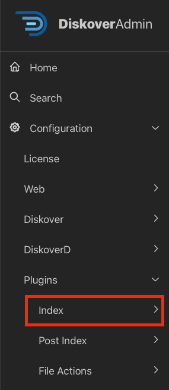

## Index Plugins Configuration

### Overview

Diskover sets the standard in the data management market with its extensive range of metadata harvest plugins, which enrich data with a comprehensive set of business-context attributes.

This extra metadata is an invaluable asset for locating, organizing, and analyzing specific data, as well as for designing workflows tailored to precise data management tasks. To ensure optimal performance and indexing speed, some of these plugins can be executed at time of index or as a post-index task. **This chapter covers plugins that run at time of index.**

| Plugins Configurable via DiskoverAdmin | Plugins Manually Configurable |
| --- | --- |
| <ul><li>Most plugins are now configurable directly in the **DiskoverAdmin** panel.</li><li>Help information is available directly within the user interface.</li><li>This section provides additional guidance when applicable.</li></ul>  | <ul><li>Note that a few plugins are still configurable via a terminal.</li><li>[Open a support ticket](https://support.diskoverdata.com/) if you currently use one of these plugins and need to upgrade to v2.3+.</li></ul> |

### Quick Access List

The plugins in this chapter are listed alphabetically. Here is a quick access list by category:

| EDITION |  PLUGIN |
| --- | --- |
| **Core Editions** | <ul><li>[Checksums](#plugin_index_checksums)</li><li>[File Kind](#plugin_index_file_kind)</li><li>[First Index/Arrival Time](#plugin_index_first_index)</li><li>[Grafana](#plugin_index_grafana)</li><li>[Grafana Cloud](#plugin_index_grafana_cloud)</li><li>[Path Tokens](#plugin_index_path_tokens)</li><li>[Tag Copier](#plugin_index_tag_copier)</li><li>[Unix Perms](#plugin_index_unix_perms)</li><li>[Windows Owner](#plugin_index_windows_owner)</li></ul> |
| **Media** | <ul><li>[Media Info](#plugin_index_mediainfo)</li></ul> |
| **Life Science** | <ul><li>[BAM Index Plugin](#plugin_index_bam)</li></ul> |

#### BAM Info | Index Plugin

| HELP | RESOURCE |
| --- | --- |
| Availability |  |
| Installation | Via terminal. 🛟 &nbsp;[Open a support ticket](https://support.diskoverdata.com/) to request assistance with installing this plugin |
| Learn more | [Visit our website](https://diskoverdata.com/products/life-science-edition/#bam-plugin) \| [Contact Diskover](mailto:sales@diskoverdata.com) |
| User Guide | [Diskover Life Science Edition Companion Guide](https://docs.diskoverdata.com/diskover_user_guide_companion_life_science_edition/#bam-harvest-plugin) |
| Demo | [🍿 Watch Demo Video](https://vimeo.com/678914314?share=copy) |

The BAM info plugin is designed to enable additional metadata collection for BAM (Binary Alignment Map) and SAM (Sequence Alignment Map) about a file without granting the Diskover user any read/write file system access. The BAM info plugin enables additional metadata for the SAM and BAM file formats to be harvested at time of index, and are therefore searchable, reportable, actionable, and can be engaged in workflows within Diskover.

[Learn more about the specification for the SAM file format.](https://samtools.github.io/hts-specs/SAMv1.pdf)

[Learn more about how the BAM info plugin uses the Python **pysam** to harvest attributes about the BAM and SAM files.](https://pysam.readthedocs.io/en/latest/)

New indices will use the plugin, and any SAM or BAM file will get additional info added to the Elasticsearch index’s **bam_info** field. The attributes provide the ability to view storage and file system content from a workflow perspective, for example, all the frame rates on any given storage.

#### Checksums

| HELP | RESOURCE |
| --- | --- |
| Availability | &nbsp;&nbsp;&nbsp;&nbsp;&nbsp;&nbsp;&nbsp;&nbsp; |
| Installation | Via the DiskoverAdmin panel |
| To learn more | [Contact Diskover](mailto:sales@diskoverdata.com) |

Adds xxhash, md5, sha1, and sha256 hash values to files in Elasticsearch indices to use for checksums/data integrity. Hash values are like fingerprints; they are unique to each file. They are the results of a cryptographic algorithm, which is a mathematical equation with different complexity and security levels, used to scramble the plain text and make it unreadable. They are used for data encryption, authentication, and digital signatures.

#### File Kind

| HELP | RESOURCE |
| --- | --- |
| Availability | &nbsp;&nbsp;&nbsp;&nbsp;&nbsp;&nbsp;&nbsp;&nbsp; |
| Installation | Via the DiskoverAdmin panel |
| To learn more | [Contact Diskover](mailto:sales@diskoverdata.com) |

Allows users to categorize file types by groups and adds the extra metadata to the Elasticsearch index during the indexing process, useful for reporting purposes.

#### First Index/Arrival Time

| HELP | RESOURCE |
| --- | --- |
| Availability | &nbsp;&nbsp;&nbsp;&nbsp;&nbsp;&nbsp; |
| Installation | Via the DiskoverAdmin panel |
| To learn more | [Contact Diskover](mailto:sales@diskoverdata.com) |

Triggers the creation of an additional attribute when Diskover first detects a new file in a given location and adds the extra metadata to the Elasticsearch index during the indexing process.

#### Grafana

| HELP | RESOURCE |
| --- | --- |
| Availability | &nbsp;&nbsp;&nbsp;&nbsp;&nbsp;&nbsp; |
| Installation | Via the DiskoverAdmin panel |
| To learn more | [Contact Diskover](mailto:sales@diskoverdata.com) |

Provides the ability to visualize and trend data metrics over time using Grafana. The plugin rolls up summary data and creates Grafana-specific indices within Elasticsearch. These indices use time series @timestamp metrics to separate logstash- indices, indexes directory size, counts up to N dir depths (default 2). Elasticsearch can then use these summary indexes as a data source for viewing these logstash indices from Grafana.

#### Grafana Cloud

| HELP | RESOURCE |
| --- | --- |
| Availability | &nbsp;&nbsp;&nbsp;&nbsp;&nbsp;&nbsp; |
| Installation | Via the DiskoverAdmin panel |
| To learn more | [Contact Diskover](mailto:sales@diskoverdata.com) |

Provides the ability to visualize and trend data metrics over time using Grafana Cloud. The plugin rolls up summary data and creates Grafana-specific indices within Elasticsearch. These indices use time series @timestamp metrics to separate logstash- indices, indexes directory size, counts up to N dir depths (default 2). Elasticsearch can then use these summary indexes as a data source for viewing these logstash indices from Grafana.

#### Media Info

| HELP | RESOURCE |
| --- | --- |
| Availability |  |
| Installation | Via the DiskoverAdmin panel |
| To learn more | [Visit our website](https://diskoverdata.com/products/products-aja-media-edition/#mediainfo) \| [Contact AJA Video Systems](mailto:sales@aja.com) |
| User Guide | [AJA Diskover Media Edition Companion Guide](https://docs.diskoverdata.com/diskover_user_guide_companion_aja_media_edition/#media-info-attributes) |

Adds business context and searchability via additional media file attributes (resolution, codec, pixel format, etc.). The enriched metadata is key for granular analysis, workflow automation, and overall data curation.

#### Path Tokens

| HELP | RESOURCE |
| --- | --- |
| Availability | &nbsp;&nbsp;&nbsp;&nbsp;&nbsp;&nbsp;&nbsp;&nbsp; |
| Installation | Via the DiskoverAdmin panel |
| To learn more | [Contact Diskover](mailto:sales@diskoverdata.com) |

Designed to break down concatenated directory/file names and add the tokenized metadata to the Elasticsearch index during the indexing process.

#### Tag Copier

| HELP | RESOURCE |
| --- | --- |
| Availability | &nbsp;&nbsp;&nbsp;&nbsp;&nbsp;&nbsp; |
| Installation | Via the DiskoverAdmin panel |
| To learn more | [Contact Diskover](mailto:sales@diskoverdata.com) |

Designed to migrate tags from one index to the next. Generally, these tags are applied post index through manual tag application or plugin tag application.

#### Unix Perms

| HELP | RESOURCE |
| --- | --- |
| Availability | &nbsp;&nbsp;&nbsp;&nbsp;&nbsp;&nbsp;&nbsp;&nbsp;&nbsp;&nbsp; |
| Installation | Via the DiskoverAdmin panel |
| To learn more | [Contact Diskover](mailto:sales@diskoverdata.com) |

Adds the Unix permission attributes of each file and directory to the Elasticsearch data catalog during indexing. Two tags are added, unixperms-plugin and ugo+rwx, if a file or directory is found with fully open permissions (777 or 666). 

#### Windows Owner

| HELP | RESOURCE |
| --- | --- |
| Availability | &nbsp;&nbsp;&nbsp;&nbsp;&nbsp;&nbsp;&nbsp;&nbsp;&nbsp;&nbsp; |
| Installation | Via the DiskoverAdmin panel |
| To learn more | [Contact Diskover](mailto:sales@diskoverdata.com) |

Adds the Windows file owner and primary group of each file and directory to the Diskover index at time of indexing. It replaces all docs showing username 0 with the Windows file/directory owner name. 

