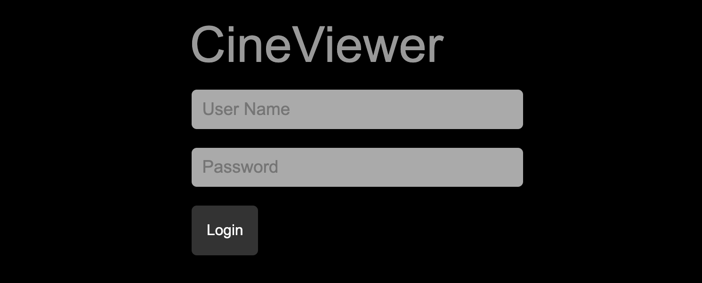
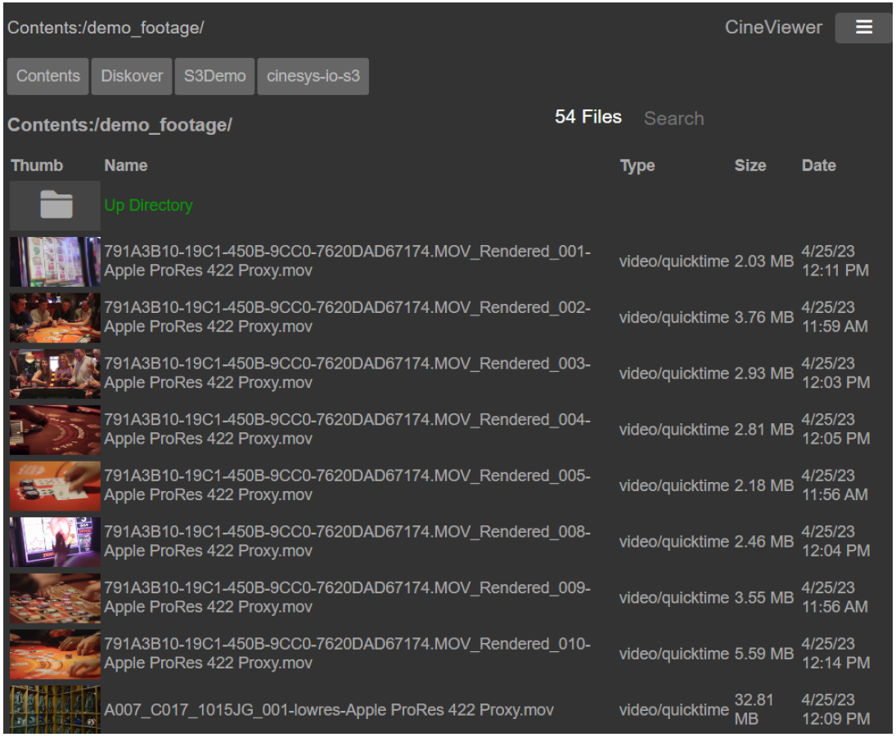
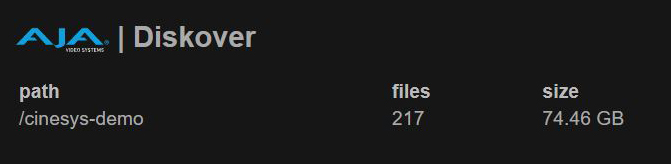

___
## Manual Plugins Configuration
___

### Overview

All plugins will eventually be included in the [**DiskoverAdmin**]() panel, but a few are still only configurable manually.

🟨  &nbsp;**IMPORTANT!** Please [open a support ticket](https://support.diskoverdata.com/) if you currently use one of these plugins and need to upgrade to v2.3+.

The plugins in this chapter are listed alphabetically, but here is a quick access list by category:

| CATEGORY | PLUGIN |
| --- | --- |
| **Core** | <ul><li>[Hash Differential Checksums File Action Plugin](#plugin_hash_diff)</li><li>[Ngenea Data Orchestrator/Mover by PixitMedia File Action Plugin](#plugin_ngenea)</li><li>[Vcinity High-Speed Data Transfer File Action Plugin](#plugin_vcinity)</li></ul> |
| **Media Edition** | <ul><li>[CineViewer Player by CineSys File Action Plugin](#plugin_cineviewer)</li><li>[Find File Sequences File Action Plugin](#plugin_find_file_sequences)</li><li>[Flow Production Tracking (formerly ShotGrid) Index Plugin](#plugin_shotgrid)</li><li>[IMF Package Validator by Oxagile File Action Plugin](#plugin_imf_validator)</li><li>[Telestream GLIM File Action Plugin](#plugin_glim)</li><li>[Xytech Asset Creation Index Plugin](#xytech_asset_creation)</li><li>[Xytech Order Status Index Plugin](#xytech_asset_creation)</li></ul> |
| **Life Science Edition** | <ul><li>[BAM Info Index Plugin](#plugin_bam)</li><li>[Research Grant File Action Plugin](#plugin_grant)</li></ul> |


<p id="plugin_bam"></p>

___
### BAM Info | Index Plugin

| HELP | RESOURCE |
| --- | --- |
| Availability |  |
| To upgrade | If you need to upgrade this plugin to the latest version, please [open a support ticket](https://support.diskoverdata.com/) |
| To learn more | [Visit our website](https://diskoverdata.com/products/life-science-edition/#bam-plugin) and/or [contact Diskover](mailto:sales@diskoverdata.com) |
| User Guide | [Diskover Life Science Edition Companion Guide](https://docs.diskoverdata.com/diskover_user_guide_companion_life_science_edition/#bam-harvest-plugin) |
| Demo | [🍿 Watch Demo Video](https://vimeo.com/678914314?share=copy) |

#### Overview

<details>

<summary>📂 Open plugin overview details.</summary>

The BAM info plugin is designed to enable additional metadata collection for BAM (Binary Alignment Map) and SAM (Sequence Alignment Map) about a file without granting the Diskover user any read/write file system access. The BAM info plugin enables additional metadata for the SAM and BAM file formats to be harvested at time of index, and are therefore searchable, reportable, actionable, and can be engaged in workflows within Diskover.

- The specification for the SAM file format can be found here:
  [https://samtools.github.io/hts-specs/SAMv1.pdf](https://samtools.github.io/hts-specs/SAMv1.pdf)
- The BAM info plugin uses the Python **pysam** to harvest attributes about the BAM and SAM files:
  [https://pysam.readthedocs.io/en/latest/](https://pysam.readthedocs.io/en/latest/)

New indices will use the plugin, and any SAM or BAM file will get additional info added to the Elasticsearch index’s **bam_info** field. The attributes provide the ability to view storage and file system content from a workflow perspective, for example, all the frame rates on any given storage.


_[Click here for a full-screen view of this image.](images/diagram_diskover_plugin_bam.png)_

#### BAM Info Fields in Diskover-Web

Please refer to the [Diskover User Guide Companion | Life Science Edition](https://docs.diskoverdata.com/diskover_user_guide_companion_life_science_edition/) for more details, including how to search using the BAM info fields.

The BAM info attributes in Diskover-Web:
```
bam_info.co_cmd:
bam_info.co_cmd_checksum:
bam_info.co.key:
bam_info.co.value:
bam_info.pg.id:
bam_info.pg.vn:
```


</details>

<p id=“plugin_cineviewer”></p>

___
### CineViewer Player by CineSys | File Action Plugin

| HELP | RESOURCE |
| --- | --- |
| Availability |  |
| To upgrade | If you need to upgrade this plugin to the latest version, please [open a support ticket](https://support.diskoverdata.com/) |
| To learn more | [Visit our website](https://diskoverdata.com/products/products-aja-media-edition/#cineviewer) and/or [contact AJA Video Systems](mailto:sales@aja.com) |
| User Guide | [AJA Diskover Media Edition Companion Guide](https://docs.diskoverdata.com/diskover_user_guide_companion_aja_media_edition/#cineviewer-player) |
| Demo | [🍿 Watch Demo Video](https://vimeo.com/765285042?share=copy) |

#### Overview

CineViewer is a video playback and management system designed for video and broadcast professionals. It is designed to securely view high-resolution media from a remote browser, without giving users access to the source files, as well as play content that may not be supported by standard web browsers, including file formats such as ProRes and MXF. Additionally, Cineviewer allows users to play back image sequences in formats such as DPX and EXR. The player can be launched in one click from the AJA Diskover Media Edition user interface, allowing for seamless validation of media assets, therefore increasing productivity, while safeguarding your production network.

With its timecode-accurate playback and seeking capabilities, CineViewer enables users to navigate through content with precision. The system also supports up to 16 channels of audio, providing a variety of audio configuration options to accommodate different projects. Furthermore, Cineviewer includes closed captioning functionality, ensuring an accessible experience for all users.

The following sections will guide you through the installation and configuration of CineViewer, helping you utilize this tool effectively for your video and broadcast needs.

The CineViewer Player is developed by [CineSys LLC](https://cinesys.io/), a major technological and channel partner working with both Diskover Data and [AJA Video Systems](https://www.aja.com/). For more information, support, or to purchase the CineViewer Player, please contact [CineSys.io](https://cinesys.io/contact-us/).


#### Supported Files & Systems

**Platforms:** CentOS 7x, other distro’s to follow (AWS EC2s, Mac, Windows, etc.)

**Browsers:** Chrome, Safari, Firefox

**File Formats:** The video player uses FFMPEG under the hood for real-time transcoding of creative content. CineViewer supports a wide range of file types and codecs including Animation, AVC-Intra, AVI, Cineform, DNxHD, DNxHR, DV, DVCPPRO HD, H.264, HEVC/H.265, IMX, MKV, MOV/QT, MP4/M4V, MPEG/M2V/MPG, TS, MPEG-2, MXF, OGG, ProRes, OGG, ProRes, VP-8, VP-9, WebM

#### CineViewer Installation Instructions

<details>

<summary>📂 Open for detailed instructions - may vary depending on your environment.</summary>
  
#### Linux Installation

CineViewer runs best on Centos 7 Linux.

🔴 &nbsp;Untar the distribution:

```
tar xf cineviewer_dev_20230410-4.tgz
```

🔴 &nbsp;Run the install script:

```
$ cd cineviewer_dev_20230410/

$ sudo ./install

Cineviewer cineviewer_dev_20230410-4 Installer

Install Destination [/opt/cinesys/cineviewer]

Directory /opt/cinesys/cineviewer/releases exists.

Created directory /opt/cinesys/cineviewer/releases/cineviewer_dev_20230410-4
Copying directory . to /opt/cinesys/cineviewer/releases/cineviewer_dev_20230410-4
Linking /opt/cinesys/cineviewer/app to /opt/cinesys/cineviewer/releases/cineviewer_dev_20230410-4

Write systemd startup script ? [y/n] y
Writing systemd startup script /etc/systemd/system/cineviewer.service
usage: systemctl [start,stop,status,restart] cineviewer
Restarting cineviewer
restarting cineviewer

To start stop cineviewer use the systemctl command.
sudo systemctl [start,stop,restart,status] cineviewer

Version cineviewer_dev_20230410-4 installed successfully.
Default url is http://localhost:3000
```

🔴 &nbsp;At this point you should be able to browse to the CineViewer page.

#### License Key Request and Installation

When CineViewer is first installed or the license expires you will see the license key page appear.


🔴 &nbsp;To get a license key start by clicking the **Request License Key** button and fill out the required fields.


🔴 &nbsp;After clicking the **Request License** button you should the screen below.


🔴 &nbsp;The license key will be emailed to the address you entered in the previous step. Click **Enter License Key** and paste all the lines including **====BEGIN LICENSE KEY====** and **====END LICENSE KEY====** as shown in this example. Click **Update License**:


🔴 &nbsp;CineViewer should reload the page and be operational.

#### Command Line Key Management

You can also edit the license file directly. 

🔴 &nbsp;Locate the keyfile at the install directory, by default:

```
/opt/cinesys/cineviewer/license.dat
```

🔴 &nbsp;Edit the file using `nano` or `vi…` after saving the file, you may need to restart Cinevieiwer using the following command:

```
sudo systemctl restart cineviewer
```

#### Command Line Process Management

Linux with systemctl.

🔴 &nbsp;To get application status:

```
systemctrl status cineviewer
```

🔴 &nbsp;To restart the application:

```
systemctrl restart cineviewer
```

🔴 &nbsp;To stop the application:

```
systemctrl stop cineviewer
```

🔴 &nbsp;To see logs in while the app is running:

```
journalctl --lines 0 --follow _SYSTEMD_UNIT=cineviewer.service
```

#### Configuration

CineViewer has two configuration files to control the app. The first is the app default configuration, usually `/opt/cinesys/cineveiwer/app/configure-default.json` which contains all the default values for the app.

The other configuration file, usually `/opt/cinesys/cineveiwer/configure.json` contains the changes specific to the installation.

🔴 &nbsp;A `configure.json` only needs to assign values that are different from the defaults. For example, the configure file to change the port used:

```
{ 
    "app": { 
        "port": "3001"
    }
}
```

🔴 &nbsp;A quick overview of some of the settings:

| SETTING | PURPOSE |
| --- | --- |
| **transcode** | For switching out transcoders ffmpeg or ffprobe |
| **cineplay** | For controlling the cache location |
| **toast** | For adding file mounts and access |

#### User Configuration | Login Credentials

By default, CineViewer is not login protected. To enable basic logins a users' config setting can be added. Note the app can also make use of the Active Directory module to enable logins at larger facilities.

```
"users": {
    "users": [
         { "name":"admin", "groups":["admin"], "pass":"******" },
         { "name":"guest", "groups":["staff"], "pass":"******" }
    ]
}
```

🔴 &nbsp;Once the user config settings are added, users will be prompted to enter their login credentials.



#### Transcoding Settings

🔴 &nbsp;By default, Cineviewer uses `ffmpeg` to do most transcoding. The paths can se modified to `ffprobe` using the transcode settings:

```
"transcode": {
    "ffmpeg":"./bin/ffmpeg/ffmpeg",
    "ffprobe":"./bin/ffmpeg/ffprobe"
}
```

#### Player Cache

```
"cineplay": {
    "cache": "./cache",
    "cache_expire": "120"
},
```

#### File Mounts

```
"toast": {
    "sortable": ["dpx", "exr"],
    "find_max_files": "2048",
    "mounts": [
    {
        "type":"fs",
        "prefix":"Diskover:",
        "name":"Diskover",
        "path": "/"
    }
   ]
}
```

#### Modes of Operation

Cineviewer has basically two modes of operation, the **file browser** and the **viewer**.

##### Using the File Browser

One of Cineviewer's biggest strengths is its file system abstraction layer called **Toast**. Toast allows the app to treat files on the local file system the same as files on S3 or even in an asset management system such as Portal or Iconik. Toast directories are configured via the `toast.mounts` configuration.



##### Configuring Different Types of File System

All file system mounts have 3 common fields:

| FIELD | PURPOSE |
| --- | --- |
| **type** | File system type |
| **prefix** | Prefix shown on the Path |
| **name** | Name shown on the navigation button |

##### File System Mounts

To make files on a standard operating system available use the **FS mount**. The FS mount uses the field **path** to point toward the desired directory.

```
"toast": {
    "mounts": [
    {
        "type":"fs",
        "prefix":"Production:",
        "name":"Production",
        "path": "/mnt/production"
    },
    {
        "type":"fs",
        "prefix":"Records:",
        "name":"Record",
        "path": "/mnt/records"
    },
 }
```

##### AWS S3 Mounts

```
    {
         "type":"s3",
         "prefix":"S3:",
         "name":"cinesys-io-s3",
         "path": "cinesys-io-s3",
         "bucket": "cinesys-io",
         "path": "support",
         "region": "us-east-1",
         "key": "XXXXXXXXXXXXXXXXXXXXXXXXXXXX",
         "secret": "XXXXXXXXXXXXXXXXXXXXXXXXXXXXXXXXXXXXXXXXX"
    },
   ]
}
```

#### Navigating and Finding Content

- You can click on a directory to change to that directory.
- Clicking on a media file will open the viewer. 
- You can sort the current directory by clicking on the headers above the file list, clicking twice will reverse the order. 
- On the right side, there is a **Search** field where you can search from the current directory. 
- To go back up a directory you can click the **Up Directory** button in the file list or click on the **Path** text in the upper left corner of the app.

One great feature of Cineviewer is that when you move through directories or view content, the browser URL updates to link to that directory or content. This way simply copying the URL allows you to share a particular directory, video, or even a single frame of content.


#### Diskover Module for CineViewer

The Diskover File Action Plugin Module for Cineviewer allows you to open files or directories seamlessly from the Diskover user interface. Inside Cineviewer the user can also take advantage of Diskover high-speed indexed search.

##### Installing CineViewer Plugin for Diskover

This plugin adds **open in CineViewer** to the **File Action** menu in Diskover.

🔴 &nbsp;Copy `cineviewer.php` to the `/var/www/diskover-web/public/fileactions` directory

```
<div style='overflow:wrap;'>
<pre style='overflow:wrap;'>
     sudo cp /opt/cinesys/cineviewer/app/modules/diskover/diskover_install/cineviewer.php /var/www/diskover-web/public/fileactions
     sudo chown nginx  /var/www/diskover-web/public/fileactions/cineviewer.php
</pre>
</div>
```

🔴 &nbsp;Depending on your web setup you may need to edit `cineviewer.php` and adjust the following line:

```
    $cineviewer_host = "http://" + $_SERVER['HTTP_HOST'] + ":3000";
```

🔴 &nbsp;Edit the Diskover `Constants.php` file and add a file action:

```
    sudo vi /var/www/diskover-web/src/diskover/Constants.php
```

🔴 &nbsp;Add **File Actions**:

```
       const FILE_ACTIONS = [
        'open in CineViewer' => [
            'webpage' => 'cineviewer.php',
            'allowed_users' => [Constants::ADMIN_USER, Constants::USER],
            'allowed_ldap_groups' => ['diskover-admins', 'diskover-powerusers', 'diskover-users'],
            'menu_icon_class' => 'far fa-file-image'
           ]
       ];
```

🔴 &nbsp;Test the installation by finding a file in Diskover and using the **open in CineViewer** under the **File Action** menu.

##### Diskover Module Settings

The Diskover module option has multiple settings. The most important is the `diskover_url`.

```
"diskover": {
        "login":   false,
        "strict":   true,
        "path":    "/var/www/diskover-web",
        "sessdir": "/var/lib/php/session",
        "self_url": "https://diskover-demo.cinesys.io/cineplayer/",
        "diskover_url": "https://diskover-demo.cinesys.io/",
        "search_url": "https://diskover-demo.cinesys.io/searchjson.php",
        "login_page":   "https://diskover-demo.cinesys.io/login.php"
}
```

#####  Installing the Diskover Search Feature for CineViewer

This config change for CineViewer will allow you to search Diskover from Cineviewer. 

🔴 &nbsp;Edit your CineViewer configuration file `/opt/cinesys/cineviewer/configure.json` and make sure there is a setting for `diskover_url` that points
to your local `diskover`:

```
    sudo vi /opt/cinesys/cineviewer/configure.json

    "diskover": {
        "diskover_url": "http://127.0.0.1/"
    }
```

##### Searching Diskover Within CineViewer

🔴 &nbsp;After restarting CineViewer, your mounts/paths should appear:



🔴 &nbsp;Click on a volume to open the search tools, then click on a search result to load into CineViewer:


<p id=“plugin_find_file_sequences”></p>

</details>

___
### Find File Sequences | File Action Plugin

| HELP | RESOURCE |
| --- | --- |
| Availability |  |
| To upgrade | If you need to upgrade this plugin to the latest version, please [open a support ticket](https://support.diskoverdata.com/) |
| To learn more | [Visit our website](https://diskoverdata.com/products/products-aja-media-edition/#file-sequences) and/or [contact Diskover](mailto:sales@diskoverdata.com) |
| User Guide | [AJA Diskover Media Edition Companion Guide](https://docs.diskoverdata.com/diskover_user_guide_companion_aja_media_edition/#find-file-sequences) |

The File Sequence web plugin File Action is designed to list out any file sequences in a directory or from a single file in a sequence. File sequences are printed out with `%08d` to show the 0 padding and number of digits in the sequence. Each sequence, whole or broken, are put into a [ ] list. [Learn more about this plugin](https://docs.diskoverdata.com/diskover_user_guide_companion_aja_media_edition/#find-file-sequences).


<p id="plugin_shotgrid"></p>

___
### Flow Production Tracking (formerly ShotGrid) | Index Plugin

| HELP | RESOURCE |
| --- | --- |
| Availability |  |
| To upgrade | If you need to upgrade this plugin to the latest version, please [open a support ticket](https://support.diskoverdata.com/) |
| To learn more | [Visit our website](https://diskoverdata.com/products/products-aja-media-edition/#flowprodtracking) and/or [contact AJA Video Systems](mailto:sales@aja.com) |
| User Guide | [AJA Diskover Media Edition Companion Guide](https://docs.diskoverdata.com/diskover_user_guide_companion_aja_media_edition/#flow-production-tracking-plugin) |

Designed to enhance basic metadata with detailed production status information, aligning data management with production schedules. The Diskover Flow Production Tracking Plugin harvests additional attributes from the [Autodesk Flow Production Tracking platform](https://www.autodesk.com/products/flow-production-tracking/) for every shot directory located on storage. These attributes become properties of the shot directories and include status information such as finaled, out-of-picture, multiple project tracking dates, and many more, totaling around one hundred indexable fields. Note that users can opt to only index the fields that are relevant to their business.
<p id=“plugin_grant”></p>

___
### Grant Research | File Action Plugin

| HELP | RESOURCE |
| --- | --- |
| Availability |  |
| To upgrade | If you need to upgrade this plugin to the latest version, please [open a support ticket](https://support.diskoverdata.com/) |
| To learn more | [Visit our website](https://diskoverdata.com/products/life-science-edition/#grant-plugin) and/or [contact Diskover](mailto:sales@diskoverdata.com) |

The Grant Plugin has a dual purpose 1) assisting research institutes in managing their grants/members/storage costs internally, and 2) fulfilling the requirements for the new NIH DMS Policy.

The Grant Plugin collects and parses grants’ metadata (grant number, group ID, etc.) to curated datasets. In turn, staff associated with a specific grant has visibility/searchability of their limited data/grant without access to the source files or other grants. That extra metadata is also available to use for further workflow automation if needed.


_[Click here for a full-screen view of this image.](images/diagram_diskover_plugin_grant.png.png)_

<p id=“plugin_hash_diff”></p>

___
### Hash Differential Checksums | File Action Plugin

| HELP | RESOURCE |
| --- | --- |
| Availability |  |
| To upgrade | If you need to upgrade this plugin to the latest version, please [open a support ticket](https://support.diskoverdata.com/) |
| To learn more | [Visit our website](https://diskoverdata.com/products/plugins/#data-integrity) and/or [contact Diskover](mailto:sales@diskoverdata.com) |
| Demo | [🍿 Watch Demo Video](https://vimeo.com/768967081) |

The Xytech Media Operations Platform order status plugin is designed to automate the correlation of the order management system and the storage system, by harvesting key business context from Xytech and applying that context within the AJA Diskover Media Edition. In turn, this business context metadata can be used to automate workflows, curate data, monitor costs, create highly customized reports, and search granularly.

Facilities often manually correlate the order management system with the storage repositories. However, manual processes are subject to human errors and difficult to scale as the volume of media orders and data turnover increases constantly.

Therefore, the lack of integration for file-based workflows between the order management system and the underlying storage repositories, makes data management decisions difficult as they are solely based on attributes of files or objects on storage. Additional business context is needed from the order management system to increase precision and accuracy of data management decisions.

An instance of key information might be the invoice date for a work order. A status change for a work order can be aa key indicator for data management, for example, once a Xytech media order has been “invoiced”, then the data associated with that media order can be a candidate for archival.


<p id=“plugin_imf_validator”></p>

___
### IMF Package Validator by Oxagile | File Action Plugin

| HELP | RESOURCE |
| --- | --- |
| Availability |  |
| To upgrade | If you need to upgrade this plugin to the latest version, please [open a support ticket](https://support.diskoverdata.com/) |
| To learn more | [Visit our website](https://diskoverdata.com/products/products-aja-media-edition/#imf-package-validator) and/or [contact Oxagile](mailto:IMF@Oxagile.com) |
| User Guide | [AJA Diskover Media Edition Companion Guide](https://docs.diskoverdata.com/diskover_user_guide_companion_aja_media_edition/#imf-package-validator) |
| Demo | [🍿 Watch Demo Video](https://vimeo.com/828166808) |

#### Overview

The IMF package validator plugin allows organizations to validate IMF packages before delivery from a remote platform, saving immense amounts of man-hours over the course of a business year.

Oxagile’s IMF Package Validator Plugin, exclusively designed for the AJA Diskover Media Edition, allows users to scan and validate IMF packages before delivery from any location, regardless of the location of the IMF package data.

IMF stands for Interoperable Master Format, which is a technical standard used in the Media and Entertainment industry for the exchange of digital content between different platforms and systems. The IMF format is used by content creators, distributors, and broadcasters to deliver high-quality video content to a variety of devices, including TVs, mobile devices, and web browsers.

Netflix, for example, requires all their content to be delivered in IMF format, which undergoes rigorous validation to ensure compliance with industry standards. The validation process involves extensive testing of the content's video, audio, and metadata to ensure that it meets the technical specifications and can be delivered to viewers in the highest quality possible.

Once the content has been validated, it is then encoded into various formats, including 4K and HDR, and made available for streaming on various platforms. The IMF validation process is a critical step in the content delivery pipeline.

#### Trial and Purchase of the plugin

The IMF Package Validator plugin is developed and sold exclusively by [Oxagile](https://www.oxagile.com/), a major technological partner working with both Diskover Data and [AJA Video Systems](https://www.aja.com/). For more information, to start a 30 day trial, or to purchase the IMF Package Validator plugin, please contact [Oxagile](mailto:IMF@Oxagile.com).

#### Functional Limitations

The following are the limitations of the current plugin version:

1.	Verification capabilities are limited with those of the latest version of Netflix Photon tool.
2.	Validation by schedule is not supported.
3.	Cloud storage is not supported.
4.	Archives are not supported.
5.	DCP packages are not supported.

<p id=“plugin_ngenea”></p>

___
### Ngenea Data Orchestrator by PixitMedia | File Action Plugin

| HELP | RESOURCE |
| --- | --- |
| Availability | &nbsp;&nbsp;&nbsp;&nbsp;&nbsp;&nbsp; |
| To upgrade | If you need to upgrade this plugin to the latest version, please [open a support ticket](https://support.diskoverdata.com/) |
| To learn more | Download this [Solution Brief](https://diskoverdata.com/wp-content/uploads/2024/08/diskover_pixitmedia_ngenea_solution_brief.pdf) and/or [contact Diskover](mailto:sales@diskoverdata.com) |
| Demo | [🍿 Watch Demo Video](https://vimeo.com/833500176?share=copy) |

With the Ngenea Data Orchestrator File Action, authorized users can quickly and securely transport data, directly from the Diskover UI, to and from globally distributed cloud, object storage, traditional NAS files, and tape resources, automatically moving data into the ‘right cost’ resource according to value and usage as your work teams and business needs demand.

<p id=“plugin_vcinity”></p>

___
### Vcinity High-Speed Data Transfer | File Action Plugin

| HELP | RESOURCE |
| --- | --- |
| Availability | &nbsp;&nbsp;&nbsp;&nbsp;&nbsp;&nbsp; |
| To upgrade | If you need to upgrade this plugin to the latest version, please [open a support ticket](https://support.diskoverdata.com/) |
| To learn more | Download this [Solution Brief](https://diskoverdata.com/wp-content/uploads/2024/05/Diskover_Data_SB.pdf) and/or [contact Diskover](mailto:sales@diskoverdata.com) |
| Demo | [🍿 Watch Demo Video](https://youtu.be/l1XZoe-ZtEI) |

Regardless of distance and latency, the high-speed data transfer Vcinity Plugin provides the framework for reliable and fast data movement based on pre-configured source and destination profiles. 

The plugin can move NFS, SMB, and S3 to any NFS, SMB, and S3 vendor, no matter the brand, ex: Dell, NetApp, HPE, etc.

The Vcinity High-Speed Data Transfer Plugin provides two mechanisms within Diskover to trigger data movement: 1) on-demand user-initiated file action directly from the Diskover interface, and 2) scheduled automated workflow based on file attributes meeting predetermined criteria.

<p id=“plugin_glim”></p>

___
### Telestream GLIM | File Action Plugin

| HELP | RESOURCE |
| --- | --- |
| Availability |  |
| To upgrade | If you need to upgrade this plugin to the latest version, please [open a support ticket](https://support.diskoverdata.com/) |
| To learn more | [Visit our website](https://diskoverdata.com/products/products-aja-media-edition/#glim) and/or [contact Diskover](mailto:sales@diskoverdata.com) |
| User Guide | [AJA Diskover Media Edition Companion Guide](https://docs.diskoverdata.com/diskover_user_guide_companion_aja_media_edition/#glim-previewvalidate-media-files) |
| Demo | [🍿 Watch Demo Video](https://vimeo.com/665037937) |

This plugin results in a seamless integration with GLIM, allowing end-users to safely view and validate media files, while safeguarding your source assets and production network. Diskover allows users to do advanced searches of media assets, and then launch GLIM in one click via our File Actions. You need to have a GLIM account and be logged in previously to launch the GLIM preview plugin within Diskover.

<p id=“plugin_xytech_asset_creation”></p>

___
### Xytech Asset Creation | Index Plugin

| HELP | RESOURCE |
| --- | --- |
| Availability |  |
| To upgrade | If you need to upgrade this plugin to the latest version, please [open a support ticket](https://support.diskoverdata.com/) |
| To learn more | [Visit our website](https://diskoverdata.com/products/products-aja-media-edition/#xytech-asset-creation) and/or [contact Diskover](mailto:sales@diskoverdata.com) |
| User Guide | [AJA Diskover Media Edition Companion Guide](https://docs.diskoverdata.com/diskover_user_guide_companion_aja_media_edition/#xytech-asset-creation-plugin-overview) |
| Demo | [🍿 Watch Demo Video](https://vimeo.com/660789118) |

Post facilities often have customers’ assets that have been archived and lack findability, visibility, searchability, and therefore the opaque nature of these assets makes them difficult to reuse or repurpose. Companies, with years of such archived assets, have often stored these on tape media or removable hard drives which are often stored in a physical vault.

Assets were often stored on such “offline” media due to costs, however, with the advent of cloud and object storage, the economics are now making it viable to store such vaulted assets on more “online media”. Although, simply putting these assets onto online media does not necessarily make these assets findable in context or within the facility’s order management system.

The Xytech asset creation tool is designed to find and index newly restored online assets from LTO tapes, removable hard drives, etc., making them available, findable, and searchable within the Xytech order management system, as well as Diskover.

The plugin operates on the assumption that the assets restored to online media are placed into a folder with the following naming convention: **CustomerID_CustomerName**

The path location is added to the asset within Xytech and the asset number is assigned to the file via a tag within the Diskover Index.

<p id=“plugin_xytech_order_status”></p>

___
### Xytech Order Status | Index Plugin

| HELP | RESOURCE |
| --- | --- |
| Availability |  |
| To upgrade | If you need to upgrade this plugin to the latest version, please [open a support ticket](https://support.diskoverdata.com/) |
| To learn more | [Visit our website](https://diskoverdata.com/products/products-aja-media-edition/#xytech-order-status) and/or [contact Diskover](mailto:sales@diskoverdata.com) |
| User Guide | [AJA Diskover Media Edition Companion Guide](https://docs.diskoverdata.com/diskover_user_guide_companion_aja_media_edition/#xytech-order-status-plugin-overview) |
| Demo | [🍿 Watch Demo Video](https://vimeo.com/768967081) |

The Xytech Media Operations Platform order status plugin is designed to automate the correlation of the order management system and the storage system, by harvesting key business context from Xytech and applying that context within the AJA Diskover Media Edition. In turn, this business context metadata can be used to automate workflows, curate data, monitor costs, create highly customized reports, and search granularly.

Facilities often manually correlate the order management system with the storage repositories. However, manual processes are subject to human errors and difficult to scale as the volume of media orders and data turnover increases constantly.

Therefore, the lack of integration for file-based workflows between the order management system and the underlying storage repositories, makes data management decisions difficult as they are solely based on attributes of files or objects on storage. Additional business context is needed from the order management system to increase precision and accuracy of data management decisions.

An instance of key information might be the invoice date for a work order. A status change for a work order can be aa key indicator for data management, for example, once a Xytech media order has been “invoiced”, then the data associated with that media order can be a candidate for archival.
