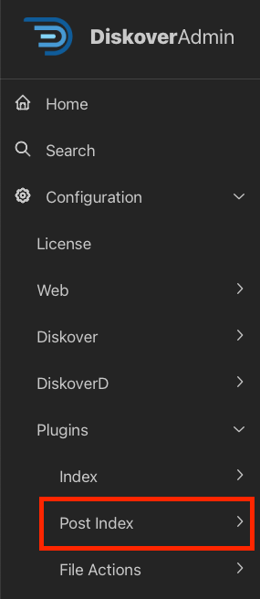

## Post-Index Plugins Configuration

### Overview

Diskover sets the standard in the data management market with its extensive range of metadata harvest plugins, which enrich data with a comprehensive set of business-context attributes.

This extra metadata is an invaluable asset for locating, organizing, and analyzing specific data, as well as for designing workflows tailored to precise data management tasks. To ensure optimal performance and indexing speed, some of these plugins can be executed at time of index or as a post-index task. **This chapter covers plugins that run as a post-index process.**

🟨 &nbsp;**IMPORTANT!** Once the plugin is configured, a task needs to be created and scheduled in the [**Task Panel**](#task_panel).

| Plugins Configurable via DiskoverAdmin | Plugins Manually Configurable |
| --- | --- |
| <ul><li>Most plugins are now configurable directly in the **DiskoverAdmin** panel.</li><li>Help information is available directly within the user interface.</li><li>This section provides additional guidance when applicable.</li></ul>  | <ul><li>Note that a few plugins are still configurable via a terminal.</li><li>[🛟 Open a support ticket](https://support.diskoverdata.com/) if you currently use one of these plugins and need to upgrade to v2.3+.</li></ul> |

### Quick Access List

The plugins in this chapter are listed alphabetically. Here is a quick access list by edition:

| EDITION |  PLUGIN |
| --- | --- |
| **Core Editions** | <ul><li>[AutoClean](#plugin_post_index_autoclean)</li><li>[AutoTag](#plugin_post_index_autotag)</li><li>[Breadcrumb](#plugin_post_index_breadcrumb)</li><li>[Checksums](#plugin_post_index_checksums)</li><li>[Checksums S3](#plugin_post_index_checksums_s3)</li><li>[Costs](#plugin_post_index_costs)</li><li>[Dupes Finder](#plugin_post_index_dupes)</li><li>[ES Field Copier](#plugin_post_index_es_field_copier)</li><li>[ES Query Report](#plugin_post_index_query_report)</li><li>[Illegal Filename](#plugin_post_index_illegal_filename)</li><li>[Index Diff](#plugin_post_index_index_diff)</li><li>[Tag Copier](#plugin_post_index_tag_copier)</li><li>[Windows Attributes](#plugin_post_index_windows_attributes)</li></ul> |
| **Media** | <ul><li>[Flow Production Tracking Index Plugin (formerly ShotGrid)](#plugin_post_index_shotgrid)</li><li>[Xytec Asset Creation Index Plugin](#plugin_post_index_xytech_asset_creation)</li><li>[Xytec Order Status Index Plugin](#plugin_post_index_xytech_order_status)</li></ul> |
| **Life Science** | |

#### AutoClean

| HELP | RESOURCE |
| --- | --- |
| Availability | &nbsp;&nbsp;&nbsp;&nbsp;&nbsp;&nbsp; |
| Enable/Config | Via the DiskoverAdmin panel |
| Learn More | [Contact Diskover](mailto:sales@diskoverdata.com) |
| Purpose | Designed to move, copy, delete, rename, or run custom commands on files and directories based on a set of highly configurable criteria. With the use of tags, the AutoClean plugin can be used to implement a RACI model or approval process for archive and deletion (approved_archive, approved_delete, etc.) tag application. The plugin criteria can then be set to meet the desired set of tags (times, etc.) to invoke action. |

#### AutoTag

| HELP | RESOURCE |
| --- | --- |
| Availability | &nbsp;&nbsp;&nbsp;&nbsp;&nbsp;&nbsp; |
| Enable/Config | Via the DiskoverAdmin panel |
| Learn More | [Contact Diskover](mailto:sales@diskoverdata.com) |
| Purpose | Allows for automated tags to be applied/added to the Elasticsearch index as a post-index process. Tags can be applied automatically via a series of rules applied to directories or files. The criteria can be very powerful based on a combination of base and business-context metadata. |

#### Breadcrumb

| HELP | RESOURCE |
| --- | --- |
| Availability | &nbsp;&nbsp;&nbsp;&nbsp;&nbsp;&nbsp; |
| Enable/Config | Via the DiskoverAdmin panel |
| Learn More | [Contact Diskover](mailto:sales@diskoverdata.com) |
| Purpose | Designed to extract/add metadata from files’ breadcrumbs to the Elasticsearch index as a post-index process. |

#### Checksums

| HELP | RESOURCE |
| --- | --- |
| Availability | &nbsp;&nbsp;&nbsp;&nbsp;&nbsp;&nbsp;&nbsp;&nbsp; |
| Enable/Config | Via the DiskoverAdmin panel |
| Learn More | [Contact Diskover](mailto:sales@diskoverdata.com) |
| Purpose | Allows for hash values to be added for files and directories to the Elasticsearch index as a post-index process and can be used for multiple checksums/data integrity tasks. |

#### Checksums S3

| HELP | RESOURCE |
| --- | --- |
| Availability | &nbsp;&nbsp;&nbsp;&nbsp;&nbsp;&nbsp; |
| Enable/Config | Via the DiskoverAdmin panel |
| Learn More | [Contact Diskover](mailto:sales@diskoverdata.com) |
| Purpose | Adds md5 and sha1 hash values for files and directories to the Elasticsearch index as a post-index process, using AWS Lambda/Fixity when using the Diskover S3 alternate indexer. |

#### Costs

| HELP | RESOURCE |
| --- | --- |
| Availability | &nbsp;&nbsp;&nbsp;&nbsp;&nbsp;&nbsp; |
| Enable/Config | Via the DiskoverAdmin panel |
| Learn More | Refer to our [Analytics](#analytics_costs) \| [Contact Diskover](mailto:sales@diskoverdata.com) |
| Purpose | Adds costs per GB for files and directories to the Elasticsearch index as a post-index process. Note that this feature can also be configured to apply at time of index under **DiskoverAdmin → Configuration → Diskover → Configurations** |

#### Dupes/Duplicates Finder

| HELP | RESOURCE |
| --- | --- |
| Availability | &nbsp;&nbsp;&nbsp;&nbsp;&nbsp;&nbsp;&nbsp;&nbsp; |
| Enable/Config | Via the DiskoverAdmin panel |
| Learn More | [Contact Diskover](mailto:sales@diskoverdata.com) |
| Purpose | Designed to add hash values, check and report on duplicate files/directories across single or multiple indices as a post-index process. The plugin supports **xxhash**, **md5**, **sha1**, and **sha256** checksums. The plugin is designed for multiple use cases:<ul><li>To check for duplicate files across a single or all file systems (single or multiple indices) and indexing the file docs in the index that are dupes.</li><li>Calculating file checksums/hashes for all duplicate files or all files and indexing hashes to file docs in the index.</li></ul>Calculating file **hash checksums** is an expensive CPU/disk operation. The dupes finder provides configuration options to control what files in the index get a hash calculated and marked as **is_dupe**. In addition, the dupes finder provides additional optimization mechanisms:<ul><li>The diskover-cache sqlite3 db can be used to store file hashes (-u cli option).</li><li>An existing index can be used to lookup file hashes (-U cli option).</li><li>The Elasticsearch fields for file type that get updated are `hash` and `is_dupe`. `hash` is an object field type and each hash type is stored in a sub-field: `hash.xxhash`, `hash.md5`, `hash.sha1`, `hash.sha256`. `is_dupe` is a boolean field and only gets added and set to `true` if the file is a duplicate file.</li></ul>
The dupes-finder can also be used to add file hashes to all the files in the index, not just the duplicates found.
_[Click here for a full-screen view of this image.](images/plugin_dupes_finder_diskover_ui_results_pane.png)_    
The duplicates plugin will store hash values that can be stored only for duplicates or for all files.
_[Click here for a full-screen view of this image.](images/image_plugins_dupes_finder_hash_values_in_file_attributes.png)_ |

#### Elasticsearch Field Copier

| HELP | RESOURCE |
| --- | --- |
| Availability | &nbsp;&nbsp;&nbsp;&nbsp;&nbsp;&nbsp; |
| Enable/Config | Via the DiskoverAdmin panel |
| Learn More | [Contact Diskover](mailto:sales@diskoverdata.com) |
| Purpose | Migrates Elasticsearch field data from one index to another as a post-index process. |

#### Elasticsearch Query Report

| HELP | RESOURCE |
| --- | --- |
| Availability | &nbsp;&nbsp;&nbsp;&nbsp;&nbsp;&nbsp; |
| Enable/Config | Via the DiskoverAdmin panel |
| Learn More | [Contact Diskover](mailto:sales@diskoverdata.com) |
| Purpose | The index Elasticsearch (ES) query report plugin is designed to search for Elasticsearch query strings in an existing completed index and create a CSV report with the ability to send the report to one or more email recipients. |

#### Flow Production Tracking (formerly ShotGrid) 

| HELP | RESOURCE |
| --- | --- |
| Availability |  |
| Enable/Config | Via a terminal 🛟 &nbsp;[Open a support ticket](https://support.diskoverdata.com/) to request assistance with installing this plugin |
| Learn more | [Visit our website](https://diskoverdata.com/products/products-aja-media-edition/#flowprodtracking) \| [contact AJA Video Systems](mailto:sales@aja.com) |
| User Guide | [AJA Diskover Media Edition Companion Guide](https://docs.diskoverdata.com/diskover_user_guide_companion_aja_media_edition/#flow-production-tracking-plugin) |
| Purpose | Designed to enhance basic metadata with detailed production status information, aligning data management with production schedules. The Diskover Flow Production Tracking Plugin harvests additional attributes from the [Autodesk Flow Production Tracking platform](https://www.autodesk.com/products/flow-production-tracking/) for every shot directory located on storage. These attributes become properties of the shot directories and include status information such as finaled, out-of-picture, multiple project tracking dates, and many more, totaling around one hundred indexable fields. Note that users can opt to only index the fields that are relevant to their business. |

#### Illegal Filename

| HELP | RESOURCE |
| --- | --- |
| Availability | &nbsp;&nbsp;&nbsp;&nbsp;&nbsp;&nbsp; |
| Enable/Config | Via the DiskoverAdmin panel |
| Learn More | [Contact Diskover](mailto:sales@diskoverdata.com) |
| Demo | [🍿 Watch Demo Video](https://vimeo.com/851931510) |
| Purpose | Analyzes the index of all directories and file names for illegal characters, and long filenames or file paths to proactively find potential files with names that can break applications. Offending filenames are tagged with the corresponding non-conformance, and the list of illegal filenames can then be sent via email reports. The plugin can be configured to remediate these issues with automatic renaming or character replacement. |

#### Index Diff

| HELP | RESOURCE |
| --- | --- |
| Availability | &nbsp;&nbsp;&nbsp;&nbsp;&nbsp;&nbsp; |
| Enable/Config | Via the DiskoverAdmin panel |
| Learn More | [Contact Diskover](mailto:sales@diskoverdata.com) |
| Purpose | The index differential plugin is designed to provide a list of file differences between two indices or points in time. The differential list can be used to feed synchronization tools (i.e. rsync) or identify deltas where two repositories should be identical. The plugin outputs a CSV file containing the differences between the two indices. It can also be used to compare checksums/hashes of files between two indices. |

#### Tag Copier

| HELP | RESOURCE |
| --- | --- |
| Availability | &nbsp;&nbsp;&nbsp;&nbsp;&nbsp;&nbsp; |
| Enable/Config | Via the DiskoverAdmin panel |
| Learn More | [Contact Diskover](mailto:sales@diskoverdata.com) |
| Purpose | Migrates tags from one index to the next as a post-index process. Note that there is also an [index Tag Copier plugin](#plugin_index_tag_copier).|

#### Windows Attributes

| HELP | RESOURCE |
| --- | --- |
| Availability | &nbsp;&nbsp;&nbsp;&nbsp;&nbsp;&nbsp; |
| Enable/Config | Via the DiskoverAdmin panel |
| Learn More | [Contact Diskover](mailto:sales@diskoverdata.com) |
| Purpose | 
The Windows Attributes plugin adds the Windows file owner, primary group and ACE's of each file and directory to the Diskover index after indexing is complete. It replaces all docs showing owner 0 and group 0 with the Windows file/directory owner name and primary group. It updates `owner`, `group` and `windacls` fields metadata of each file or directory to diskover index after indexing with the Windows owner, primary group, and ACL info. The plugin can take a long time to run due to name/sid lookups.
Requirements:<ul><li>This plugin works in Windows only.</li><li>[Enable long path support in Windows](https://docs.microsoft.com/en-us/windows/win32/fileio/maximum-file-path-limitation?tabs=cmd) if long paths are being scanned.</li></ul> |

#### Xytech Asset Creation | Index Plugin

| HELP | RESOURCE |
| --- | --- |
| Availability |  |
| Enable/Config | Via a terminal 🛟 &nbsp;[Open a support ticket](https://support.diskoverdata.com/) to request assistance with installing this plugin |
| Learn mMre | [Visit our website](https://diskoverdata.com/products/products-aja-media-edition/#xytech-asset-creation) \| [Contact AJA Video Systems](mailto:sales@aja.com) |
| User Guide | [AJA Diskover Media Edition Companion Guide](https://docs.diskoverdata.com/diskover_user_guide_companion_aja_media_edition/#xytech-asset-creation-plugin-overview) |
| Demo | [🍿 Watch Demo Video](https://vimeo.com/660789118) |
| Purpose | 
Post facilities often have customers’ assets that have been archived and lack findability, visibility, and searchability, and therefore, the opaque nature of these assets makes them difficult to reuse or repurpose. Companies with years of such archived assets have often stored these on tape media or removable hard drives, which are often stored in a physical vault.

Assets were often stored on such “offline” media due to costs; however, with the advent of cloud and object storage, the economics are now making it viable to store such vaulted assets on more “online media”. However, simply putting these assets onto online media does not necessarily make these assets findable in context or within the facility’s order management system.

The Xytech asset creation tool is designed to find and index newly restored online assets from LTO tapes, removable hard drives, etc., making them available, findable, and searchable within the Xytech order management system, as well as Diskover.

The plugin operates on the assumption that the assets restored to online media are placed into a folder with the following naming convention: **CustomerID_CustomerName**

The path location is added to the asset within Xytech and the asset number is assigned to the file via a tag within the Diskover Index.
 |

#### Xytech Order Status | Index Plugin

| HELP | RESOURCE |
| --- | --- |
| Availability |  |
| Enable/Config | Via a terminal 🛟 &nbsp;[Open a support ticket](https://support.diskoverdata.com/) to request assistance with installing this plugin |
| Learn More | [Visit our website](https://diskoverdata.com/products/products-aja-media-edition/#xytech-order-status) \| [Contact AJA Video Systems](mailto:sales@aja.com) |
| User Guide | [AJA Diskover Media Edition Companion Guide](https://docs.diskoverdata.com/diskover_user_guide_companion_aja_media_edition/#xytech-order-status-plugin-overview) |
| Demo | [🍿 Watch Demo Video](https://vimeo.com/768967081) |
| Purpose | 
The Xytech Media Operations Platform order status plugin is designed to automate the correlation of the order management system and the storage system by harvesting key business context from Xytech and applying that context within the AJA Diskover Media Edition. In turn, this business context metadata can be used to automate workflows, curate data, monitor costs, create highly customized reports, and search granularly.

Facilities often manually correlate the order management system with the storage repositories. However, manual processes are subject to human errors and difficult to scale as the volume of media orders and data turnover increases constantly.

Therefore, the lack of integration for file-based workflows between the order management system and the underlying storage repositories, makes data management decisions difficult as they are solely based on attributes of files or objects on storage. Additional business context is needed from the order management system to increase precision and accuracy of data management decisions.

An instance of key information might be the invoice date for a work order. A status change for a work order can be aa key indicator for data management, for example, once a Xytech media order has been “invoiced”, then the data associated with that media order can be a candidate for archival.
 |

