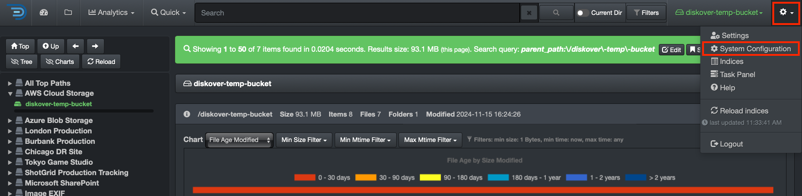

<p id="create_alt_config"></p>

## Create an Alternate Indexing Configuration

### Overview

This section will walk you through how to set up an alternate indexing configuration that you can use in a [task](#create_index_task).

### Alternate Config Setup

🔴 &nbsp;If you are in the main Diskover user interface, navigate to the **DiskoverAdmin** panel.



🔴 &nbsp;Go to **Configuration → Diskover → Configurations → Default**. 

- You can change the name from **Default** to a name of your choosing.
- Hit **Save** and **refresh** the page.
- You should now see the new alternate configuration that you’ve created. You can see alternate configs in the example below that were created using **Custom** and **ImageInfo**.


🔴 &nbsp;Click into the alternate configuration - we used the **Custom** alternate config for this example. Follow the help text on the config page to customize several parameters, such as:

- Include/exclude particular directories upon scanning - **see example below**
- Rules based on times
- Set up [AutoTags](#autotag)
- Set up [storage costs](#analytics_costs)
- And more
- Don't forget to **Save** once done!


🔴 &nbsp;Now navigate to the [Task Panel](#create_index_task). When creating or modifying an existing task, scroll down to **Alternate Config Name** and use the name exactly as you created it on the DiskoverAdmin page - we used the **Custom** alternate config again for this example.


### Alternate Config Testing

🔴 &nbsp;You should now be able to run that task, and we’re using the alternate configuration name **Custom** in the `/var/log/diskover/diskoverd_subproc` logs:

```
2024-11-11 13:55:24,804 - diskoverd_subproc - INFO - [do_work_thread_3] run command: python3 /opt/diskover/diskover.py --task "root"  -f -i diskover-root-202411112055 --configurationname Diskover.Configurations.Custom --altscanner scandir_dircache /
```
