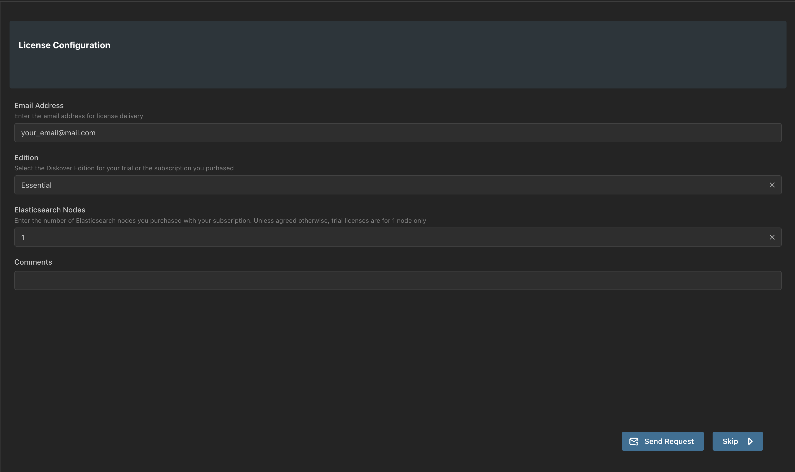

___
## Initial DiskoverAdmin Configuration
___

### Access DiskoverAdmin

You have reached THE big moment. Paste this link in a browser to access DiskoverAdmin and complete the configuration process for all Diskover's components and plugins.

[http://diskover-web:8000/diskover_admin/config/](http://diskover-web:8000/diskover_admin/config/)

🟨  Can't find what you are looking for? Select **Search** and type a simple word to find where a feature is located in the DiskoverAdmin menu, or refer to the [**DiskoverAdmin Panel Navigation**]() section.

### DiskoverAdmin Wizard

The DiskoverAdmin service allows for the fine-tuning of Diskover's core components and plugins. The setup wizard will guide you through the initial configuration of the DiskoverAdmin services, which can be further customized later.

🔴  Access the Wizard by selecting **System** > **Meta** > **Wizard** > **Setup**:

 

#### Elasticsearch Connection for Diskover-Web

🟨  Note that Diskover-Web and the indexer(s) can point to two different Elasticsearch hosts, hence the next 2 steps.

🔴  Input the **IP/AWS endpoint** where your Elasticsearch is running. If you have a clustered ES setup, click **+ Add Item** to list your other IPs.

🔴  Keep the port at **9200**.

🔴  Enable **HTTPS** your Elasticsearch uses an encrypted protocol. Otherwise, keep it unchecked for **HTTP**.

🔴  If you select **HTTPS**, enter your Elasticsearch username & password.

🔴  Click **Test** to see if Diskover can connect to your Elasticsearch system. The page will refresh and output the health of your cluster at the top of the page (number of shards, nodes, etc.) If this completes successfully, you're ready to proceed forward.

 

🔴  If the test is successfull, click **Save & Continue**.

#### Elasticsearch Connection for Indexers

🔴  **Copy connection settings from Diskover-Web?**:
- If your Diskover-Web and indexer(s) point to the same ES host, click **Yes**.
- If your Diskover-Web and indexer(s) point to different ES hosts, click **No**, go through each field, and click:
    - **Test** to test your connection.
    - **Save & Continue** once done.

#### License

This is the point where you need to send your license request and the wizard partially automates this task for you. Note that if you skip this part for now, you can always send a [license request]() manually at any time.

🔴  The wizard will prompt you through the steps to collect the information for your license request: email, Diskover edition, number of nodes, and hardware ID. 

 

🔴  You should receive your license within 24 hours, usually much less than 24 hours. You have 2 choices at this point:

- Pause and wait to receive the license to continue.
- Click **Skip** and come back once you receive the license.

🔴  Once you receive the license, copy/paste the keys as instructed on the License Configuration page.

🔴  Click **Test** if you want to validate your license, example below, then click **Save & Continue**.

 

#### Time Zone

🔴  Select your **Time Zone**. More customization can be done later on regarding this parameter, click **Save & Continue**.

🔴  Click the box to enable your time zone selection, click **Save & Continue**.

#### RabbitMQ or Amazon MQ

🔴  If applicable to your environment, follow the instructions on this page, click **Test** to check the connection, and then **Save & Continue**, or click **Skip** if not applicable. You can configure or edit your entries at any time.

🟨  The basic setup using the wizard is not completed. CONGRATS!

### API Configuration

Once you’re finished with the Diskover Admin Wizard, click System → API:

API Host needs to be the IP address where Diskover Web is running
Specify an API Port if you have a different port than the default of 8000

Enable logging for the Diskover Web & Diskoverd services:
Web: Diskover → Configurations → Default
Check Enable Log File and change the logging output if you have a custom logging location

Diskoverd: Diskoverd → Default
Check Enable Log File and change the logging output if you have a custom logging location

Change the timezone, if needed
