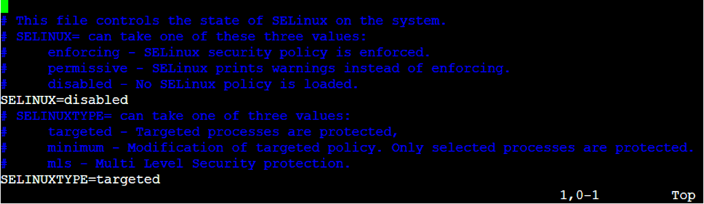
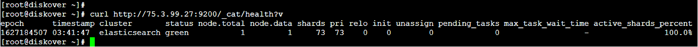

## Install Elasticsearch for Linux - CentOS and RHEL

Install CentOS 7.x, CentOS 8.x, RHEL 7.x, or RHEL8.x

### Disable SELinux (Optional)

➡️ Disabling SELinux is optional and not required to run Diskover, however, if you use SELinux you will need to adjust the SELinux policies to allow Diskover to run:
```
vi /etc/sysconfig/selinux
```

➡️ Change **SELINUX** to **disabled**:



➡️ Reboot now.

### Update Server

➡️ Update Server:
```
yum -y update
```

### Install Java 8

➡️ Install Java 8 JDK (OpenJDK) required for Elasticsearch:
```
yum -y install java-1.8.0-openjdk.x86_64
```

### Install Elasticsearch 7.x:

The following section describes installing Elasticsearch on Linux.

➡️ Install Elasticsearch:
```
yum install -y
https://artifacts.elastic.co/downloads/elasticsearch/elasticsearch-7.10.2-x86_64.rpm
```

➡️ Configure the Java JVM for Elasticsearch:
```
vi /etc/elasticsearch/jvm.options
```

➡️ Set the set the following memory heap size options to 50% of memory, up to 32g max:
```
-Xms8g
-Xmx8g
```

➡️ Update the Elasticsearch configuration file to define desired Elasticsearch endpoint:
```
vi /etc/elasticsearch/elasticsearch.yml
````

➡️ Network Host Configuration:
```
network.host:
```
> _Note_: Leave commented out for localhost (default) or uncomment and set to the  **ip**  you want to bind to, using  **0.0.0.0** will bind to all  **ips**.

➡️ Discovery Seed Host Configuration:
```
discovery.seed_hosts:
```

>_Note_: Leave commented out for **[“127.0.0.1", "[::1]"]** (default) or uncomment and set to **["<host ip>"]**.

➡️ Configure the Elasticsearch storage locations to the path of desired fast storage devices (SSD or other fast disk):
```
path.data: /var/lib/elasticsearch
path.logs: /var/log/elasticsearch
```

>_Note_: Change from default location below if desired.


➡️ Configure the Elasticsearch Bootstrap Memory variable to **true**:
```
bootstrap.memory_lock: true
```
  
➡️ Update Elasticsearch **systemd** service settings:
```
mkdir /etc/systemd/system/elasticsearch.service.d
```
  
➡️ Update the Elasticsearch service configuration file:
```
vi /etc/systemd/system/elasticsearch.service.d/elasticsearch.conf
```
  
➡️ Add the following text:
```
[Service]
LimitMEMLOCK=infinity
LimitNPROC=4096
LimitNOFILE=65536
```

### Open Firewall Ports for Elasticsearch
  
➡️ Open firewall ports:
```
firewall-cmd --add-port=9200/tcp --permanent
firewall-cmd --reload
```

➡️ Start and enable Elasticsearch service:
```
systemctl enable elasticsearch.service
systemctl start elasticsearch.service
systemctl status elasticsearch.service
```

### Check Elasticsearch Health

➡️ Check the health of the Elasticsearch cluster:
```
curl http://ip_address:9200/_cat/health?v
```


