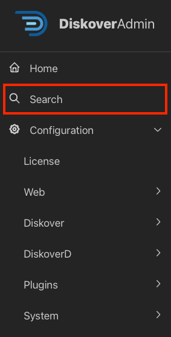

## Feature Navigator | Where to Find What

This section alphabetically sorts the main configurable Diskover features, whether they are in the DiskoverAdmin panel or still manually configurable, and where to find them. Some features are there two and three times, under different names, to ensure that you can find what you are looking for.

Additionally, if you are using the DiskoverAdmin panel, you can select **Search** in the menu on the left and type a simple word to find where a feature is located in the DiskoverAdmin menu.

| FEATURE | CONFIGURE IN USER INTERFACE DiskoverAdmin → Configuration | ELSEWHERE |
| --- | --- | --- |
| **Alternate Indexers** | Diskover → Alternate Indexers | |
| **Amazon MQ** | System → Message Queue | |
| **Analytics Filters** | Web → Analytics Filters | |
| **API** | System → API | |
| **Arrival Time Plugin** | Plugins → Index → First Index Time | |
| **Atempo Miria** alt indexer | | [Atempo Alternate Indexer](#alt_indexer_atempo) |
| **Authentication by default for Diskover-Web** | Web → General | |
| **Authentication LDAP** | Web → LDAP | |
| **Authentication OAuth** | Web → OAUTH | |
| **AutoClean** | Plugins → Post Index → AutoClean | |
| **AutoTag** at index time | Diskover → Configurations → Default | |
| **AutoTag Plugin** post index | Plugins → Post Index → AutoTag | |
| **Azure** alt indexer | Diskover → Alternate Indexers → Azure | |
| **Azure AD Authentication** | Web → OAUTH | |
| **BAM Info Plugin** | | [BAM Info Index Plugin](#plugin_bam) |
| **Breadcrumb Plugin** | Plugins → Post Index → Breadcrumb | |
| **Checksums** at index time | Plugins → Index → Checksums | |
| **Checksums** post index | Plugins → Post Index → Checksums | |
| **Chesksums S3** post index | Plugins → Post Index → Checksums S3 | 
| **CineViewer Player Plugin** | | [CineViewer Player File Action Plugin by CineSys](#plugin_cineviewer) |
| **Collapsible Top Path** | Web → Top Path Display | |
| **Cost** at time of index | Diskover → Configurations → Default | |
| **Cost Plugin** post-index | Plugins → Post Index → Costs | |
| **Daemon** for indexers | DiskoverD → Default | |
| **Dell PowerScale** alt indexer | | [Dell PowerScale Alternate Indexer](#alt_indexer_dell) |
| **DirCache** alt indexer | Diskover → Alternate Indexers → DirCache | |
| **Diskover** indexers | Diskover → Configurations → Default | |
| **DiskoverD** daemons | DiskoverD → Default | |
| **Diskover-Web** | Web → General | |
| **Dropbox** alt indexer | | [Dropbox Alternate Indexer](#alt_indexer_dropbox) |
| **Dupes Finder Plugin** | Plugins → Post Index → Dupes Finder | |
| **EDL Check Plugin** | Plugins → File Actions → In Development → EDL Check | |
| **EDL Download Plugin** | Plugins → File Actions → In Development → EDL Download | | 
| **Elasticsearch for Diskover-Web** | Web → Elasticsearch | |
| **Elasticsearch for Indexers** | Diskover → Elasticsearch | |
| **Elasticsearch Field Copier** | Plugins → Post Index → ES Field Copier | |
| **Elasticsearch Query Report** | Plugins → Post Index → ES Query Report | |
| **Enable Index Plugins** | Diskover → Configurations → Default | |
| **Export Plugin** | Plugins → File Actions → In Development → Export | |
| **Extra Fields** | Web → General | |
| **File Kind Plugin** | Plugins → Index → File Kind | |
| **File Types** | Web → File Types | |
| **Find File Sequences Plugin** | | [Find File Sequences File Action Plugin](#plugin_find_file_sequences) |
| **First Index Time Plugin** | Plugins → Index → First Index Time | |
| **Fix Permissions Plugin** | Plugins → File Actions → In Development → Fix Permissions | |
| **Flow Production Tracking Plugin** formerly ShotGrid | | [Flow Production Tracking Plugin](#plugin_shotgrid) |
| **FTP** alt indexer | | [FTP Alternate Indexer](#alt_indexer_ftp) |
| **GLIM Plugin** | | [Telestream GLIM File Action Plugin](#plugin_glim) |
| **Grafana Plugin** | Plugins → Index → Grafana | |
| **Grafana Cloud Plugin** | Plugins → Index → Grafana Cloud | |
| **Grant Plugin Plugin** | | [Research Grant File Action Plugin](#plugin_grant) | 
| **Hash Differential Checksums Plugin** | | [Hash Differential Checksums File Action Plugin](#plugin_hash_diff) |
| **Illegal Filename Plugin** | Plugins → Post Index → Illegal Filename | |
| **IMF Change Report Plugin** | Plugins → File Actions → IMF Change Report | |
| **IMF Package Validator Plugin** | | [IMF Package Validator File Action Plugin by Oxagile](#plugin_imf_validator) |
| **Index Access** | Web → Index Access | |
| **Index Differential Plugin** | Plugins → Post Index → Index Diff | |
| **Index Mapping** | Web → Index Access | |
| **Indexers** | Diskover → Configurations → Default | |
| **JSON/CSV text** alt indexer | | [JSON/CSV Generic Text Alternate Indexer](#alt_indexer_json) |
| **LDAP** | Web → LDAP | |
| **License** | License | |
| **Live View Plugin** | Plugins → File Actions → Live View | |
| **Make Links Plugin** | Plugins → File Actions → Make Links | |
| **Media Info Plugin** | Plugins → Index → Media Info | |
| **Message Queue** | System → Message Queue | |
| **Ngenea Data Orchestrator Plugin** | | [Ngenea Data Orchestrator/Mover File Action Plugin by PixitMedia](#plugin_ngenea) |
| **OAuth** | Web → OAUTH | |
| **Offline Media** alt indexer | Diskover → Alternate Indexers → Offline Media | |
| **Okta** | Web → OAUTH | |
| **OneDrive/SharePoint** alt indexer | | [Microsoft OneDrive and SharePoint Alternate Indexer](#alt_indexer_onedrive) |
| **Path Tokens Plugin** | Plugins → Index → Path Tokens | |
| **Path Translation** | Web → Path Translations | |
| **PDF Viewer Plugin** | Plugins → File Actions → PDF | |
| **RabbitMQ** | System → Message Queue | |
| **Rclone Plugin** | Plugins → File Actions → Rclone | |
| **S3** AWS and non-AWS alt indexer | Diskover → Alternate Indexers → S3 | |
| **ShotGrid** now Flow Production Tracking Plugin | | [Flow Production Tracking Plugin](#plugin_shotgrid) |
| **SMTP** | System → SMTP | |
| **Spectra Plugin** | Plugins → File Actions → In Development → Spectra | |
| **Tag Copier** at time of index | Plugins → Index → Tag Copier | |
| **Tag Copier** post-index | Plugins → Post Index → Tag Copier | |
| **Tags Customization** for manual tags| Web → Custom Tags | |
| **Task Notifications** | DiskoverD → Default | |
| **Time Zone** for files and directories | Web → General | |
| **Time Zone** for indexers | DiskoverD → Default | |
| **Time Zone** for indices | Web → General | |
| **Top Paths** | Web → Top Path Display | |
| **Unix Permissions Plugin** | Plugins → Index → Unix Perms | |
| **Vantage Plugin** | Plugins → File Actions → Vantage | |
| **Vcinity High-Speed Data Transfer Plugin** | | [Vcinity High-Speed Data Transfer File Action Plugin](#plugin_vcinity) |
| **Windows Attributes Plugin** | Plugins → Post Index → Windows Attributes | |
| **Windows Owner Plugin** | Plugins → Index → Windows Owner | |
| **Wizard** for initial config | System → Meta → Wizard | |
| **Xytech Asset Creation Plugin** | | [Xytech Asset Creation Index Plugin](#plugin_xytech_asset_creation) |
| **Xytech Order Status Plugin** | | [Xytech Order Status Index Plugin](#plugin_xytech_order_status) |

