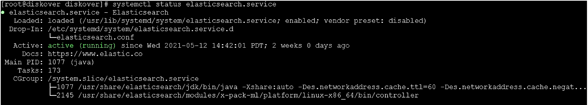
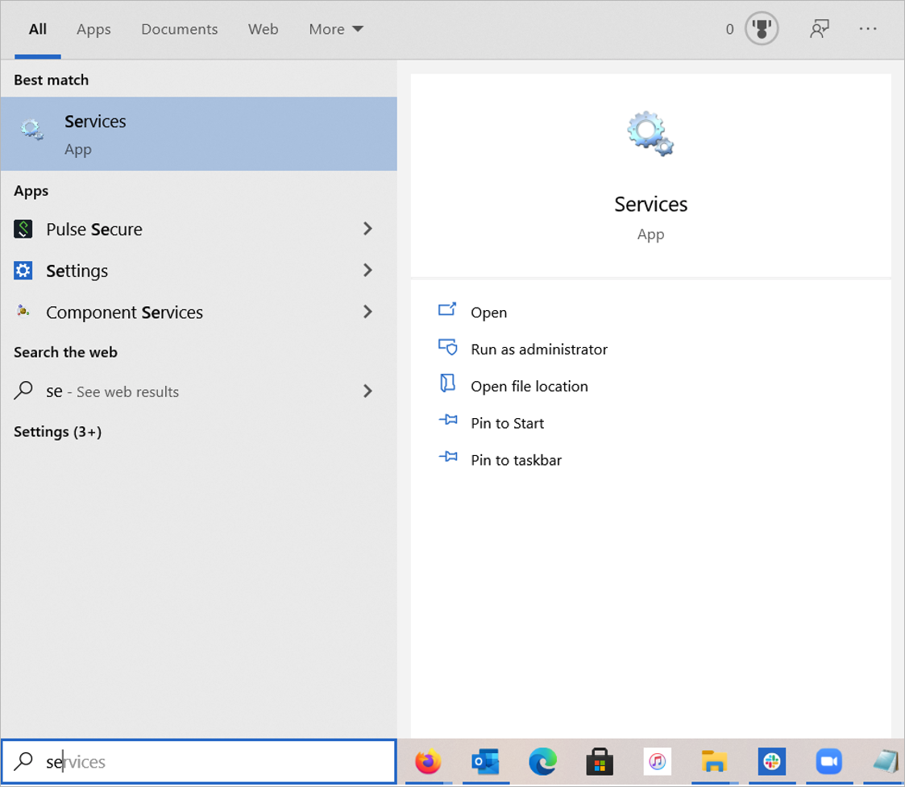
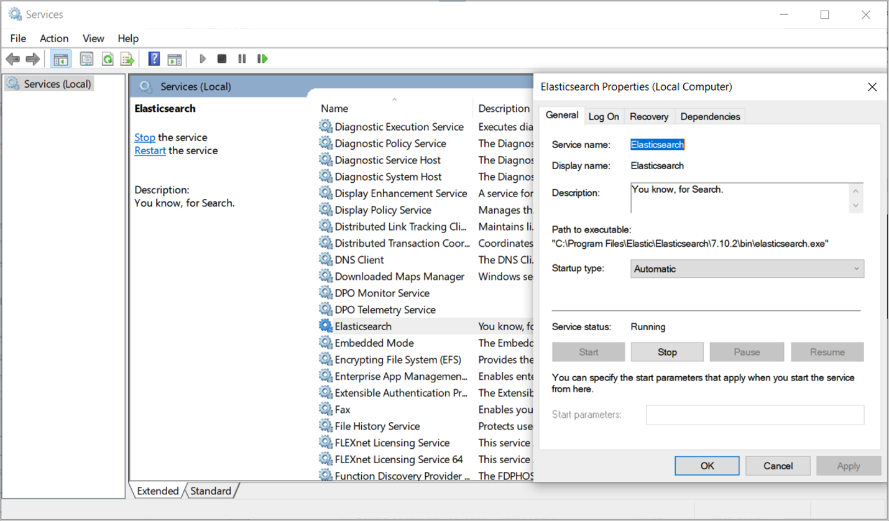
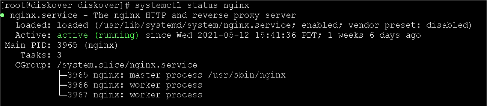
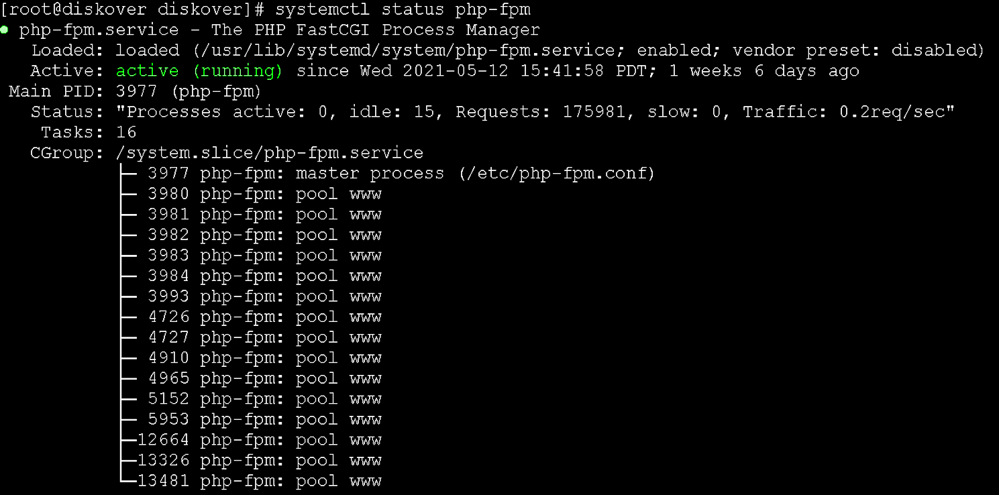
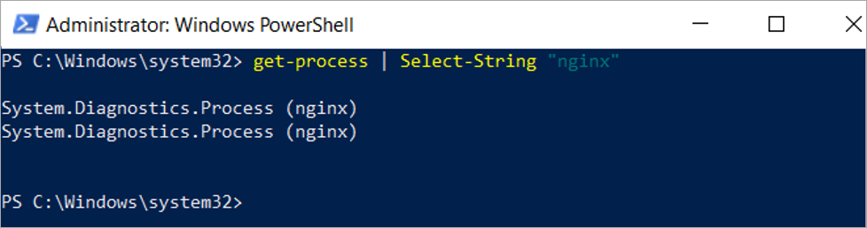

___
## Health Check
___

The following section outlines health checks for the various Diskover's components.

### Elasticsearch Domain

#### Status of Elasticsearch Service for Linux

🔴 &nbsp;Check status of Elasticsearch  service:
```
systemctl status elasticsearch.service
```



#### Status of Elasticsearch Service for Windows

🔴 &nbsp;To check the status of the Elasticsearch service under Windows, open **Services** by typing **services** in the search bar.



🔴 &nbsp;Ensure the Elasticsearch service is running:




### Diskover-Web

To validate health of the Diskover-Web, basically ensures the Web serving applications are functioning properly.

#### Diskover-Web for Linux

🔴 &nbsp;Check status of NGINX service:
```
systemctl status nginx
```



🔴 &nbsp;Check status of PHP-FPM service:
```
systemctl status php-fpm
```


#### Diskover-Web for Windows

🔴 &nbsp;Check status of NGINX service.

🔴 &nbsp;Open Windows Powershell:
```
get-process | Select-String "nginx"
```



🔴 &nbsp;Check status of PHP-FPM service.

🔴 &nbsp;Open Windows Powershell:
```
get-process | Select-String "php"
```


