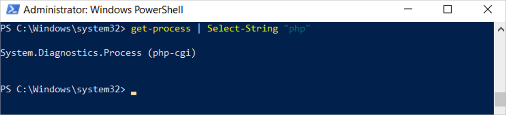

<p id="health_check"></p>

## Health Check

The following section outlines health checks for the various Diskover's components. 

🚧 &nbsp;We're hard at work updating these instructions. Meanwhile, [click here to open a support ticket](https://support.diskoverdata.com/), and we'll gladly assist you with checking the health of your environment.

### Elasticsearch Domain

Click the following links to view more instructions on how to verify the health of your Elasticsearch services [without SSL](#es_health_check_without_ssl) and [with SSL](#es_health_check_with_ssl).

#### Status of Elasticsearch Service for Linux

🔴 &nbsp;Check status of Elasticsearch  service:
```
systemctl status elasticsearch.service
```


#### Status of Elasticsearch Cluster for Linux
🔴 &nbsp;Check status of Elasticsearch  Cluster Health:
```
curl http://ip_address:9200/_cluster/health?pretty
curl -u username:p4ssword http://ip_address:9200/_cluster/health?pretty
curl -u username:password https://aws_endpoint:443/_cluster/health?pretty
List Master Node - 
curl http://ip_address:9200/_cat/master?v
```

#### Status of Elasticsearch Service for Windows

🔴 &nbsp;To check the status of the Elasticsearch service under Windows, open **Services** by typing **services** in the search bar.


🔴 &nbsp;Ensure the Elasticsearch service is running:


### Diskover-Web

To validate health of the Diskover-Web, basically ensures the Web serving applications are functioning properly.

#### Diskover-Web for Linux

🔴 &nbsp;Check status of NGINX service:
```
systemctl status nginx
```


🔴 &nbsp;Check status of PHP-FPM service:
```
systemctl status php-fpm
```


#### Diskover-Web for Windows

🔴 &nbsp;Check status of NGINX service.

🔴 &nbsp;Open Windows Powershell:
```
get-process | Select-String "nginx"
```


🔴 &nbsp;Check status of PHP-FPM service.

🔴 &nbsp;Open Windows Powershell:
```
get-process | Select-String "php"
```



### Celery

🚧 &nbsp;We're hard at work preparing these instructions. Meanwhile, [click here to open a support ticket](https://support.diskoverdata.com/), and we'll gladly assist you with your Celery healh check.

### RabbitMQ

🔴 &nbsp;Run diagnostic status:
```
rabbitmq-diagnostics status
```

