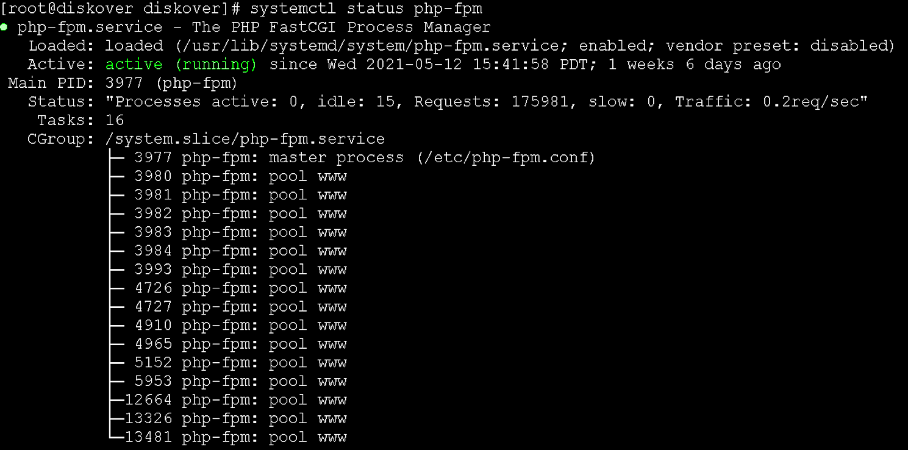

### Diskover-Web

To validate health of the Diskover-Web, basically ensures the Web serving applications are functioning properly.

#### Diskover-Web for Linux

🔴 &nbsp;Check status of NGINX service:
```
systemctl status nginx
```


🔴 &nbsp;Check status of PHP-FPM service:
```
systemctl status php-fpm
```

