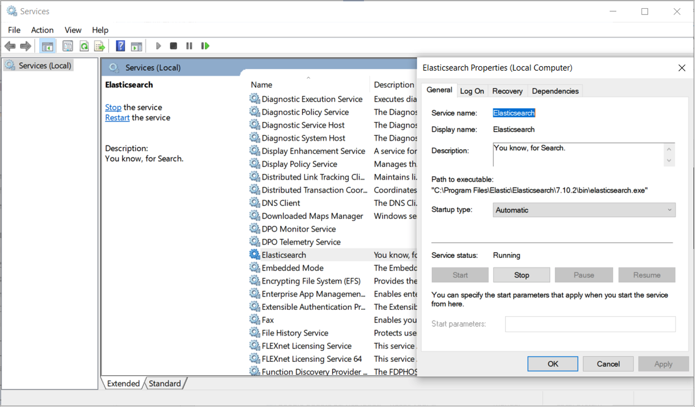

### Status of Elasticsearch Service for Windows

➡️ To check the status of the Elasticsearch service under Windows, open **Services** by typing **services** in the search bar.

➡️ Ensure the Elasticsearch service is running:

