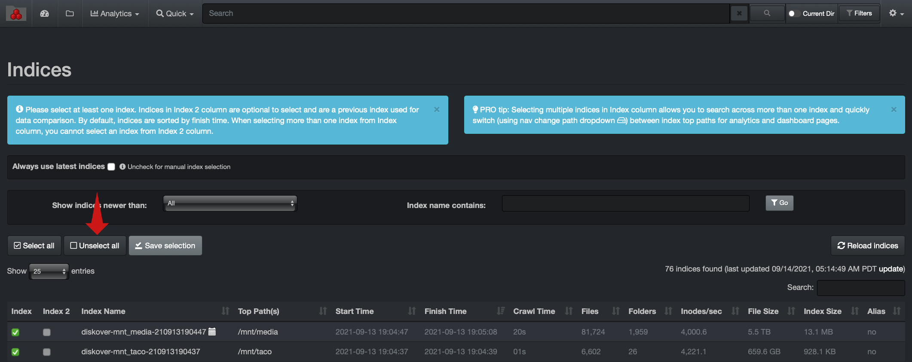
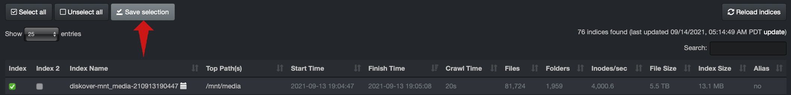
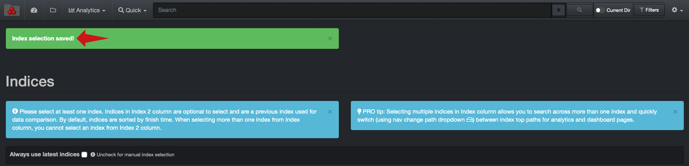
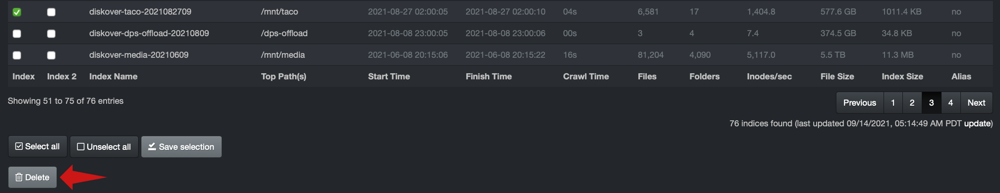
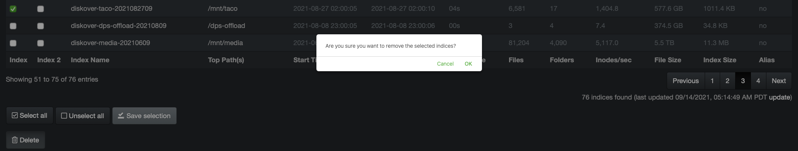
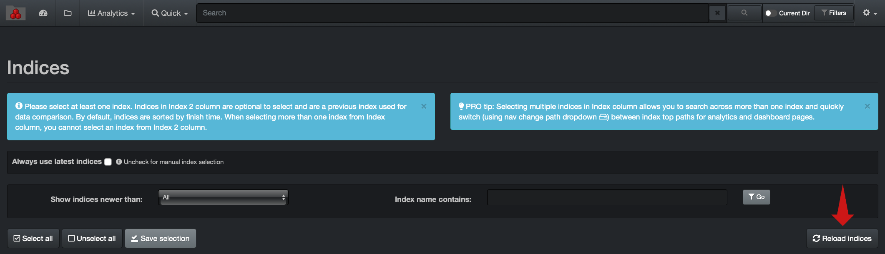

## Diskover-Web Index Management

The Diskover-Web user interface provides manual index management capabilities. By default, Diskover-Web is configured to always use the latest indices when production user login to Diskover.

### Loading / Unloading Indexes within Diskover-Web User Interface

➡️ To manually manage indexes thru the Diskover-Web user interface, uncheck the **Always Use Latest Indices**.

>Index management can’t be performed on an actively loaded index.

➡️ **Unselect all** indices:

>To manage an index that is actively loaded, the desired index can be unloaded by selecting any other index and clicking **Save selection**.

➡️ Select another index from **Index** column > **Save selection** and load in Diskover-Web user interface:

The following confirmation will be displayed upon successful index load:

### Deleting Indices within Diskover-Web User Interface

➡️ To manually delete indices thru the Diskover-Web user interface, follow the steps in the previous section to ensure the index targeted for deletion is not “loaded” within the Diskover-Web user interface.

➡️ Select index targeted for deletion and select **Delete**.

➡️ Confirm desired index deletion:

The following confirmation of successful index deletion will be displayed:

➡️ Select the **Reload Indices** button to ensure recently deleted index is not displayed in the list of available indices:

>_Note:_ Attempting to delete an index that is actively loaded in the Diskover-Web will result in the error message below. The index must first be unloaded as described in this section.

