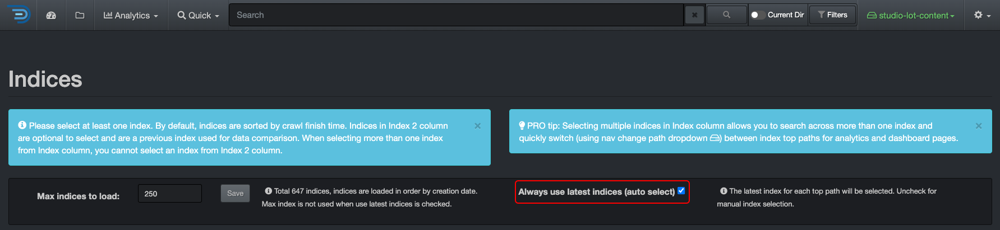

<p id="indices_management"></p>

## Indices Management

<p id="indices_mgmt_diskoverweb"></p>

### Indices Management via Diskover-Web

&nbsp;&nbsp;&nbsp;&nbsp;&nbsp;&nbsp;&nbsp;&nbsp;

Diskover creates indexes within an Elasticsearch endpoint. Each index is basically a snapshot of a point in time of any given volume (filesystem or S3 Bucket). Note that **indexes** and **indices** have the same meaning, and both are used throughout this guide. These indexes require management:

- Indexes can’t be stored infinitely, but ultimately, the Elasticsearch environment will exhaust its available storage space, causing undesired cluster states.
- To name a few, the index retention policy should reflect the requirements to:
	- Search across various points in time within Diskover-Web.
	- Perform [heatmap differential comparison](https://docs.diskoverdata.com/diskover_user_guide/#heatmap).
	- Perform index differential comparisons via the [Index Diff post-index plugin](plugin_index_diff)

#### Access the Indices Page

From the search page in Diskover-Web, select ⛭ → **Indices**:


#### Load and Unload Indices

🔴 &nbsp;The Diskover-Web interface provides manual index management capabilities. By default, Diskover-Web is configured to always use the latest indices when production user logs in to Diskover.



🔴 &nbsp;To manually manage indexes through the Diskover-Web user interface:

- Uncheck the **Always Use Latest Indices**. Note that index management can’t be performed on an actively loaded index.
- **Unselect all** indices:


⚠️ &nbsp;To manage an index that is actively loaded, the desired index can be unloaded by selecting any other index and clicking **Save selection**.

🔴 &nbsp;Select another index from **Index** column and **Save selection** to load in the Diskover-Web user interface. The message **Index selection saved!** will appear upon the index loading successfully:


#### Delete Indices

🔴 &nbsp;To manually delete indices thru the Diskover-Web user interface, follow the steps in the previous section to ensure the index targeted for deletion is not “loaded” within the Diskover-Web user interface.

🔴 &nbsp;Select index(es) targeted for deletion and click **Delete**. You will get a message asking **Are you sure you want to remove the selected indices?**, click **OK**:


The following confirmation of successful index deletion will be displayed:


🔴 &nbsp;Select the **Reload Indices** button to ensure that the recently deleted index(es) is not displayed in the list of available indices:


⚠️ &nbsp;Attempting to delete an index that is actively loaded in the Diskover-Web will result in the error message below. The index must first be unloaded as described in this section.


<p id="es_lifecycle_mgmt"></p>

### Elasticsearch Index Management

#### Overview

Indices can be managed by policy and manually with Elasticsearch using curl from the command line. Indices can also be managed using [Kibana index management](https://www.elastic.co/kibana) which is not covered in this guide.

⚠️ &nbsp;Note that it may be easier and less prone to shell issues to put the JSON text (text after `-d` in the single quotes) into a file first and then use that file for `-d` using:
```
curl -X PUT -H "Content-Type: application/json" -d @FILENAME DESTINATION
```

#### Elasticsearch Lifecycle Management

You can create and apply **Index Lifecycle Management (ILM) policies** to automatically manage your Diskover indices according to your performance, resiliency, and retention requirements.

More information on index lifecycle management can be found on [elastic.co](https://www.elastic.co/guide/en/elasticsearch/reference/current/index-lifecycle-management.html).

The following provides an example for managing Diskover indices on your Elasticsearch cluster by creating a policy that **deletes indices after 30 days** for new Diskover indices:

🔴 &nbsp;Your Elasticsearch server is accessible at [http://elasticsearch:9200](http://elasticsearch:9200)

🔴 &nbsp;In this example:

- Indices will be purged after 30 days **30d**
- Your policy name will be created as **cleanup_policy_diskover**

```
curl -X PUT "http://elasticsearch:9200/_ilm/policy/cleanup_policy_diskover?pretty" \
     -H 'Content-Type: application/json' \
     -d '{
      "policy": {
        "phases": {
          "hot": {
            "actions": {}
          },
          "delete": {
            "min_age": "30d",
            "actions": { "delete": {} }
          }
        }
      }
    }' 
```

🔴 &nbsp;You can apply this policy to all existing Diskover indices based on index name pattern:
```
curl -X PUT "http://elasticsearch:9200/diskover-*/_settings?pretty" \
     -H 'Content-Type: application/json' \
     -d '{ "lifecycle.name": "cleanup_policy_diskover" }'
```

🔴 &nbsp;You can create a template to apply this policy to new Diskover indices based on the index name pattern:
```  
    curl -X PUT "http://elasticsearch:9200/_template/logging_policy_template?pretty" \
     -H 'Content-Type: application/json' \
     -d '{
      "index_patterns": ["diskover-*"],                 
      "settings": { "index.lifecycle.name": "cleanup_policy_diskover" }
    }' 
```

#### Index State Management in Amazon OpenSearch Service

⚠️ &nbsp;Helpful links:
- [Index State Management in Amazon OpenSearch Service](https://docs.aws.amazon.com/elasticsearch-service/latest/developerguide/ism.html)
- [OpenDistro ism api doc](https://opendistro.github.io/for-elasticsearch-docs/docs/im/ism/api/)
- [OpenSearch ism api doc](https://opensearch.org/docs/latest/im-plugin/ism/index/)

🔴 &nbsp;In this example:

- Your AWS Elasticsearch Service endpoint url is **`<aws es endpoint>`**
- You want your indices to be purged after seven days **7d**
- Your policy name will be created as **cleanup_policy_diskover**

```
curl -u username:password -X PUT "https://<aws es endpoint>:443/_opendistro/_ism/policies/cleanup_policy_diskover" \
     -H 'Content-Type: application/json' \
     -d '{
	  "policy": {
	    "description": "Cleanup policy for diskover indices on AWS ES.",
	    "schema_version": 1,
	    "default_state": "current",
	    "states": [{
	      "name": "current",
	      "actions": [],
	      "transitions": [{
	        "state_name": "delete",
	        "conditions": {
	          "min_index_age": "7d"
	        }
	      }]
	      },
	      {
	        "name": "delete",
	        "actions": [{
	          "delete": {}
	        }],
	        "transitions": []
	      }
	    ],
	    "ism_template": {
	      "index_patterns": ["diskover-*"],
	      "priority": 100
	    }
	  }
        }'
```

🔴 &nbsp;Apply this policy to all existing diskover indices:

```sh
curl -u username:password -X POST "https://<aws es endpoint>:443/_opendistro/_ism/add/diskover-*" \
     -H 'Content-Type: application/json' \
     -d '{ "policy_id": "cleanup_policy_diskover" }'
```

#### Elasticsearch Manual Index Management

Indexes can be manually listed and deleted in Elasticsearch via:

🔴 &nbsp;List indices, see [Elasticsearch cat index api](https://www.elastic.co/guide/en/elasticsearch/reference/current/cat-indices.html) for more info:
```
curl -X GET http://elasticsearch_endpoint:9200/_cat/indices
```

🔴 &nbsp;Delete indices, see [Elasticsearch delete index api](https://www.elastic.co/guide/en/elasticsearch/reference/current/indices-delete-index.html) for more info:
```
curl -X DELETE http://elasticsearch_endpoint:9200/diskover-indexname
```

🔴 &nbsp;Delete indices on AWS OpenSearch:
```
curl -u username:password -X DELETE https://endpoint.es.amazonaws.com:443/diskover-indexname
```

