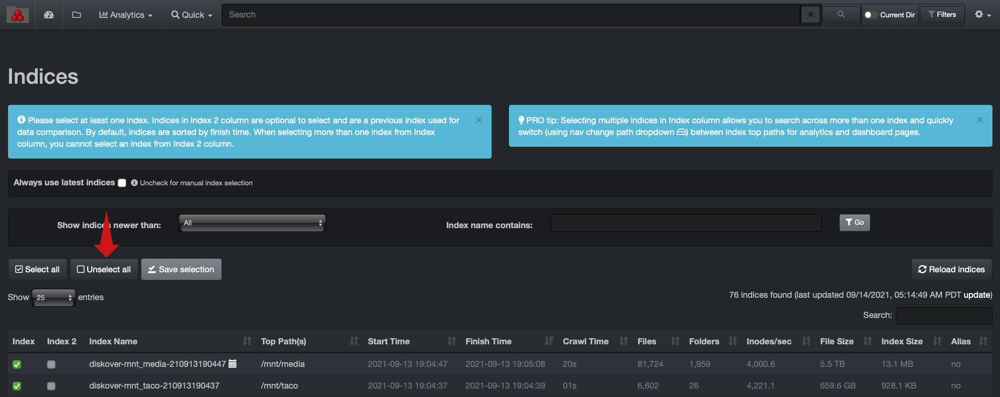
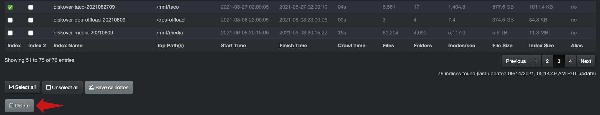
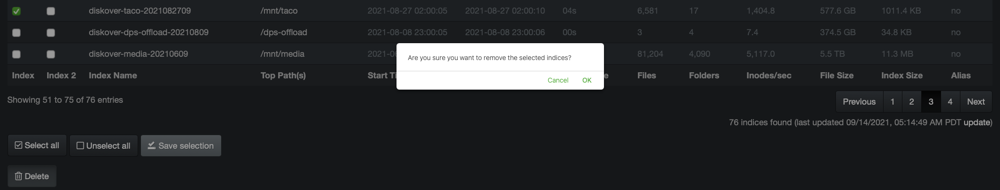

<p id=“”>indices_management</p>

## Indices Management

The Diskover curation platform creates indexes within an Elasticsearch endpoint. Each index is basically a snapshot of a point in time of any given volume (filesystem of S3 Bucket). These indexes require management:

- Indexes can’t be stored infinitely as ultimately the Elasticsearch environment will exhaust available storage space causing undesired cluster states.
- The index retention policy should reflect the requirements to:
	- Search across various points in time within Diskover-web.
	- Perform heatmap differential comparison.
	- Perform index differential comparisons via  indexdiff plugin, etc.

### Diskover-Web Index Management

&nbsp;&nbsp;&nbsp;&nbsp;&nbsp;&nbsp;&nbsp;&nbsp;

The Diskover-Web user interface provides manual index management capabilities. By default, Diskover-Web is configured to always use the latest indices when production user login to Diskover.


#### Loading / Unloading Indexes within Diskover-Web User Interface

🔴 &nbsp;To manually manage indexes thru the Diskover-Web user interface, uncheck the **Always Use Latest Indices**.

>Index management can’t be performed on an actively loaded index.

🔴 &nbsp;**Unselect all** indices:



>To manage an index that is actively loaded, the desired index can be unloaded by selecting any other index and clicking **Save selection**.

🔴 &nbsp;Select another index from **Index** column > **Save selection** and load in Diskover-Web user interface:


The following confirmation will be displayed upon successful index load:


#### Deleting Indices within Diskover-Web User Interface

🔴 &nbsp;To manually delete indices thru the Diskover-Web user interface, follow the steps in the previous section to ensure the index targeted for deletion is not “loaded” within the Diskover-Web user interface.

🔴 &nbsp;Select index targeted for deletion and select **Delete**.



🔴 &nbsp;Confirm desired index deletion:



The following confirmation of successful index deletion will be displayed:


🔴 &nbsp;Select the **Reload Indices** button to ensure recently deleted index is not displayed in the list of available indices:


>_Note:_ Attempting to delete an index that is actively loaded in the Diskover-Web will result in the error message below. The index must first be unloaded as described in this section.
>
>


### Elasticsearch Index Management

Indices can be managed by policy and manually with Elasticsearch using curl from the command line. Indices can also be managed using [Kibana index management](https://www.elastic.co/guide/en/elasticsearch/reference/7.16/index-mgmt.html) which is not covered in this guide.

> _Note:_ For AWS ES/OpenSearch see Index State Management on AWS ES/OpenSearch below.
>
> _Note:_ It may be easier and less prone to shell issues, to put the json text (text after -d in the single quotes), into a file first and then use that file for -d using `curl -X PUT -H "Content-Type: application/json" -d @FILENAME DESTINATION`.

#### Elasticsearch Index Lifecycle Management

You can create and apply Index Lifecycle Management (ILM) policies to automatically manage your Diskover indices according to your performance, resiliency, and retention requirements.

More information on index lifecycle management can be found on elastic.co here:

[https://www.elastic.co/guide/en/elasticsearch/reference/current/index-lifecycle-management.html](https://www.elastic.co/guide/en/elasticsearch/reference/current/index-lifecycle-management.html)

The following provides an example for managing Diskover indices on your Elasticsearch cluster, by creating a policy that deletes indices after 30 days for new Diskover indices:

🔴 &nbsp;Your Elasticsearch server is accessible at [http://elasticsearch:9200](http://elasticsearch:9200)

🔴 &nbsp;Your Elasticsearch service endpoint url is `<aws es endpoint>`

🔴 &nbsp;You want your indices to be purged after seven days **7d**

🔴 &nbsp;Your policy name will be created as  **cleanup_policy_diskover**
```
curl -X PUT "http://elasticsearch:9200/_ilm/policy/cleanup_policy_diskover?pretty" \
     -H 'Content-Type: application/json' \
     -d '{
      "policy": {
        "phases": {
          "hot": {
            "actions": {}
          },
          "delete": {
            "min_age": "7d",
            "actions": { "delete": {} }
          }
        }
      }
    }' 
```

🔴 &nbsp;Apply this policy to all existing Diskover indices based on index name pattern:
```
curl -X PUT "http://elasticsearch:9200/diskover-*/_settings?pretty" \
     -H 'Content-Type: application/json' \
     -d '{ "lifecycle.name": "cleanup_policy_diskover" }'
```

🔴 &nbsp;Create a template to apply this policy to new Diskover indices based on index name pattern:
```  
    curl -X PUT "http://elasticsearch:9200/_template/logging_policy_template?pretty" \
     -H 'Content-Type: application/json' \
     -d '{
      "index_patterns": ["diskover-*"],                 
      "settings": { "index.lifecycle.name": "cleanup_policy_diskover" }
    }' 
```

#### Index State Management on AWS ES/OpenSearch

Helpful links:
- [Index State Management in Amazon OpenSearch Service](https://docs.aws.amazon.com/elasticsearch-service/latest/developerguide/ism.html)
- [OpenDistro ism api doc](https://opendistro.github.io/for-elasticsearch-docs/docs/im/ism/api/)
- [OpenSearch ism api doc](https://opensearch.org/docs/latest/im-plugin/ism/index/)


Example:
* Your AWS Elasticsearch Service endpoint url is `<aws es endpoint>`
* You want your indices to be purged after seven days **7d**
* Your policy name will be created as cleanup_policy_diskover

🔴 &nbsp;Create a policy that deletes indices after one month for new diskover indices

```sh
curl -u username:password -X PUT "https://<aws es endpoint>:443/_opendistro/_ism/policies/cleanup_policy_diskover" \
     -H 'Content-Type: application/json' \
     -d '{
	  "policy": {
	    "description": "Cleanup policy for diskover indices on AWS ES.",
	    "schema_version": 1,
	    "default_state": "current",
	    "states": [{
	      "name": "current",
	      "actions": [],
	      "transitions": [{
	        "state_name": "delete",
	        "conditions": {
	          "min_index_age": "7d"
	        }
	      }]
	      },
	      {
	        "name": "delete",
	        "actions": [{
	          "delete": {}
	        }],
	        "transitions": []
	      }
	    ],
	    "ism_template": {
	      "index_patterns": ["diskover-*"],
	      "priority": 100
	    }
	  }
        }'
```
🔴 &nbsp;Apply this policy to all existing diskover indices

```sh
curl -u username:password -X POST "https://<aws es endpoint>:443/_opendistro/_ism/add/diskover-*" \
     -H 'Content-Type: application/json' \
     -d '{ "policy_id": "cleanup_policy_diskover" }'
```

#### Elasticsearch Manual Index Management

Indexes can be manually listed and deleted in Elasticsearch via:

🔴 &nbsp;List indices:
> See Elasticsearch [cat index api](https://www.elastic.co/guide/en/elasticsearch/reference/current/cat-indices.html) for more info.
```
curl -X GET http://elasticsearch_endpoint:9200/_cat/indices
```

🔴 &nbsp;Delete indices:
> See Elasticsearch [delete index api](https://www.elastic.co/guide/en/elasticsearch/reference/current/indices-delete-index.html) for more info.
```
curl -X DELETE http://elasticsearch_endpoint:9200/diskover-indexname
```
🔴 &nbsp;Delete indices on AWS ES/OpenSearch:
```
curl -u username:password -X DELETE https://endpoint.es.amazonaws.com:443/diskover-indexname
```

