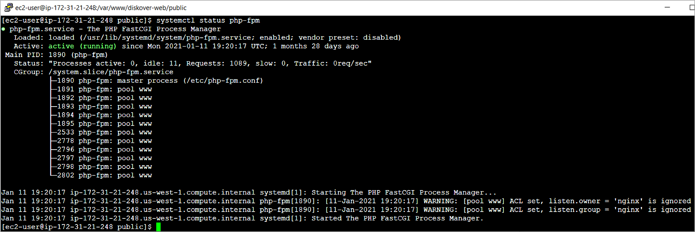

___
### Install PHP 7 and PHP-FPM (fastcgi)

🔴 &nbsp;Perform the following commands to install PHP and PHP-FPM:
```
yum-config-manager --enable remi-php74
amazon-linux-extras install php7.4
yum -y install php php-common php-fpm php-opcache php-pecl-mcrypt php-cli php-gd php-mysqlnd php-ldap php-zip php-xml php-xmlrpc php-mbstring php-json
```

🔴 &nbsp;Set PHP configuration settings for NGINX:
```
vi /etc/php-fpm.d/www.conf
```

🔴 &nbsp;Change ownership to **nginx**:
```
user = nginx
group = nginx
```

🔴 &nbsp;Uncomment and change the NGINX listen parameters:
```
listen.owner = nginx
listen.group = nginx
```

🔴 &nbsp;Change the NGINX listen socket:
```
listen = /var/run/php-fpm/php-fpm.sock
```

🔴 &nbsp;Change file system ownership, enable and start PHP-FPM service:
```
chown -R root:nginx /var/lib/php
chown -R nginx:nginx /var/run/php-fpm/
systemctl enable php-fpm
systemctl start php-fpm
systemctl status php-fpm
```



>_Note:_ The following warning will not affect ability to for Diskover-Web to launch.
>
>**_WARNING_:** [pool www] ACL set, listen.owner = 'nginx' is ignored
