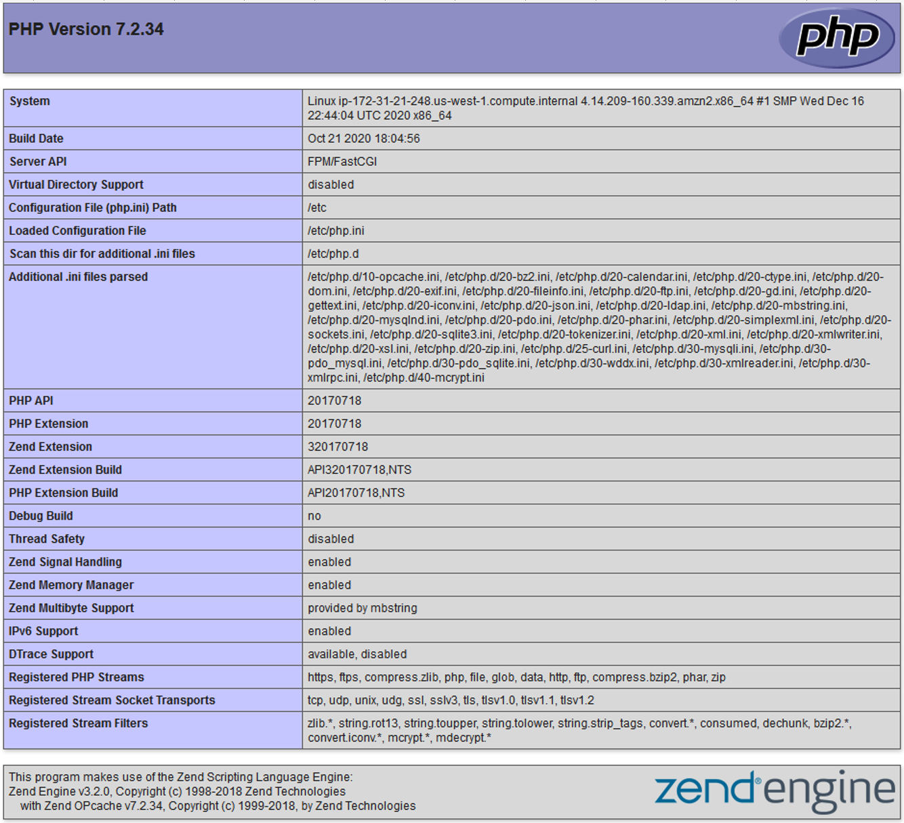

#### Install Diskover-Web

🔴 &nbsp;Copy Diskover-Web files:
```
cp -a diskover-web /var/www/
```

🔴 &nbsp;Edit the Diskover-Web configuration file **Constants.php** to authenticate against your Elasticsearch endpoint:
```
cd /var/www/diskover-web/src/diskover
cp Constants.php.sample Constants.php
vi Constants.php
```

<p id="change_user_pass_linux"></p>

🔴 &nbsp;Set your Elasticsearch (ES) **host(s)**, **port**, **username**, **password**, etc:

Community Edition (ce):
```
const ES_HOST = 'localhost';
const ES_PORT = 9200;
const ES_USER = 'strong_username';
const ES_PASS = 'strong_password';
```

Essential +:
```
const ES_HOSTS = [
    [
        'hosts' => ['localhost'],
        'port' => 9200,
        'user' => 'strong_username',
        'pass' => 'strong_password',
        'https' => FALSE
    ]
```

>_Note:_ Diskover-Web Essential+ uses a number of txt and json files to store some settings and task data. The default install has sample files, but not the actual files. The following will copy the sample files and create default starting point files. **Skip the next 3 steps for Community Edition**.

🔴 &nbsp;Create actual files from the sample files **filename.txt.sample**:
```
cd /var/www/diskover-web/public
for f in *.txt.sample; do cp $f "${f%.*}"; done
chmod 660 *.txt
```

🔴 &nbsp;Create actual task files from the sample task files **filename.json.sample**:
```
cd /var/www/diskover-web/public/tasks/
```

🔴 &nbsp;Copy default/sample JSON files:
```
for f in *.json.sample; do cp $f "${f%.*}"; done
chmod 660 *.json
```

🔴 &nbsp;Set the proper ownership on the default starting point files:
```
chown -R nginx:nginx /var/www/diskover-web
```

🔴 &nbsp;Configure the NGINX Web server with **diskover-web** configuration file:
```
vi /etc/nginx/conf.d/diskover-web.conf
```

🔴 &nbsp;Add the following to the **/etc/nginx/conf.d/diskover-web.conf** file:
```
server {
        listen   8000;
        server_name  diskover-web;
        root   /var/www/diskover-web/public;
        index  index.php index.html index.htm;
        error_log  /var/log/nginx/error.log;
        access_log /var/log/nginx/access.log;
        location / {
            try_files $uri $uri/ /index.php?$args =404;
        }
        location ~ \.php(/|$) {
            fastcgi_split_path_info ^(.+\.php)(/.+)$;
            set $path_info $fastcgi_path_info;
            fastcgi_param PATH_INFO $path_info;
            try_files $fastcgi_script_name =404; 
            fastcgi_pass unix:/var/run/php-fpm/php-fpm.sock;
            #fastcgi_pass 127.0.0.1:9000;
            fastcgi_index index.php;
            include fastcgi_params;
            fastcgi_param SCRIPT_FILENAME $document_root$fastcgi_script_name;
            include fastcgi_params;
            fastcgi_read_timeout 900;
            fastcgi_buffers 16 16k;
            fastcgi_buffer_size 32k;
        }
}
```

#### NGINX Changes Required for CentOS/RHEL 8

🔴 &nbsp;Change `fastcgi_pass` in `/etc/nginx/conf.d/diskover-web.conf` file:
```
fastcgi_pass unix:/var/run/php-fpm/www.sock;
```

🔴 &nbsp;If **IPV6** is not in use or disabled comment out the following line in the `/etc/nginx/nginx.conf` file:
```
# listen       [::]:80 default_server;
```

🔴 &nbsp;Restart NGINX:
```
systemctl restart nginx
```

#### OS Security Changes Required for CentOS/RHEL 8

🔴 &nbsp;Update crypto policies to allow for sha1 rsa keys:
```
update-crypto-policies --show
update-crypto-policies --set DEFAULT:SHA1
```

🔴 &nbsp;Reboot


#### Open Firewall Ports for Diskover-Web

🔴 &nbsp;Diskover-Web listens on **port 8000** by default. To open the firewall for ports required by Diskover-Web:
```
firewall-cmd --add-port=8000/tcp --permanent
firewall-cmd --reload
```


#### Create a Test Web Page to Verify NGINX Configuration for Linux

🔴 &nbsp;The following will create a test page to verify if the NGINX Web server configuration is properly configured (independent of the Diskover-Web application):
```
vi /var/www/diskover-web/public/info.php
```

🔴 &nbsp;Insert the following text:
```
<?php
phpinfo();
```

🔴 &nbsp;For CentOS 8.x / RHEL insert the following text:
```
<?php
phpinfo();
phpinfo(INFO_MODULES);
?>
```

🔴 &nbsp;Open a test page:
```
http://< diskover_web_host_ip >:8000/info.php
```


