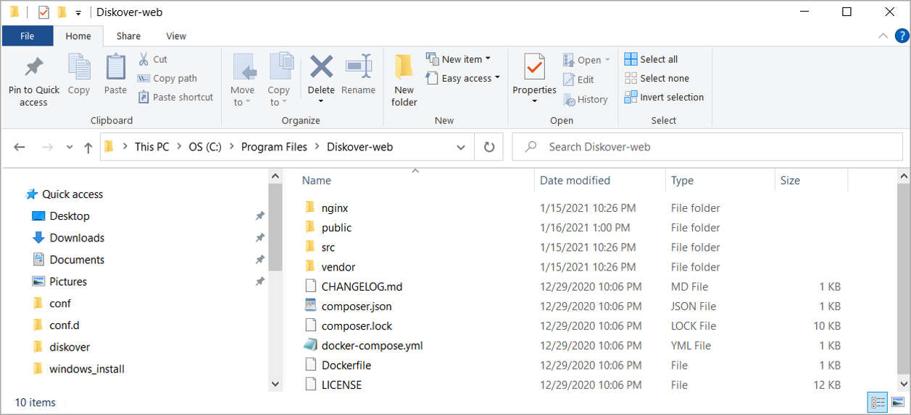
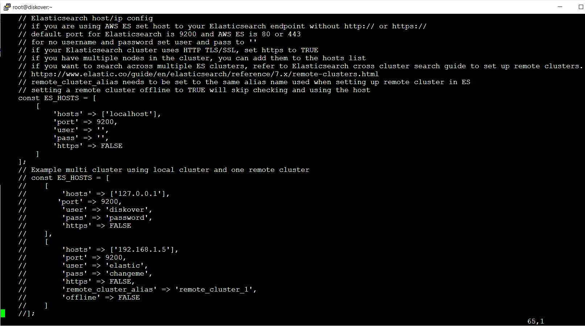
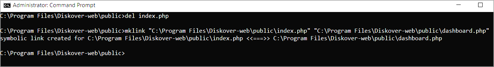
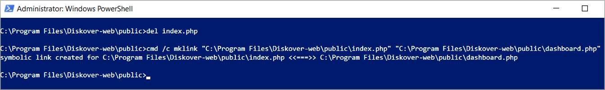

#### Install Diskover-Web

🔴 &nbsp;Extract **diskover-web** folder.

🔴 &nbsp;Copy **diskover-web** folder to program files:
```
Xcopy C:\tmp\diskover-web "C:\Program Files\Diskover-web" /E /H /C /I
```

The image below shows the resulting folder structure:



🔴 &nbsp;Copy default/sample config file:
```
cd 'C:\Program Files\Diskover-web\src\diskover\'
copy .\Constants.php.sample .\Constants.php
```

<p id="change_user_pass_windows"></p>

🔴 &nbsp;Edit **Constants.php**  (Diskover-web config file):
```
C:\Program Files\Diskover-web\src\diskover\Constants.php
```

🔴 &nbsp;Set **ES_HOSTS** to your Elasticsearch **hostname/ip**:



🔴 &nbsp;Change to **Diskover-Web** public directory:
```
cd "C:\Program Files\Diskover-web\public"
```

🔴 &nbsp;Delete **index.php** file.

```
del index.php
```

🔴 &nbsp;Create symbolic link from **index.php** to **dashboard.php**

🔴 &nbsp;Using command prompt as administrator:
```
mklink "C:\Program Files\Diskover-web\public\index.php" "C:\Program Files\Diskover-web\public\dashboard.php"
```



🔴 &nbsp;Using Windows PowerShell as administrator:
```
cmd /c mklink "C:\Program Files\Diskover-web\public\index.php" "C:\Program Files\Diskover-web\public\dashboard.php"
```




🔴 &nbsp;Copy sample txt and json data files:
```
cd 'C:\Program Files\Diskover-web\public\'
copy .\costanalysis.txt.sample .\costanalysis.txt
copy .\smartsearches.txt.sample .\smartsearches.txt
copy .\customtags.txt.sample .\customtags.txt

cd 'C:\Program Files\Diskover-web\public\tasks\'
copy .\workers.json.sample .\workers.json
copy .\tasks.json.sample .\tasks.json
copy .\templates.json.sample .\templates.json
copy .\tasklog.json.sample .\tasklog.json
```

🔴 &nbsp;Restart the NGINX Web server.

🔴 &nbsp;Open Windows PowerShell as administrator and run:
```
PS C:\Program Files\Nginx\nginx-1.19.6> .\nginx.exe
```
