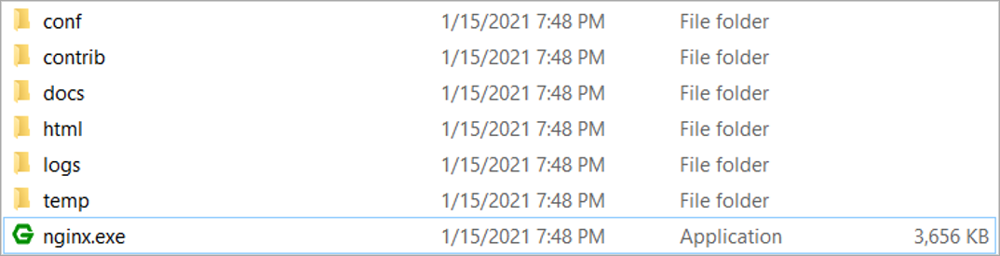
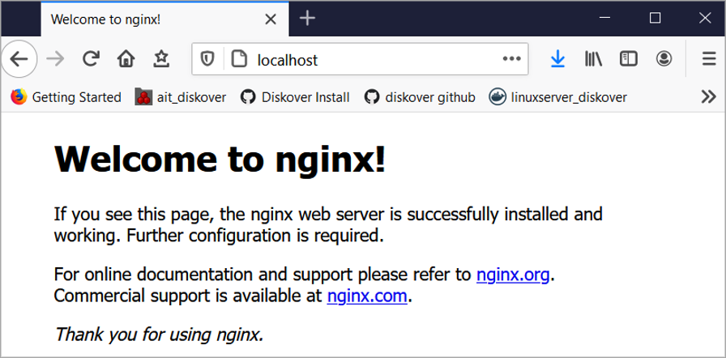

### Install NGINX

To install NGINX/Windows, download the latest mainline version distribution, since the mainline branch of NGINX contains all known fixes: <a href=“https://nginx.org/en/download.html”>https://nginx.org/en/download.html</a>

➡️ Extract the  **zip file**  and run the  **nginx.exe**:

➡️ Verify the NGINX  installation has been successful, open a Web browser to  **localhost**:

