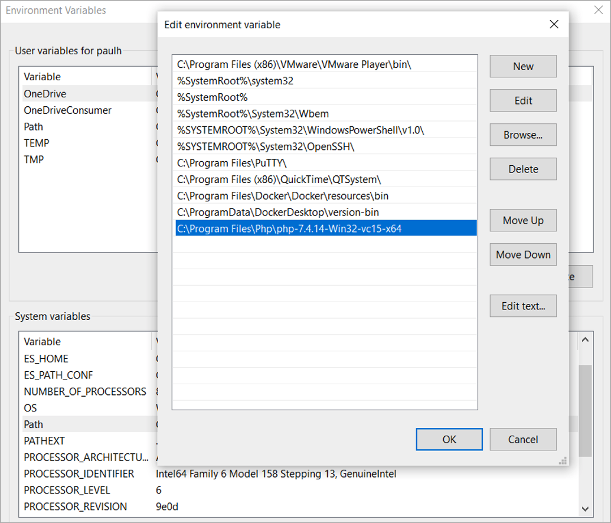
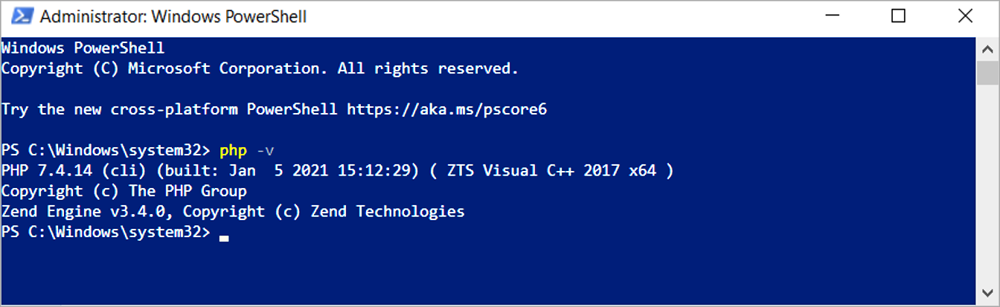
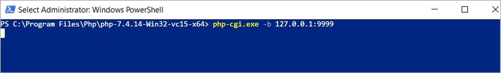
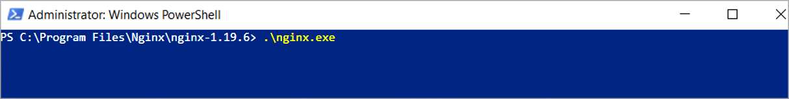
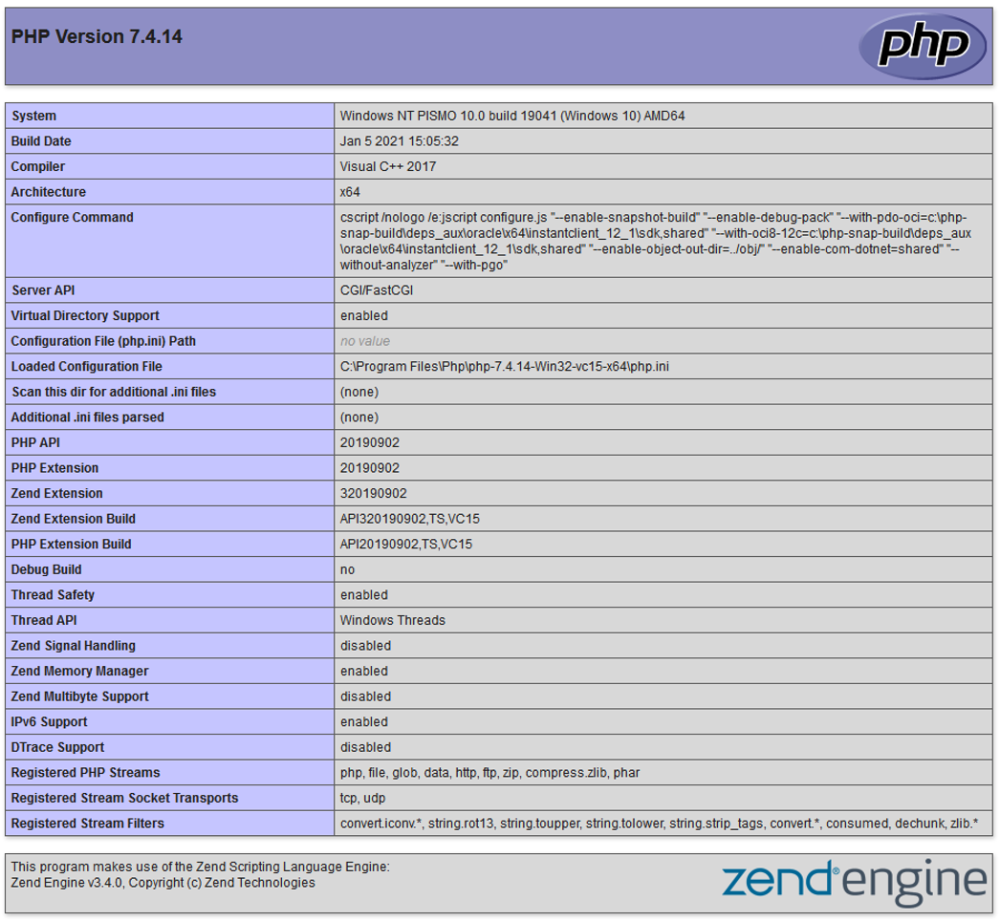

#### Install PHP

🔴 &nbsp;Go to the official download link and download the required version of PHP 7.4.x for Windows: [https://www.php.net/downloads.php](https://www.php.net/downloads.php)

🔴 &nbsp;Download the **Thread Safe** version 7.4.X for Windows.

🔴 &nbsp;Create the following folder **C:\Program Files\Php**

🔴 &nbsp;Extract the **php zip file** and move to **C:\Program Files\Php**

🔴 &nbsp;Configure the environment variable to access PHP from the command line.

🔴 &nbsp;Type **environment** in the search box and select **Edit the system environment variables**.

🔴 &nbsp;Select the **Environment variables** button, then click on the path row under **System variables**, and click **Edit**.

🔴 &nbsp;Add the following and replace with *your install location*:
```
C:\Program Files\Php\php-7.4.14-Win32-vc15-x64
```



🔴 &nbsp;Open Windows PowerShell and type in `php -v` to verify PHP is working.



🔴 &nbsp;In **C:\Program Files\Php\php-7.4.14-Win32-vc15-x64\** copy php production ini file ***php.ini-production*** to **php.ini** file.

🔴 &nbsp;Edit **php.ini** file and add the below to extensions section to enable required extensions and adjust as neccessary for your php version:
```
; Directory in which the loadable extensions (modules) reside.
extension_dir = "C:\Program Files\Php\php-7.4.14-Win32-vc15-x64\ext"

;;;;;;;;;;;;;;;;;;;;;;;;;;;;;;;;;;;;;;;;;;;;;;;;;
; Dynamic Extensions Required ;
;;;;;;;;;;;;;;;;;;;;;;;;;;;;;;;;;;;;;;;;;;;;;;;;;

extension=php_curl.dll
zend_extension=php_opcache.dll
extension=php_gd2.dll
extension=php_ldap.dll
extension=php_xmlrpc.dll
extension=php_mbstring.dll
extension=php_openssl.dll
extension=php_sqlite3.dll
sqlite3.extension_dir = "C:\Program Files\Php\php-7.4.14-Win32-vc15-x64\ext"
```

🔴 &nbsp;Configure integration of NGINX with PHP.

In C:\Program Files\Php\php-7.4.14-Win32-vc15-x64 folder create a ***php-cgi.bat*** file with the below contents:
```
SET PHP_FCGI_MAX_REQUESTS=0
php-cgi.exe -b 127.0.0.1:9999
```

🔴 &nbsp;Open Windows PowerShell as administrator and run:
```
C:\Program Files\Php\php-7.4.14-Win32-vc15-x64> php-cgi.bat
```



🔴 &nbsp;Make a backup of **nginx.conf** file and copy:
```
C:\Program Files\Nginx\nginx-1.19.6\conf\nginx.conf” “C:\Program Files\Nginx\nginx-1.19.6\conf\nginx.conf.bak
```

🔴 &nbsp;Edit **nginx.conf** file:
```
C:\Program Files\Nginx\nginx-1.19.6\conf\nginx.conf
```

>*Note:* This configuration file assumes Diskover-Web is the only Web server running on the machine.

🔴 &nbsp;Replace contents with the following text:
```
#user  nobody;
worker_processes  1;

#error_log  logs/error.log;
#error_log  logs/error.log  notice;
#error_log  logs/error.log  info;

#pid        logs/nginx.pid;

events {
    worker_connections  1024;
}


http {
    include       mime.types;
    default_type  application/octet-stream;

    #log_format  main  '$remote_addr - $remote_user [$time_local] "$request" '
    #                  '$status $body_bytes_sent "$http_referer" '
    #                  '"$http_user_agent" "$http_x_forwarded_for"';

    #access_log  logs/access.log  main;

    sendfile        on;
    #tcp_nopush     on;

    #keepalive_timeout  0;
    keepalive_timeout  65;

    #gzip  on;

    server {
        listen   8000;
        server_name  diskover-web;
        root   "C:\Program Files\Diskover-web\public";
        index  index.php  index.html index.htm;
        # error_log  "C:\Program Files\Nginx\nginx-1.21.6\logs\error.log";
        # access_log "C:\Program Files\Nginx\nginx-1.21.6\logs\access.log";
        location / {
            try_files $uri $uri/ /index.php?$args =404;
        }
        location ~ \.php(/|$) {
            fastcgi_split_path_info ^(.+\.php)(/.+)$;
            set $path_info $fastcgi_path_info;
            fastcgi_param PATH_INFO $path_info;
            try_files $fastcgi_script_name =404;
            # fastcgi_pass unix:/var/run/php-fpm/php-fpm.sock;
            fastcgi_pass 127.0.0.1:9999;
            fastcgi_index index.php;
            include fastcgi_params;
            fastcgi_param SCRIPT_FILENAME $document_root$fastcgi_script_name;
            include fastcgi_params;
            fastcgi_read_timeout 900;
            fastcgi_buffers 16 16k;
            fastcgi_buffer_size 32k;
        }
}

}
```

🔴 &nbsp;Create a file:
```
C:\Program Files\Nginx\nginx-1.19.6\html\info.php
```

🔴 &nbsp;And test PHP configuration with the text below:
```
<?php
phpinfo();
?>
```

🔴 &nbsp;Start the NGINX Web server.

🔴 &nbsp;Open Windows PowerShell as administrator and run:
```
PS C:\Program Files\Nginx\nginx-1.19.6> .\nginx.exe
```



🔴 &nbsp;Open **info.php** page to confirm proper configuration: [http://localhost/info.php](http://localhost/info.php)


