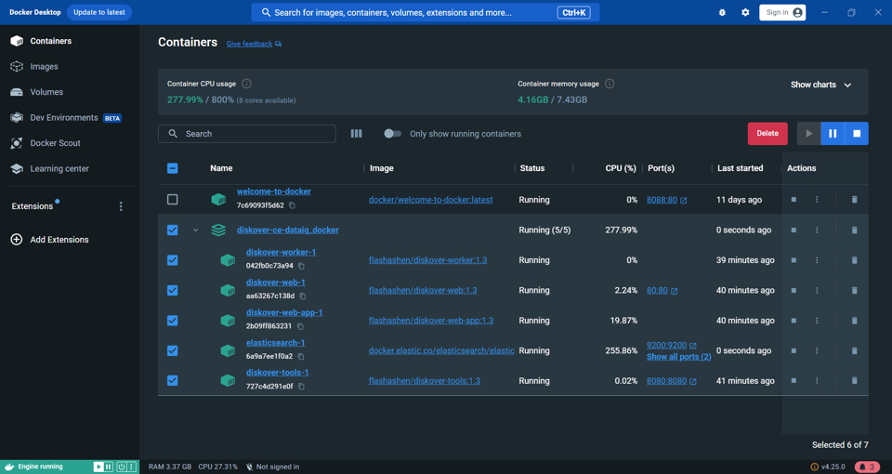

___
## Docker Installation | Introduction
___

This installation produces no-source Docker images that, provided with the application source, will run the full Diskover stack with zero or minimal configuration.

This guide covers:
- Installing Diskover via Docker for our free Community Edition.
- Installing Diskover via Docker for our annual subscription editions using Linux, Windows, and Mac.
- Instructions when migrating from Dell DataIQ.
- Additional references.

___
## Install Diskover Docker for Community Edition
___

If you want to run Diskover Community Edition in Docker, there is a Docker Hub container built by [LinuxServer.io](https://www.linuxserver.io/) at [Diskover Docker Hub](https://hub.docker.com/r/linuxserver/diskover) and [Diskover LinuxServer.io GitHub](https://github.com/linuxserver/docker-diskover).

___
## Install Diskover Docker on Linux
___

&nbsp;&nbsp;&nbsp;&nbsp;&nbsp;&nbsp;&nbsp;&nbsp;

🔴 Go to [www.docker.com/products/docker-desktop/](www.docker.com/products/docker-desktop/) and select **Download for Linux**.

🔴 Installation instructions: [[https://docs.docker.com/desktop/install/linux-install/](https://docs.docker.com/desktop/install/linux-install/)

*Instructions coming soon.*

___
## Install Diskover Docker on Windows
___

&nbsp;&nbsp;&nbsp;&nbsp;&nbsp;&nbsp;&nbsp;&nbsp;

🔴 Go to [www.docker.com/products/docker-desktop/](www.docker.com/products/docker-desktop/) and select **Download for Windows**.

🔴 Installation instructions: [https://docs.docker.com/desktop/install/windows-install/](https://docs.docker.com/desktop/install/windows-install/)

🔴 Extract this folder:

```shell
diskover-ce-dataiq_docker.zip folder
```

🔴  Copy `diskover-ce-dataiq_docker` folder to program files:

```
cd ' C:\tmp\diskover-ce-dataiq_docker'
mkdir " C:\Program Files\Docker\containers"
Xcopy C:\tmp\ diskover-ce-dataiq_docker\ " C:\Program Files\Docker\containers"
/E /H /C /I
```

🔴  Build and start the docker container:

```
cd ' C:\Program Files\Docker\containers\diskover-ce-dataiq_docker'
docker compose up -d
```

🔴  View `Containers Status` in Docker Desktop. The image below shows the resulting folder structure:



___
## Install Diskover Docker on Mac
___

&nbsp;&nbsp;&nbsp;&nbsp;&nbsp;&nbsp;&nbsp;&nbsp;

🔴 Go to [www.docker.com/products/docker-desktop/](www.docker.com/products/docker-desktop/) and select **Download for Mac**.

🔴 Installation instructions: [https://docs.docker.com/desktop/install/mac-install/](https://docs.docker.com/desktop/install/mac-install/)

*Instructions coming soon.*

___
## Install Diskover Docker | Dell DataIQ Migration
___

### Dell DataIQ Migration to Diskover Community Edition

This section gives additional instructions on how to install the free Diskover Community Edition for Dell DataIQ migration using Docker.

*Instructions coming soon.*

### Dell DataIQ Migration to Diskover Annual Subscription Editions

This section gives additional instructions on how to install Diskover annual subscription editions for Dell DataIQ migration using Docker.

*Instructions coming soon.*

___
## Diskover Docker | Additional References
___

The following information is common to all Linux, Windows, and Mac.

### Elasticsearch Container

🔴 &nbsp;docker-compose.yml:
```
version: '3'
services:
  elasticsearch:
    container_name: elasticsearch
    image: docker.elastic.co/elasticsearch/elasticsearch:7.16.1
    environment:
      - discovery.type=single-node
      - bootstrap.memory_lock=true
      - "ES_JAVA_OPTS=-Xms1g -Xmx1g"
    ulimits:
      memlock:
        soft: -1
        hard: -1
    volumes:
      # local ES data directory
      - ./esdata:/usr/share/elasticsearch/data
    ports:
      - 9200:9200
      - 9300:9300
    #depends_on:
    #  - elasticsearch-helper
  #elasticsearch-helper:
  #  image: alpine
  #  command: sh -c "sysctl -w vm.max_map_count=262144"
  #  privileged: true
  #kibana:
  #  image: docker.elastic.co/kibana/kibana:7.16.1
  #  container_name: kibana
  #  ports:
  #    - 5601:5601
  #  depends_on:
  #    - elasticsearch
  #  environment:
  #    ELASTICSEARCH_URL: http://elasticsearch:9200
  #    ELASTICSEARCH_HOSTS: http://elasticsearch:9200
```

See [Elasticsearch Docker docs](https://www.elastic.co/guide/en/elasticsearch/reference/7.17/docker.html) for more info.

### Diskover Container

🔴 &nbsp;Dockerfile:
```
FROM python:3.7-alpine

# Install additional packages
RUN apk update \
  && apk add --no-cache --virtual build-dependencies \
  build-base \
  gcc \
  python3-dev \
  && apk add --no-cache bash \
  ncurses

# Copy existing application directory contents
COPY . /app/diskover

WORKDIR /app/diskover

# Install required python3 pip modules
RUN pip3 install --no-cache-dir -r requirements.txt

# Start diskoverd task woker (Essential + versions only)
CMD ["python3", "diskoverd.py", "-v"]
```

🔴 &nbsp;docker-compose.yml:
```
version: '3'
services:
  #diskover python app
  diskover:
    image: python:3.7-buster
    container_name: diskover
    build:
      context: .
      dockerfile: Dockerfile
    working_dir: /app/diskover
    environment:
      # diskoverd task worker (Essential + versions only)
      -  DISKOVERD_WORKERNAME=docker-worker
    volumes:
      - .:/app/diskover
      # diskover config files
      - ./configs:/root/.config
      # mount points for crawling
      - /mnt/stor1:/data
```

### Diskover-Web Container

🔴 &nbsp;Dockerfile:
```
FROM php:7.4-fpm

# Install php ldap extension (Essential + versions only)
RUN apt-get update && \
    apt-get install -y libldap2-dev
RUN docker-php-ext-configure ldap
RUN docker-php-ext-install ldap

# Copy php.ini
RUN cp /usr/local/etc/php/php.ini-production /usr/local/etc/php/php.ini

# Copy existing application directory contents
COPY . /var/www

EXPOSE 8000
```

🔴 &nbsp;docker-compose.yml:
```
version: '3'
services:
  # diskover-web php app
  diskover-web:
    image: php:7.4-fpm
    container_name: diskover-web-app
    build:
      context: .
      dockerfile: Dockerfile
    working_dir: /var/www
    volumes:
      - .:/var/www
  # Nginx web server
  nginx:
    image: nginx:1.21
    container_name: diskover-web-nginx
    working_dir: /var/www
    volumes:
      - ./diskover-web.conf:/etc/nginx/conf.d/diskover-web.conf
      - .:/var/www
    ports:
      - 8000:8000
```

### Quick Start

Distributions of this project can run as-is, out of the box, with default settings. Custom setup and customizations can be performed as you go. 

🔴 For a quick start:

```shell
export DISKOVER_SCAN_DIR=<host directory to scan>
tar -xf diskover_docker.tar.gz  # archive file may have a different name
cd diskover_docker
docker compose up -d
```

#### Setup

##### Initial Setup

🔴 Unpack the archive file containing the dockerized application. The file will be named something like `diskover_docker.tar.gz`:

```shell
tar -xf diskover_docker.tar.gz
```
  
🔴 Change the current working directory to `diskover_docker` that was unpacked from the archive file:

```shell
cd diskover_docker
```
  
🔴 Edit the settings in `.env` to match the current environment. Pay special attention to the `DISKOVER_SCAN_DIR` setting as this is the directory that will be accessible to the container for the scan. 

```shell
vi .env
```

> *Note:* You can also use execution (shell) environment variables that override those in the `.env` file.

##### Multiple Directories Cannot be Scanned/Mounted under a Single Parent Directory

🔴 **If** you have more than one directory to scan and they cannot be mounted under a single parent directory, then you will have to add volumes directly in the 
  `./docker-compose.yml` file under the diskover-worker service:

```shell
vi docker-compose.yml
```
  
🔴 Position the application files/directories. Depending on your dockerized diskover distribution, you will need to do one of the following...
  
🔴 **If the application files are included:** No action is required.
    
🔴 **If the application is in separate archive files:** Copy application archive files into `./resources`:

```shell
cp <somewhere on your filesystem>/diskover*.tar.gz ./resources
```

🔴 **If you have an existing application:** Edit `HOST_MOUNT_*` settings in the `.env` to point to the existing directories:

```shell
vi .env  # if the HOST_MOUNT_* variables have not already been set
```

##### SSL Certificate and Private Key for Diskover 
    
🔴 **If** you have an ssl certificate and private key for diskover, place them in the resources directory alongside the application `tar` files. If not, a self-signed cert
  will be generated. 
  
```shell
cp <somewhere on your filesystem>/your-disover-web.crt ./resources
cp <somewhere on your filesystem>/your-disover-web.key ./resources
```

> *Note:* If you provide your own files they must have `.crt` and `.key` extensions or they will be ignored.

##### Certificate Authority and/or Intermediate Certs
  
🔴 **If** you have certificate authority and/or intermediate certs, place them in `./resources/cacerts`.

```shell
cp <somewhere on your filesystem>/your-root-ca.crt ./resources/cacerts
cp <somewhere on your filesystem>/your-intermediate-ca.crt ./resources/cacerts
```

> *Note:* Currently, they will only installed in the worker container.

#### Run

The compose services are categorized into three profiles: 
- Web
- Worker
- Elasticsearch

This allows the same `docker-compose.yml` file to be used to run the application on different hosts or on a single host, as desired.

🔴 To run all, assuming the default setting `COMPOSE_PROFILES=web,worker,elasticsearch`

```shell
docker compose up -d
```

🔴 To run a specific set of containers, the worker for example:

```shell
docker compose --profile worker up -d
```

> *NOTE:* Docker compose commands on individual services may not work when there are dependencies across profiles and you will see an error like this example below. To work around this just don't specify the individual service and operate on the level of profile.

```shell
$ docker-compose --profile web restart diskover-web-app
no such service: elasticsearch
```

#### Web Endpoints

- Diskover: http://localhost
- Kibana - indexes: http://localhost:5601/app/management/data/index_management/indices

#### Configuration and Data Files

This project intends to eventually obviate direct editing of project config files, but that option is still available.

> *Note:* If you do directly edit configuration files, then set the `S6_TEMPLATE_OVERWRITES variable=false` for the corresponding container if the edited file is templated. To list template files for a given service execute the following:

```shell
docker exec <container> find /templates -type f
```

All application host (bind) mounts are in the mount directory by default. The directory structure of all containers closely follows the standard install paths as detailed in the [Diskover Installation Guide](https://docs.diskoverdata.com/diskover_installation_guide/). Here is a list of a few core configuration files:

**Core settings:**
```
./mount/web/www/src/diskover/Constants.php
```

**Worker scanner:**
```
./mount/worker/config/diskover/config.yaml
```

**Worker daemon:**
```
./mount/worker/config/diskoverd/config.yaml
```
