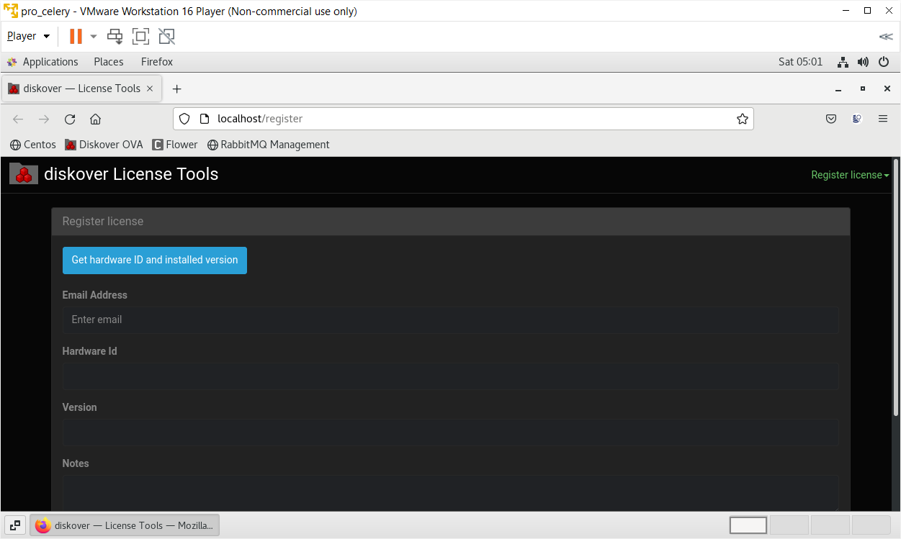

___
## Docker Installation
___

This project produces no-source docker images that, provided with application source, will run the full Diskover stack with zero or minimal configuration. 

### Quickstart Demo

Distributions of this project can run as-is, out of the box, with default settings. Custom setup and customizations can be performed as you go. 

🔴 For a quick start:

```shell
export DISKOVER_SCAN_DIR=<host directory to scan>
tar -xf diskover_docker.tar.gz  # archive file may have a different name
cd diskover_docker
docker compose up -d
```

### Setup

#### Initial Setup

🔴 Unpack the archive file containing the dockerized application. The file will be named something like `diskover_docker.tar.gz`:

```shell
tar -xf diskover_docker.tar.gz
```
  
🔴 Change the current working directory to `diskover_docker` that was unpacked from the archive file:

```shell
cd diskover_docker
```
  
🔴 Edit the settings in `.env` to match the current environment. Pay special attention to the `DISKOVER_SCAN_DIR` setting as this is the directory that will be accessible to the container for the scan. 

> *Note:* You can also use execution (shell) environment variables which override those in the `.env` file.

```shell
vi .env
```

#### Multiple Directories Cannot be Scanned/Mounted under a Single Parent Directory

🔴 **If** you have more than one directory to scan and they cannot be mounted under a single parent directory, then you will have to add volumes directly in the 
  `./docker-compose.yml` file under the diskover-worker service:

```shell
vi docker-compose.yml
```
  
🔴 Position the application files/directories. Depending on your dockerized diskover distribution, you will need to do one of the following...
  
🔴 **If the application files are included:** No action is required.
    
🔴 **If the application is in separate archive files:** Copy application archive files into `./resources`:

```shell
cp <somewhere on your filesystem>/diskover*.tar.gz ./resources
```

🔴 **If you have an existing application:** Edit `HOST_MOUNT_*` settings in the `.env` to point to the existing directories:

```shell
vi .env  # if the HOST_MOUNT_* variables have not already been set
```

#### SSL Certificate and Private Key for Diskover 
    
🔴 **If** you have an ssl certificate and private key for diskover, place them in the resources directory along side the application `tar` files. If not, a self-signed cert
  will be generated. 
  
> *Note:* If you provide your own files they must have `.crt` and `.key` extensions or they will be ignored.
 
```shell
cp <somewhere on your filesystem>/your-disover-web.crt ./resources
cp <somewhere on your filesystem>/your-disover-web.key ./resources
```

#### Certificate Authority and/or Intermediate Certs
  
🔴 **If** you have certificate authority and/or intermediate certs, place them in `./resources/cacerts`.

> *Note:* Currently, they will only installed in the worker container.

```shell
cp <somewhere on your filesystem>/your-root-ca.crt ./resources/cacerts
cp <somewhere on your filesystem>/your-intermediate-ca.crt ./resources/cacerts
```

### Run

The compose services are categorized into three profiles: 
- web
- worker
- elasticsearch

This allows the same `docker-compose.yml` file to be used to run the application different hosts or on a single host, as desired.

🔴 To run all, assuming the default setting `COMPOSE_PROFILES=web,worker,elasticsearch`

```shell
docker compose up -d
```

🔴 To run a specific set of containers, the worker for example:

```shell
docker compose --profile worker up -d
```

> *NOTE:* Docker compose commands on individual services will may not work when there are dependencies across profiles and you will see an eror like this example below. To work around this just don't specify the individual service and operate on the level of profile.
>
> ```shell
> $ docker-compose --profile web restart diskover-web-app
> no such service: elasticsearch
> ```

### Web Endpoints

- [Diskover](http://localhost): http://localhost
- [Kibana - indexes](http://localhost:5601/app/management/data/index_management/indices): http://localhost:5601/app/management/data/index_management/indices

### Configuration and Data Files

The intention of this project is to eventually obviate direct editing of project config files, but that option is still available.

> *Note:* If you do directly edit configuration files, then set the `S6_TEMPLATE_OVERWRITES variable=false` for the corresponding container if the edited file is templated. To list template files for a given service execute the following:

```shell
docker exec <container> find /templates -type f
```

All application host (bind) mounts are in the mount directory by default. The directory structure of all containers closely follows the standard install paths as detailed in the [Diskover Installation Guide](https://docs.diskoverdata.com/diskover_installation_guide/). Here is a list of a few core configuration files:

**Core**
[Settings](./mount/web/www/src/diskover/Constants.php): ./mount/web/www/src/diskover/Constants.php

**Worker**
[Scanner](./mount/worker/config/diskover/config.yaml): ./mount/worker/config/diskover/config.yaml
[Worker daemon](./mount/worker/config/diskoverd/config.yaml): ./mount/worker/config/diskoverd/config.yaml


This section contains instructions to quickly get up and running with Diskover using OVA (Open Virtual Appliance) on VMware.

### Features
- Diskover and dependencies already installed.
- Diskover is configured to start at boot.
- Hostname set to `diskover`
- DHCP enabled
- CentOS 7.x

### Understand the Network

Understand the networking architecture of the site you will be deploying into. If the site has DHCP already configured,
the virtual machine will acquire an IP address from the offered range. Ensure the offered IP address will route to the
clients who will use the service. The file systems to be scanned must also be reachable from offered DHCP range.

For clients to access the service, they will need to route to the hostname provided in the license file. The hostname
in the license file must match the hostname on the Linux host. It is recommended that DNS be used to resolve the
service.

### Requirements

The OVA is designed to run on VMware hypervisors and includes _VMware Tools_ already installed into the OVA. The OVA has been tested on the following VMware hypervisors:

- VMware Workstation Pro for Windows
- VMware Player for Windows
- VMware vSphere

### Size the Instance

Before you begin, ensure there is sufficient memory and disk resources for the OVA:

- Memory 32GB RAM
- Disk:
  - Media & Entertainment workflows: 256GB fast disk/SSD
  - Life Science, EDA, etc. workflows: 512GB fast disk/SSD

🔴 To Expand the root partition and filesystem:

```
sudo -s
```
```
yum install cloud-utils-growpart-0.27-10.el7.x86_64
```

🔴 To grow the sda3 partition:

```
growpart /dev/sda 3
```

🔴 To grow the root filesystem:

```
xfs_growfs -d /
```

### How to Install OVA

🔴  To obtain the Diskover OVA software:

1. If you are new to the **Diskover Download Portal**, you will fist need to [create an account](https://download.diskoverdata.com/register.php).
2. Once your account is approved, you'll receive a confirmation email.
3. You can then log in and download the software at [https://download.diskoverdata.com/](https://download.diskoverdata.com/)


🔴  Linux Login:

User: **diskover**

Password: **darkdata**

🔴  You can elevate yourself via:
```
sudo -s
```

🔴  Diskover Login:

User: **admin**

Password: **darkdata**

🔴 Request a license by sending us your [hardware ID](https://docs.diskoverdata.com/diskover_installation_guide_ova/#generating-a-hardware-id) so we can generate a license. 

- First, you can click on the **Diskover Install Tools** icon on the desktop to open the **Diskover License Tools** application.


- Select **Register license** in the drop-down list located at the upper right corner, and then click on **Get hardware ID and installed version** to get your hardware ID number:



🔴  Install your license files as explained in the [software activation chapter](https://docs.diskoverdata.com/diskover_installation_guide_ova/#software_activation).

🔴  You will need to mount the file system(s) of interest to the virtual machine then start indexing. You can create a [scheduled index task by following these instructions](https://docs.diskoverdata.com/diskover_configuration_and_administration_guide/#managing-diskover-tasks-via-the-task-panel).

🔴  Or you can manually initiate an index:

1. To run the Diskover indexing process from a shell prompt:
```
cd /opt/diskover
```
2. Start your first crawl:
```
python3 diskover.py -i diskover-<indexname> <storage_top_dir>
```
