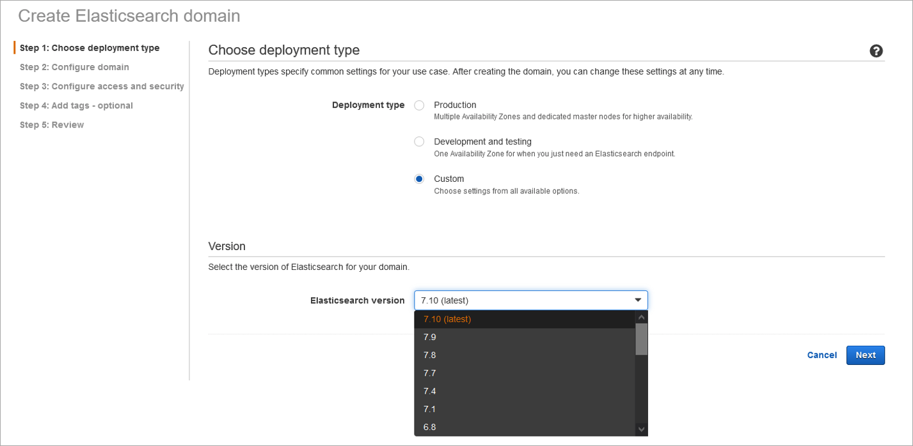
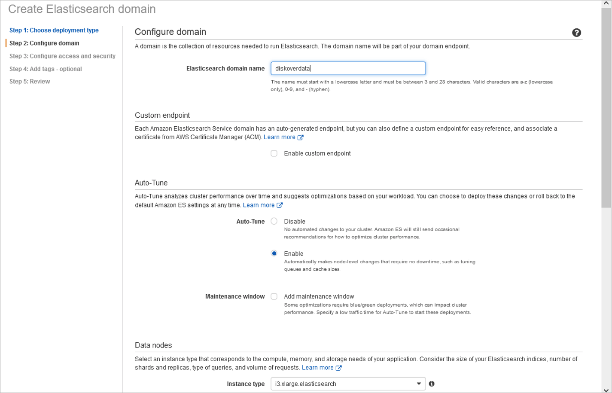
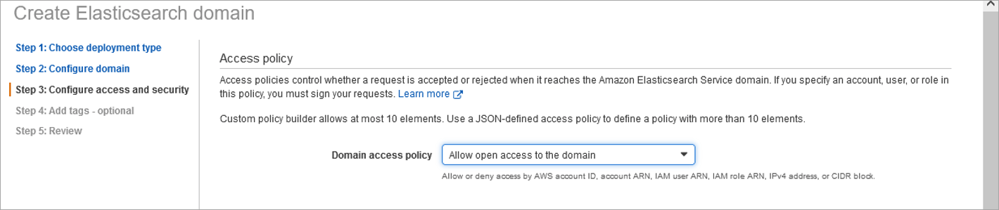
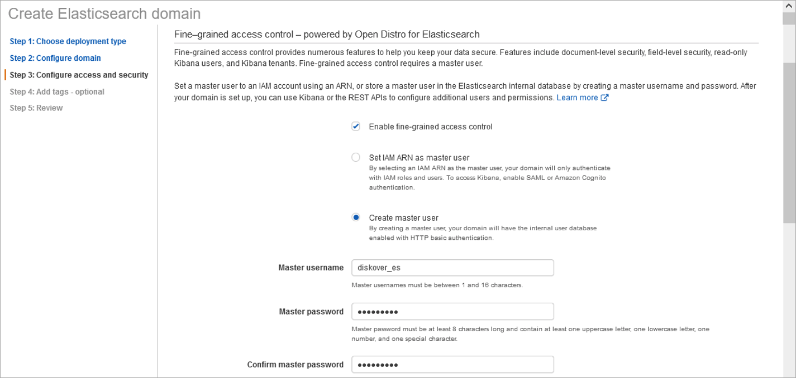
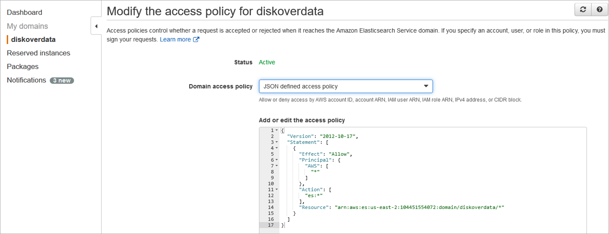
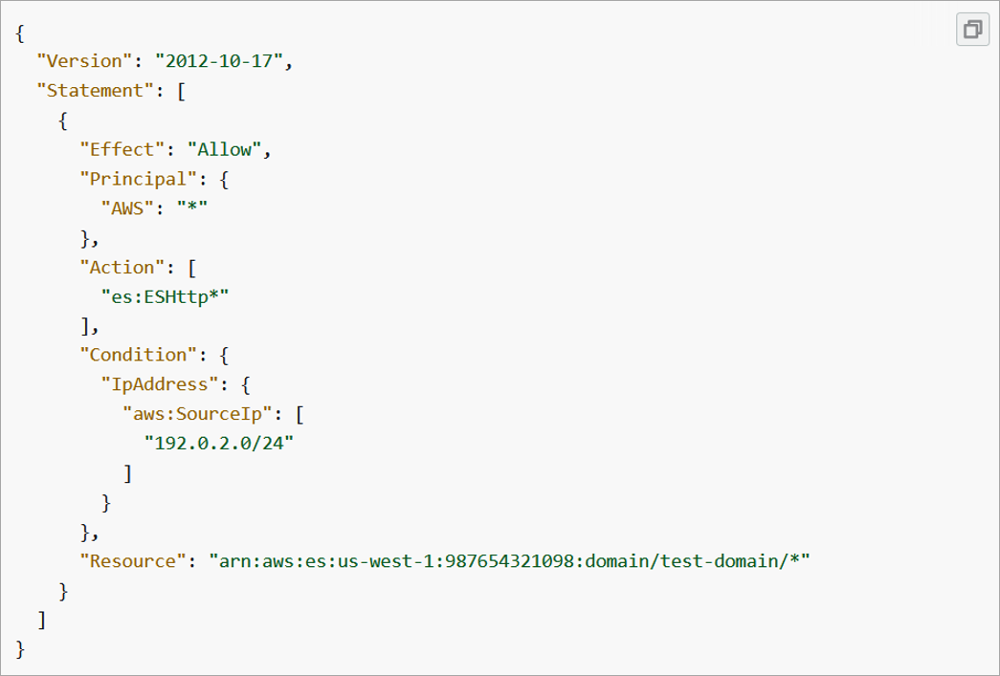

___
## AWS Elasticsearch Environment
___

### Choose Deployment Type

🔴 &nbsp;Diskover requires an Elasticsearch 7.X environment - Select **custom** for deployment type:

### Configure Domain

- One node is sufficient for initial testing.
- Production deployments should be configured with a minimum of 3 nodes to achieve redundancy in the Elasticsearch configuration.

🔴 &nbsp;Select node type - Diskover recommends **i3.xlarge** Elasticsearch:

### Configure Access and Security

🔴 &nbsp;Create a master username with strong password. The Elasticsearch master user credentials should align with the strong password policy adopted for IAM users. 

More information can be found here:  

[https://docs.aws.amazon.com/IAM/latest/UserGuide/id_credentials_passwords_account-policy.html](https://docs.aws.amazon.com/IAM/latest/UserGuide/id_credentials_passwords_account-policy.html)

🔴 &nbsp;Initially, allow open access to the domain during install to confirm all components are operational (master username and strong password are still required during setup of configuration). This reduces initial troubleshooting that may be required during setup of configuration. Once confirmed working configuration, the access policy will be modified to increase security.

### Modify Access Policy

🔴 &nbsp;Modify access policy to restrict access to known IP address / subnets of Diskover indexer(s) and Diskover-Web server.

The IP addresses/subnets will be known after completion of [Diskover-Web for Amazon Linux](#diskover_web_amazon_linux) installation and [Install Diskover On-Premise Indexer(s)](#install_indexers_on_prem) installation. If additional Diskover indexer(s) are deployed in the future, the access policy should be modified to align with deployment of Diskover indexer(s).

For more information visit:

[https://docs.aws.amazon.com/opensearch-service/latest/developerguide/what-is.html](https://docs.aws.amazon.com/opensearch-service/latest/developerguide/what-is.html)
