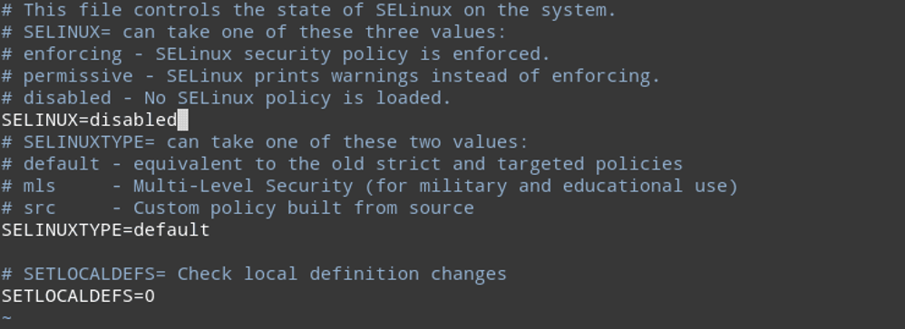
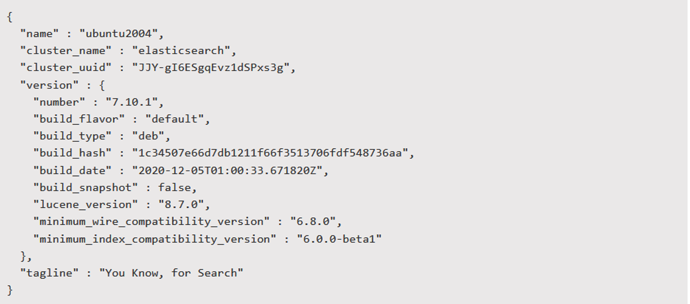

___
### Install Elasticsearch for Linux Ubuntu

🔴 &nbsp;Install Ubuntu 20.x

#### Disable SELinux (Optional)

🔴 &nbsp;Disabling SELinux is optional and not required to run Diskover, however, if you use SELinux you will need to adjust the SELinux policies to allow Diskover to run:
```
vi /etc/sysconfig/selinux
```

🔴 &nbsp;Change **SELINUX** to **disabled**:



🔴 &nbsp;Reboot now.

🔴 &nbsp;Check Security Enhanced Linux status.

#### Update Server

🔴 &nbsp;Update Server:
```
apt-get update -y
apt-get upgrade -y
```

#### Add Elasticsearch Repository

🔴 &nbsp;Add the Elasticsearch Repository. By default, Elasticsearch is not available in the Ubuntu standard OS repository, so you will need to add the Elasticsearch repository to your system. First, install the required dependencies with the following command:
```
apt-get install apt-transport-https ca-certificates gnupg2 -y

```

🔴 &nbsp;Once all the dependencies are installed, import the GPG key with the following command:
```
wget -qO - https://artifacts.elastic.co/GPG-KEY-elasticsearch | apt-key add
```

🔴 &nbsp;Next, add the Elasticsearch repository with the following command:

```
sh -c 'echo "deb https://artifacts.elastic.co/packages/7.x/apt stable main" > /etc/apt/sources.list.d/elastic-7.x.list'

```

Once the repository is added, you can proceed and install Elasticsearch.

#### Install Elasticsearch 8.x:

The following section describes installing Elasticsearch on Linux Ubuntu.

🔴 &nbsp;Update the repository cache and install Elasticsearch with the following command:
```
apt-get update -y
apt-get install elasticsearch -y

```

🔴 &nbsp;Test Elasticsearch install status:
```
systemctl start elasticsearch

```

🔴 &nbsp;Install curl:
```
apt-get curl
apt install curl

```

🔴 &nbsp;Test Elasticsearch endpoint:
```
curl -X GET "localhost:9200"
```

🔴 &nbsp;Configure Java JVM for Elasticsearch:
```
apt install vim
vim /etc/elasticsearch/jvm.options
```

🔴 &nbsp;Set the set the following memory heap size options to 50% of memory, up to 32g max:
```
-Xms8g
-Xmx8g
```

🔴 &nbsp;Update the Elasticsearch configuration file to define the desired Elasticsearch endpoint:
```
vi /etc/elasticsearch/elasticsearch.yml
```

🔴 &nbsp;Network host configuration:
```
network.host:
```
> _Note_: Leave commented out for localhost (default) or uncomment and set to the  **ip**  you want to bind to, using  **0.0.0.0** will bind to all  **ips**.

🔴 &nbsp;Discovery seed host configuration:
```
discovery.seed_hosts:
```

>_Note_: Leave commented out for **[“127.0.0.1", "[::1]"]** (default) or uncomment and set to **["<host ip>"]**.

🔴 &nbsp;Configure the Elasticsearch storage locations to the path of desired fast storage devices (SSD or other fast disk):
```
path.data: /var/lib/elasticsearch
path.logs: /var/log/elasticsearch
```

>_Note_: Change from default location below if desired.

🔴 &nbsp;Configure the Elasticsearch bootstrap memory variable to **true**:
```
bootstrap.memory_lock: true
```
  
🔴 &nbsp;Update Elasticsearch **systemd** service settings:
```
mkdir /etc/systemd/system/elasticsearch.service.d
```
  
🔴 &nbsp;Update the Elasticsearch service configuration file:
```
vi /etc/systemd/system/elasticsearch.service.d/elasticsearch.conf
```
  
🔴 &nbsp;Add the following text:
```
[Service]
LimitMEMLOCK=infinity
LimitNPROC=4096
LimitNOFILE=65536
```

#### Open Firewall Ports for Elasticsearch
  
🔴 &nbsp;Open firewall ports:
```
firewall-cmd --add-port=9200/tcp --permanent
firewall-cmd --reload
```

🔴 &nbsp;Start and enable Elasticsearch service:
```
systemctl stop elasticsearch.service
systemctl enable elasticsearch.service
systemctl start elasticsearch.service
systemctl status elasticsearch.service
```

#### Check Elasticsearch Health

🔴 &nbsp;Check the health of the Elasticsearch cluster:
```
curl http://ip_address:9200/_cat/health?v
```


