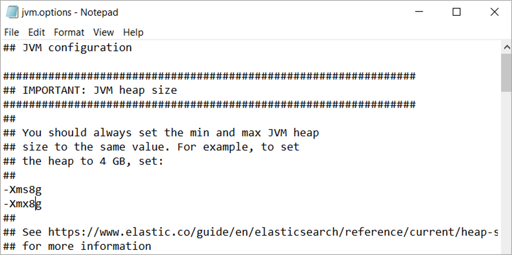
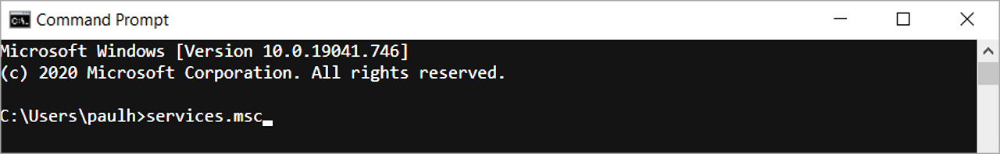
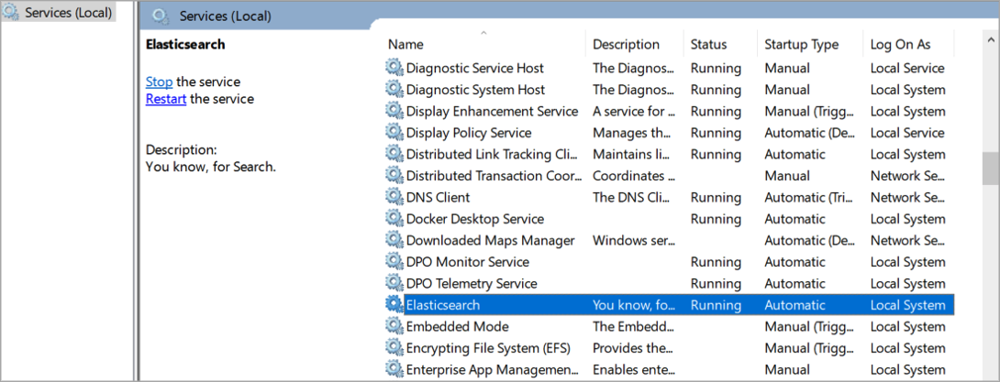

### Configure the Elasticsearch Settings

➡️ Set JVM configuration (mem heap size).

➡️ Edit the following file **C:\ProgramData\Elastic\Elasticsearch\config\jvm.options**

➡️ Set **Xms8g** to 50% of memory, up to 32g max:
```
-Xms8g
```



➡️ Edit the following file **C:\ProgramData\Elastic\Elasticsearch\config\elasticsearch.yml** and change:
```
bootstrap.memory_lock: true
```


➡️ Restart the Elasticsearch service and then open a **cmd prompt**.
```
services.msc
```


➡️ Select  **Elasticsearch**  and restart.


