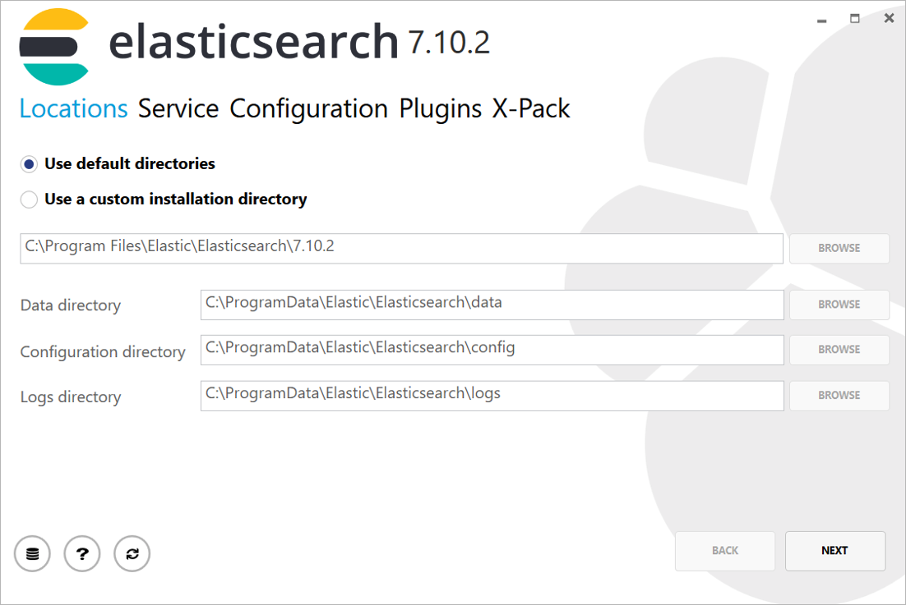
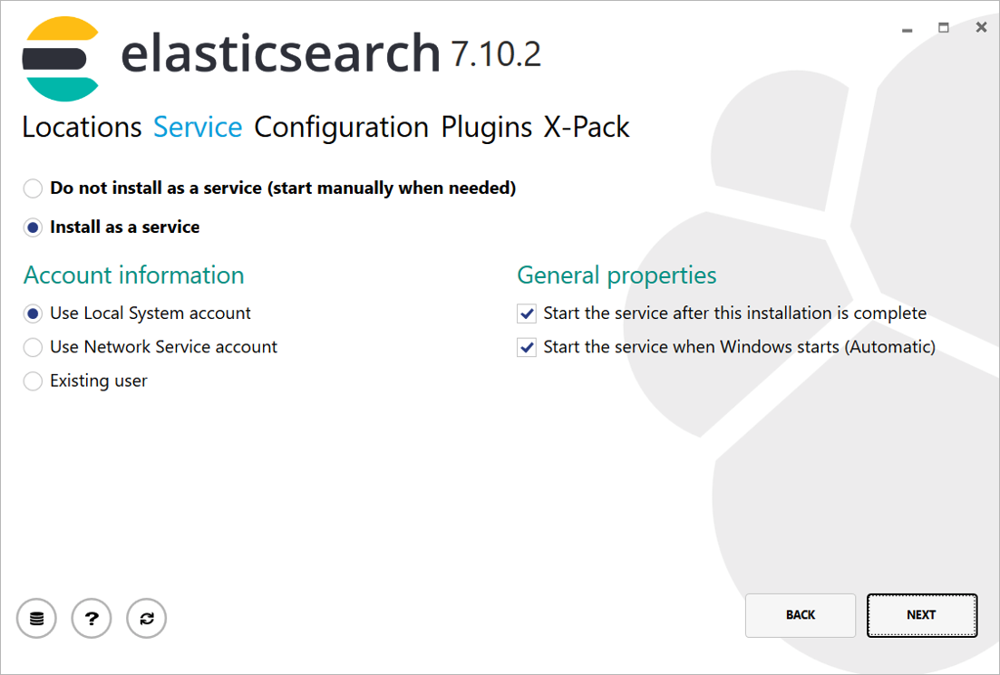
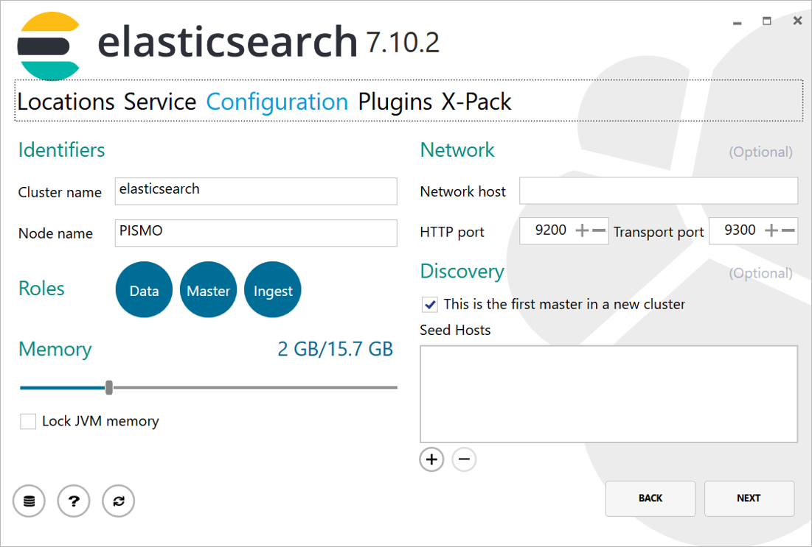
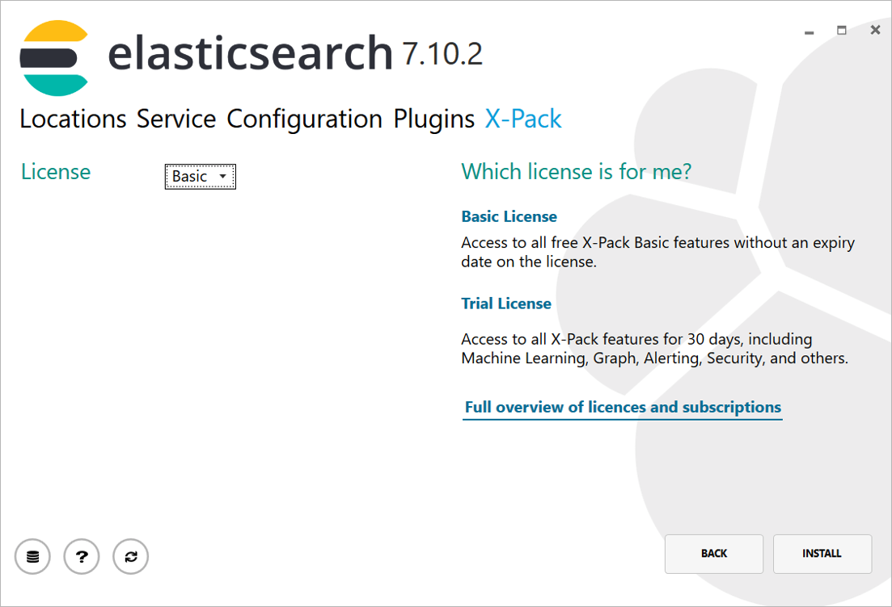
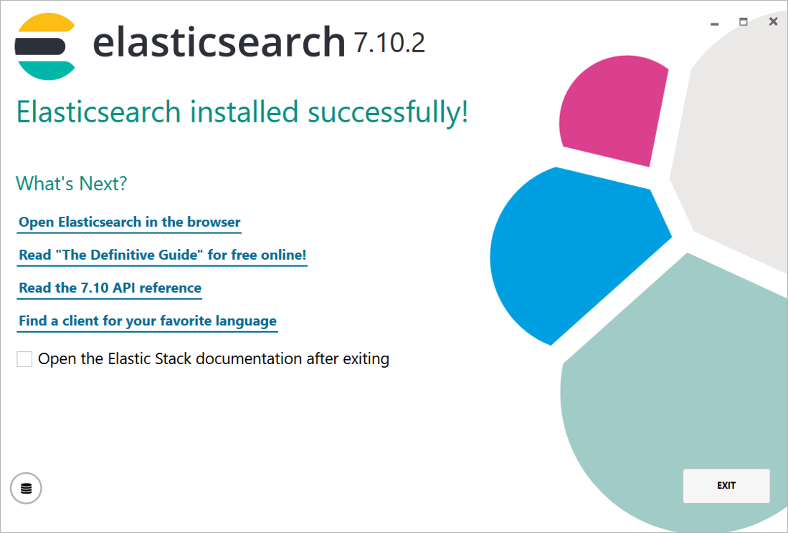
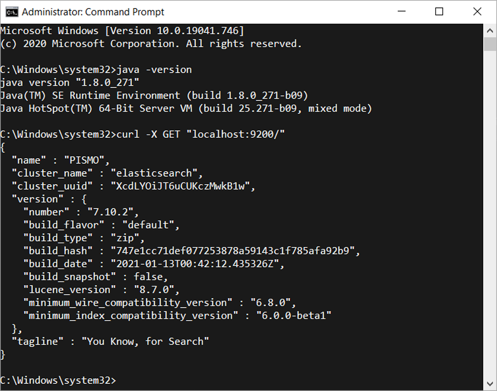
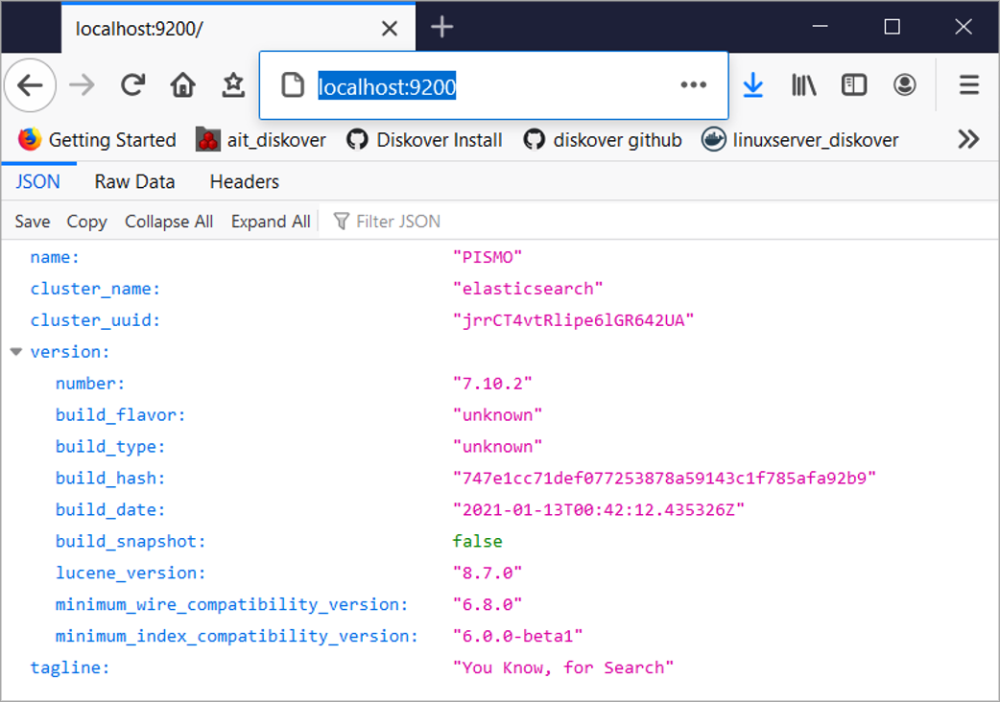

#### Install Elasticsearch

Elasticsearch Windows MSI install instructions can be found here:  

<a href=“https://www.elastic.co/guide/en/elasticsearch/reference/current/windows.html”>https://www.elastic.co/guide/en/elasticsearch/reference/current/windows.html</a>

🔴 &nbsp;Download the Windows MSI installer: 

<a href=“https://artifacts.elastic.co/downloads/elasticsearch/elasticsearch-7.10.2.msi”>https://artifacts.elastic.co/downloads/elasticsearch/elasticsearch-7.10.2.msi</a>

🔴 &nbsp;Select **Use default directories**:




🔴 &nbsp;Select **Install as a service**:


                                                                         


🔴 &nbsp;Select **This is the first master in new cluster**:




🔴 &nbsp;No **X-Pack Plugins**  selected:


                                                                         


🔴 &nbsp;Select **Basic** License:




🔴 &nbsp;Installation completed:


                                                                         


You can also use **curl** in a Windows command prompt and make a **GET** request to the Elasticsearch cluster to check if the service is running on your local server.

>_Note:_ **curl** must first be downloaded and installed on your Windows machine before you use it to make HTTP requests.

🔴 &nbsp;Open a command prompt as administrator:
```
curl -X GET "localhost:9200/"
```



🔴 &nbsp;Alternatively, you can open a Web browser to http://localhost:9200/:


