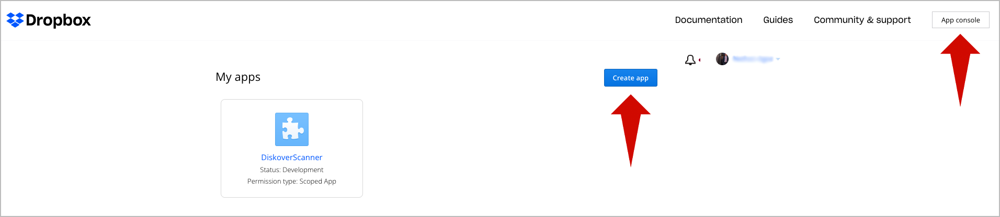
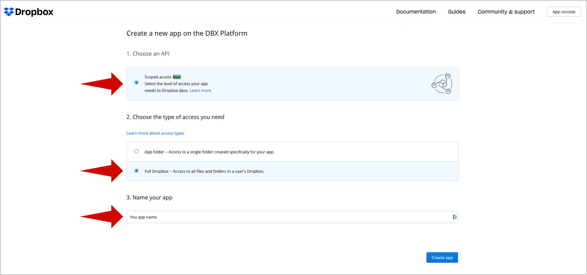
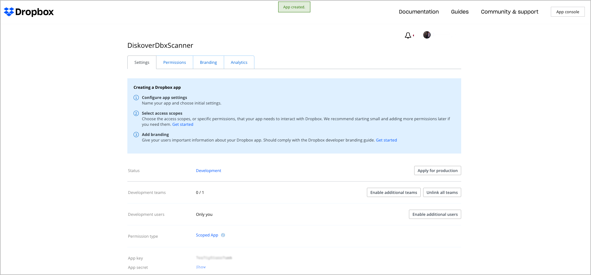
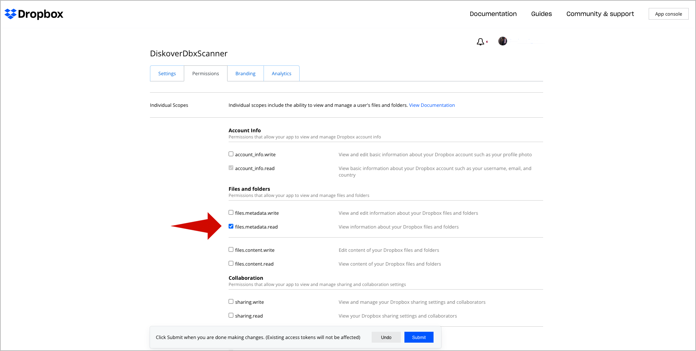
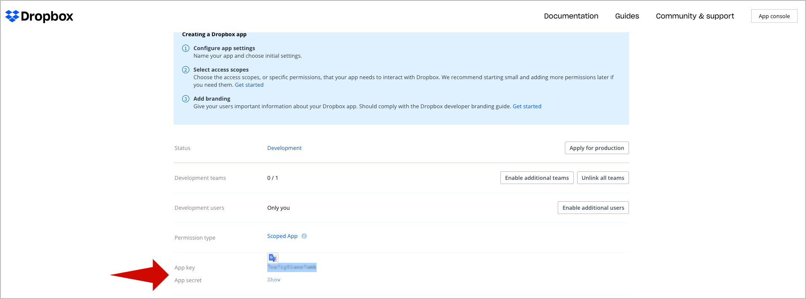
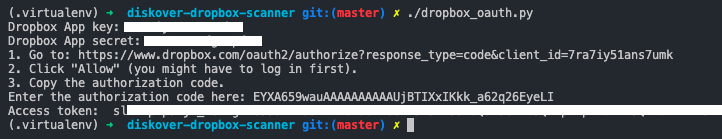

___
### Create an Index of Dropbox

The Dropbox alternate scanner modules can be installed in the alternate scanners directory and are two Python modules used for scanning Dropbox.
The following outlines installing the Diskover Dropbox alternate scanner on Linux.

#### Dropbox Modules Installation

🔴 &nbsp;Extract `diskover-dropbox-scanner-master` to `/tmp`:
```
cd /tmp
unzip diskover-dropbox-scanner-master.zip
cd diskover-dropbox-scanner-master
```

🔴 &nbsp;Install Python 3.x and required modules, then check the version after the install:
```
yum -y install python3 python3-devel gcc
python3 -V
pip3 -V
```

🔴 &nbsp;Install the Dropbox alt scanner dependecies:
```
pip3 install dropbox 
pip3 install -r requirements.txt
```

🔴 &nbsp;Move the Dropbox modules to their proper location:
```
cp dropbox_client.py /opt/diskover/scanners
cp scandir_dropbox.py /opt/diskover/scanners
```

🔴 &nbsp;Create a new Dropbox Application:
1.	Go to [https://www.dropbox.com/developers/](https://www.dropbox.com/developers/)
2.	Select **App console** in the top menu.
3.	Select **Create App**



🔴 &nbsp;Configure the application:



🔴 &nbsp;Review your settings via the application overview:



🔴 &nbsp;Enable permissions by checking `files.metadata.read`



🔴 &nbsp;Copy the Dropbox app **access key** and **secret**:



🔴 &nbsp;Generate the Dropbox **Access token**:
```
chmod +x dropbox_oauth.py
./dropbox_oauth.py
```


#### Run Crawler

🔴 &nbsp;Index the Dropbox folder:
```
export DROPBOX_TOKEN=<your_token>
```

🔴 &nbsp;If you want to crawl a specific folder:
```
cd /opt/diskover
python3 diskover.py --altscanner scandir_dropbox /<your_folder_ath>
```

🔴 &nbsp;If you want to crawl from the root of your dropbox account:
```
cd /opt/diskover
python3 diskover.py --altscanner scandir_dropbox /root
```
