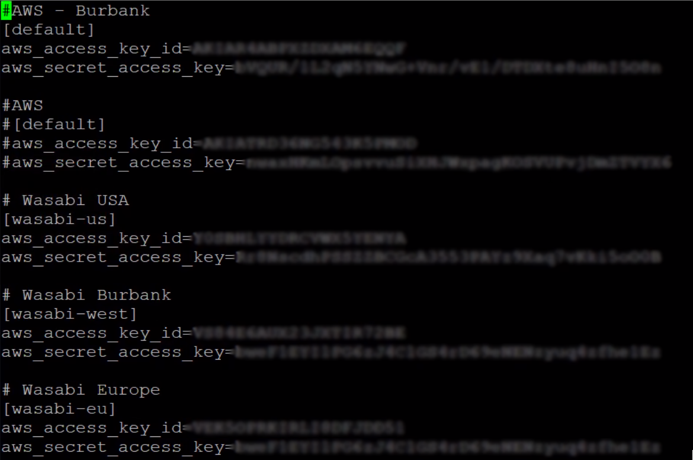
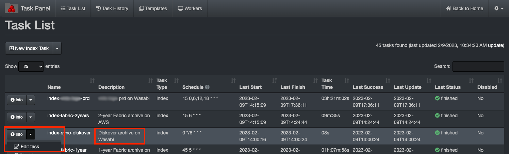
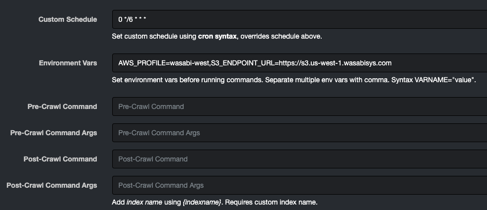

___
### Create an Index of an S3 Bucket

&nbsp;&nbsp;&nbsp;

Included in the alt scanners directory is a Python module **scandir_s3** for scanning AWS S3 buckets using the boto3 API.

>_Note:_ If you want to install Diskover on an existing AWS infrastructure, please refer to our [Diskover AWS Customer Deployment Guide](https://docs.diskoverdata.com/diskover_aws_deployment_guide/).
<br>

🔴 &nbsp;To use the **s3** alternate scanner, first install the **boto3** Python module:

```
pip3 install boto3
```

🔴 &nbsp;After, you will need to set up and configure AWS credentials, etc. for **boto3**:

  [https://boto3.amazonaws.com/v1/documentation/api/latest/guide/quickstart.html](https://boto3.amazonaws.com/v1/documentation/api/latest/guide/quickstart.html)

  [https://boto3.amazonaws.com/v1/documentation/api/latest/guide/configuration.html](https://boto3.amazonaws.com/v1/documentation/api/latest/guide/configuration.html)

#### Using Different Endpoint URL (Other than AWS)

This section describes how to use S3 endpoints different than AWS.

🔴 &nbsp;Add credentials to default location for AWS S3 credentials:
```
cd /root/.aws
```
```
vi credentials
```
Example:



🔴 &nbsp;To use a different **S3 endpoint url** (Wasabi, etc.), set the **AWS_PROFILE** and the **S3_ENDPOINT_URL** environment variables before running the crawl.

🔴 &nbsp;To export variables via the command line, for example:

```
export AWS_PROFILE=wasabi-eu
```
```
export S3_ENDPOINT_URL=https://<endpoint>
```

🔴 &nbsp;To add S3 endpoint via the Diskover-Web task panel, select **gear icon** > **Task Panel** > click **Info** then **Edit task** in line with the index you want to modify.



🔴 &nbsp;Go down to **Environment Vars** and insert your endpoint in the dialog box for the task, for example:

```
AWS_PROFILE=wasabi-west,S3_ENDPOINT_URL=https://s3.us-west-1.wasabisys.com
```




#### SSL Certificate Verification

🔴 &nbsp;To not use ssl and/or to not verify ssl certificates, set the **S3_USE_SSL** and the **S3_VERIFY** environment variables before running the crawl:

```
export S3_USE_SSL=false
```
```
export S3_VERIFY=false
```

🔴 &nbsp;Scan and index a **s3** bucket _**bucketname**_ using an auto-index name:

```
cd /opt/diskover
python3 diskover.py --altscanner scandir_s3 s3://bucketname
```
> _Note:_ bucketname is optional, you can scan all buckets using s3://

🔴 &nbsp;Create an s3 index with index name "diskover-s3-bucketname":

```
cd /opt/diskover
python3 diskover.py -i diskover-s3-bucketname --altscanner scandir_s3 s3://bucketname
```
