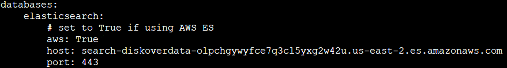

## Install Diskover Indexer(s)

### Install Python 3.x, pip and Development Tools

➡️ Install Python and pip:
```
yum -y install python3 python3-devel gcc
python3 -V
pip3 -V
```

### Install Diskover Indexer

➡️ Extract **diskover** compressed file (from ftp server) - replace `<version number>` with only the number, do not use the <>:
```
mkdir /tmp/diskover
tar -zxvf diskover-v<version number>.tar.gz -C /tmp/diskover-v<version number>/
cd /tmp/diskover-v<version number>
```

➡️ Copy **diskover** files to **opt** folder:
```
cp -a diskover /opt/
cd /opt/diskover
```

➡️ Install required Python dependencies:
```
pip3 install -r requirements.txt
```

➡️ If indexing to AWS Elasticsearch run:
```
pip3 install -r requirements-aws.txt
```

➡️ Copy default/sample configs:
```
for d in configs_sample/*; do d=`basename $d` && mkdir -p ~/.config/$d && cp configs_sample/$d/config.yaml ~/.config/$d/; done
```

➡️ Edit Diskover config file:
```
vi ~/.config/diskover/config.yaml
```

➡️ Configure indexer to create indexes in your AWS Elasticsearch endpoint in the following section of the **config.yaml** file:
```
databases:
    elasticsearch:
```


### Mount File Systems

➡️ NFS Mount:
```
yum -y install nfs-utils
mkdir /mnt/nfsstor1
mount -t nfs -o ro,noatime,nodiratime server_name:/export_name /mnt/nfsstor1
```

➡️ Windows SMB/CIFS Mount:
```
yum -y install cifs-utils
mkdir /mnt/smbstor1
mount -t cifs -o username=user_name //server_name/share_name /mnt/smbstor1
```
### Create Index of File System

➡️ To run the Diskover indexing process from a shell prompt:
```
cd /opt/diskover
```

➡️ Install your license files as explained in the [Software Activation](#activation) chapter.

➡️ Start your first crawl:
```
python3 diskover.py -i diskover-<indexname> <storage_top_dir>
```
