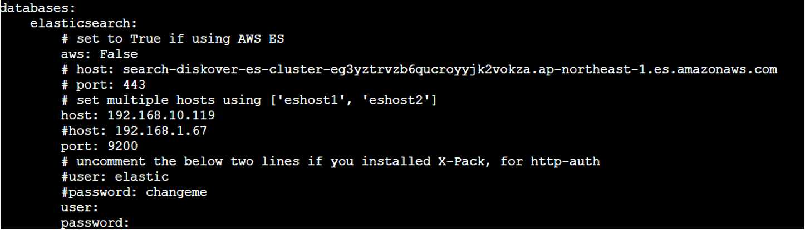

## Install Diskover Indexer(s) for Linux

The following outlines installing the Diskover indexer on Linux.

### Install Python 3.x, pip and Development Tools

➡️ Install Python and pip:

```
yum -y install python3 python3-devel gcc
python3 -V
pip3 -V
```

### Install Diskover Indexer

➡️ Extract **diskover** compressed file (from ftp server) - replace `<version number>` with only the number, do not use the <>:

```
mkdir /tmp/diskover-v<version number>
tar -zxvf diskover-v<version number>.tar.gz -C /tmp/diskover-v<version number>/
cd /tmp/diskover-v<version number>
```

➡️ Copy  **diskover**  files to  **opt**:

```
cp -a diskover /opt/
cd /opt/diskover
```

➡️ Install required Python dependencies:

```
pip3 install -r requirements.txt
```

➡️ If indexing to AWS Elasticsearch run:

```
pip3 install -r requirements-aws.txt
```

➡️ Copy default/sample **configs**:

```
for d in configs_sample/*; do d=`basename $d` && mkdir -p ~/.config/$d && cp configs_sample/$d/config.yaml ~/.config/$d/; done
```

➡️ Edit Diskover  **config**  file:

```
vi ~/.config/diskover/config.yaml
```

➡️ Configure indexer to create indexes in your Elasticsearch  endpoint in the following section of the  **config.yaml**  file:

```
databases:
    elasticsearch:
```



### Mount File Systems

➡️ **NFS**  mount:

```
yum -y install nfs-utils
mkdir /mnt/nfsstor1
mount -t nfs -o ro,noatime,nodiratime server_name:/export_name /mnt/nfsstor1
```

➡️ Windows  **SMB/CIFS**  mount:

```
yum -y install cifs-utils
mkdir /mnt/smbstor1
mount -t cifs -o username=user_name //server_name/share_name /mnt/smbstor1
```

### Create Index of File System

➡️ To run the Diskover indexing process from a shell prompt:

```
cd /opt/diskover
```

➡️ Install your license files as explained in the [Software Activation](#activation) chapter.

➡️ Start your first crawl:

```
python3 diskover.py -i diskover-<indexname> <storage_top_dir>
```

### Create Index of S3 Bucket

The Diskover indexer can add additional alternate scanners besides the default  **scandir** Python  module. The  **scanners/**  directory is the location of alternate Python modules for scanning. Included in the directory is a Python module  **scandir_s3**  for scanning AWS S3 buckets.

➡️ To use the  **s3**  alternate scanner, first install the  **boto3**  Python  module:

```
pip3 install boto3
```

After you will need to set up and configure AWS credentials, etc. for  **boto3**:

[https://boto3.amazonaws.com/v1/documentation/api/latest/guide/quickstart.html](https://boto3.amazonaws.com/v1/documentation/api/latest/guide/quickstart.html)

[https://boto3.amazonaws.com/v1/documentation/api/latest/guide/configuration.html](https://boto3.amazonaws.com/v1/documentation/api/latest/guide/configuration.html)

➡️ Scan and index a  **s3**  bucket  _**bucketname**_  using an auto-index name:

```
cd /opt/diskover
python3 diskover.py --altscanner scandir_s3 s3://bucketname
```

### Using Different Endpoint URL (other than AWS)

➡️ To use a different  **s3 endpoint url**  (Wasabi, etc.), set the  **AWS_PROFILE**  and the  **S3_ENDPOINT_URL** environment variables before running the crawl:

```
export AWS_PROFILE=wasabi-eu
```
```
export S3_ENDPOINT_URL=https://s3.us-central-1.wasabisys.com
```

➡️ Run the index:

```
cd /opt/diskover
python3 diskover.py --altscanner scandir_s3 s3://bucketname
```
