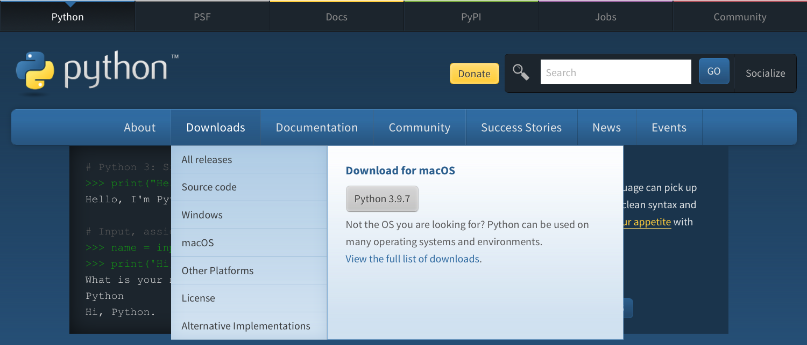
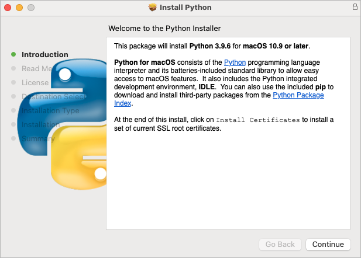
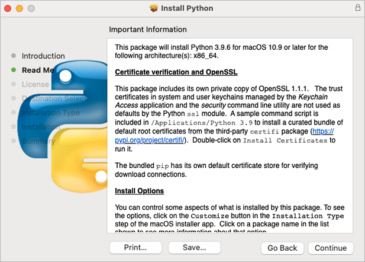
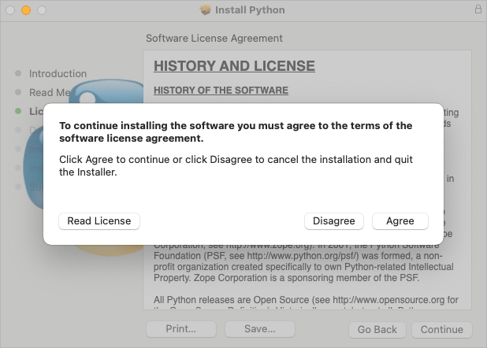
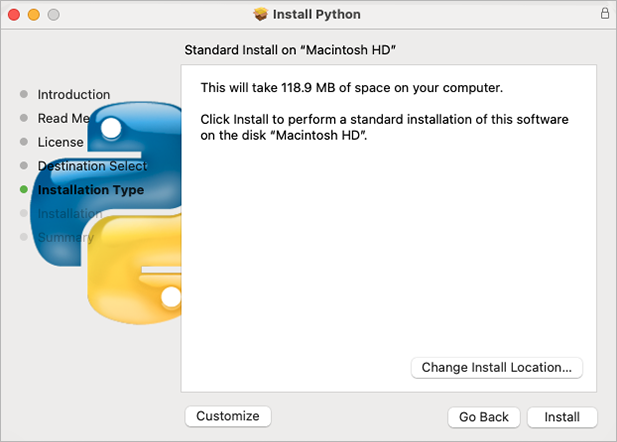
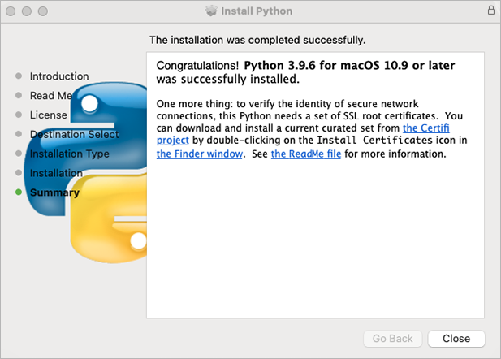
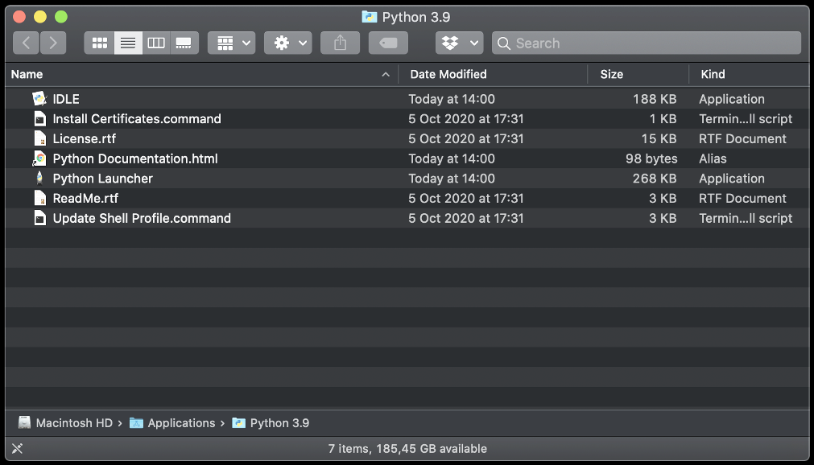
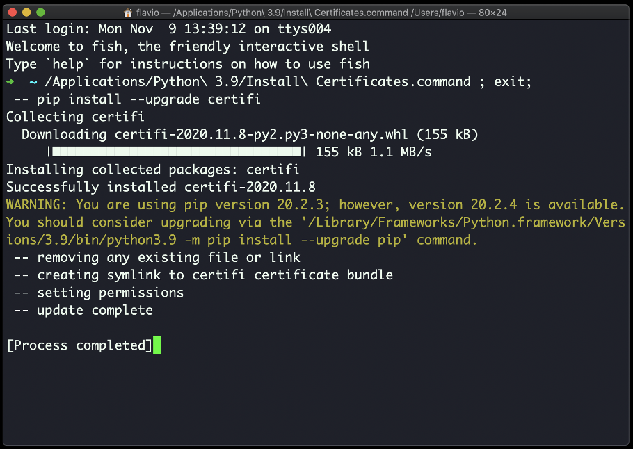

___
### Install Diskover Indexers for Mac

The following outlines installing the Diskover indexer on MacOS.

#### Install Python 3.x on MacOS

🔴 &nbsp;Go to [https://www.python.org/](https://www.python.org/)

🔴 &nbsp;Select the **Downloads** menu.

🔴 &nbsp;Click the **Python** **3.x** download button.



🔴 &nbsp;Launch the installer – Welcome Introduction - click **Continue**:



🔴 &nbsp;Read Me - click **Continue**:



🔴 &nbsp;History and License - click **Continue**:


🔴 &nbsp;Python license – click **Agree**:



🔴 &nbsp;Select the destination if prompted – click **Continue**:


🔴 &nbsp;Begin the installation by clicking **Install**:



🔴 &nbsp;Installation successfully completed acknowledgement – click **Close**:



🔴 &nbsp;Open your **Applications** and select **Phython 3.x** folder.

Python will be installed in **/usr/bin/python3**

🔴 &nbsp;A new folder is created under **/Applications/Python 3.x** change that with your exact version number, ex: 3.9:



🔴 &nbsp;As the instructions said in the last installation panel, you need to run the **Install Certificates.command** to install the SSL certificates needed by Python.

🔴 &nbsp;Double-click on **Install Certificates.command** to run:



#### Install Diskover Indexer

🔴 &nbsp;Copy **diskover** file to **/tmp**

🔴 &nbsp;Extract **diskover** folder.

🔴 &nbsp;Copy **diskover** folder to **/Applications/Diskover.app/Contents/MacOS/**
```
cp -R diskover /Applications/Diskover.app/Contents/MacOS/
```

🔴 &nbsp;Change directory to **diskover** location:
```
cd /Applications/Diskover.app/Contents/MacOS/diskover/
```

🔴 &nbsp;Install Python dependencies required by Diskover indexer:
```
Python3 -m pip install -r requirements.txt
```

🔴 &nbsp;Copy default/sample configs to **~/.config/**
```
cd /Applications/Diskover.app/Contents/MacOS/diskover/configs
```
```
cp -R diskover* ~/.config/
```

🔴 &nbsp;Edit **diskover** config file:
```
vi  ~/.config/diskover/config.yaml
```

🔴 &nbsp;Configure indexer to create indexes in your Elasticsearch endpoint in the following section of the **config.yaml** file:
```
databases:
    elasticsearch:
```


#### Create Index of File System

🔴 &nbsp;To run the Diskover indexing process from a shell prompt:
```
cd /Applications/Diskover.app/Contents/MacOS/diskover/
python3 diskover.py -i diskover-<indexname> <storage_top_dir>
```
