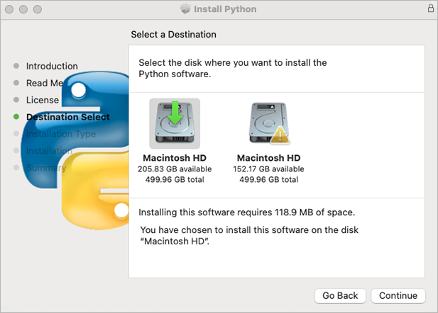

___
### Install Diskover Indexers for Mac

The following outlines installing the Diskover indexer on MacOS.

#### Install Python 3.x on MacOS

🔴  Go to [https://www.python.org/](https://www.python.org/)

🔴  Select the **Downloads** menu.

🔴  Click the **Python** **3.x** download button.


🔴  Launch the installer – Welcome Introduction - click **Continue**:


🔴  Read Me - click **Continue**:


🔴  History and License - click **Continue**:


🔴  Python license – click **Agree**:


🔴  Select the destination if prompted – click **Continue**:



🔴  Begin the installation by clicking **Install**:


🔴  Installation successfully completed acknowledgement – click **Close**:


🔴  Open your **Applications** and select **Phython 3.x** folder.

Python will be installed in **/usr/bin/python3**

🔴  A new folder is created under **/Applications/Python 3.x** change that with your exact version number, ex: 3.9:


🔴  As the instructions said in the last installation panel, you need to run the **Install Certificates.command** to install the SSL certificates needed by Python.

🔴  Double-click on **Install Certificates.command** to run:


#### Install Diskover Indexer

🔴  Copy **diskover** file to **/tmp**

🔴  Extract **diskover** folder.

🔴  Copy **diskover** folder to **/Applications/Diskover.app/Contents/MacOS/**
```
cp -R diskover /Applications/Diskover.app/Contents/MacOS/
```

🔴  Change directory to **diskover** location:
```
cd /Applications/Diskover.app/Contents/MacOS/diskover/
```

🔴  Install Python dependencies required by Diskover indexer:
```
Python3 -m pip install -r requirements.txt
```

🔴  Copy default/sample configs to **~/.config/**
```
cd /Applications/Diskover.app/Contents/MacOS/diskover/configs
```
```
cp -R diskover* ~/.config/
```

🔴  Edit **diskover** config file:
```
vi  ~/.config/diskover/config.yaml
```

🔴  Configure indexer to create indexes in your Elasticsearch endpoint in the following section of the **config.yaml** file:
```
databases:
    elasticsearch:
```


#### Create Index of File System

🔴  To run the Diskover indexing process from a shell prompt:
```
cd /Applications/Diskover.app/Contents/MacOS/diskover/
python3 diskover.py -i diskover-<indexname> <storage_top_dir>
```
