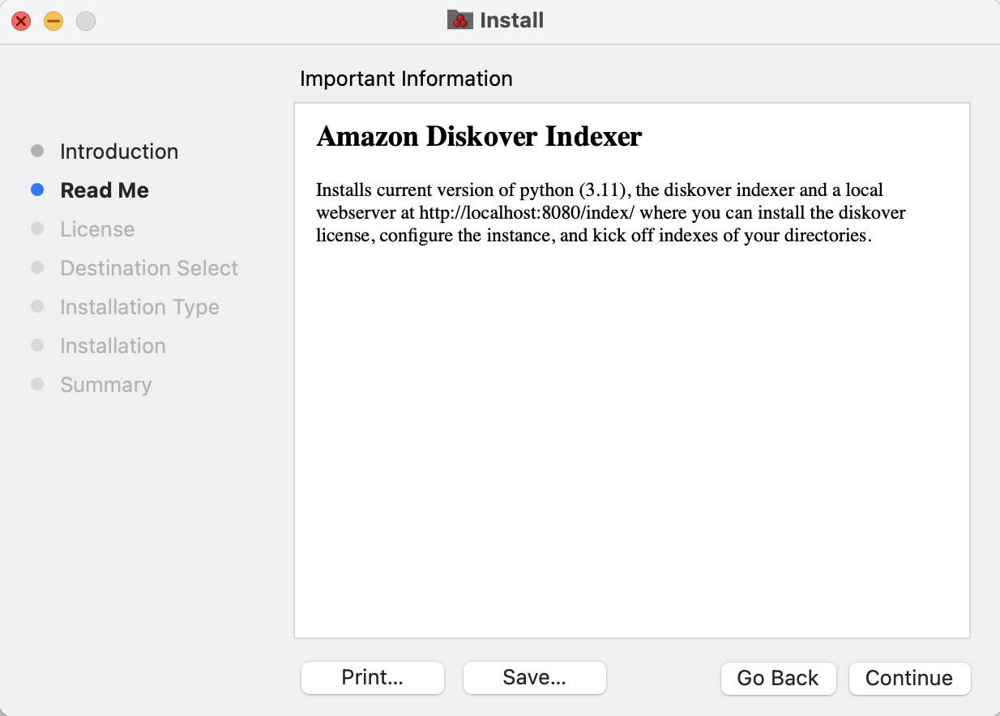
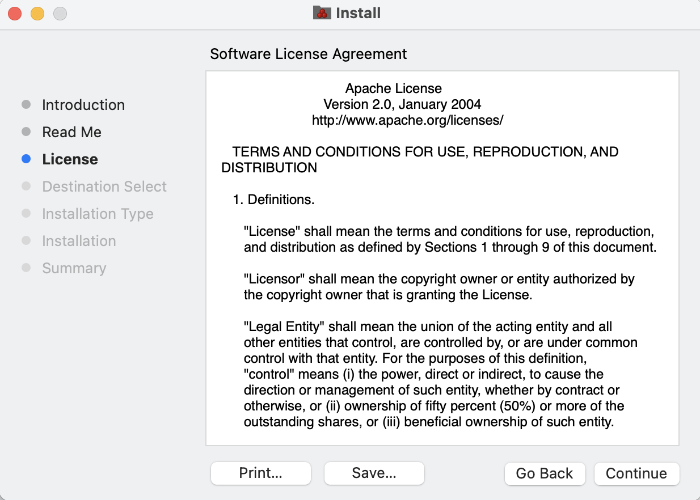
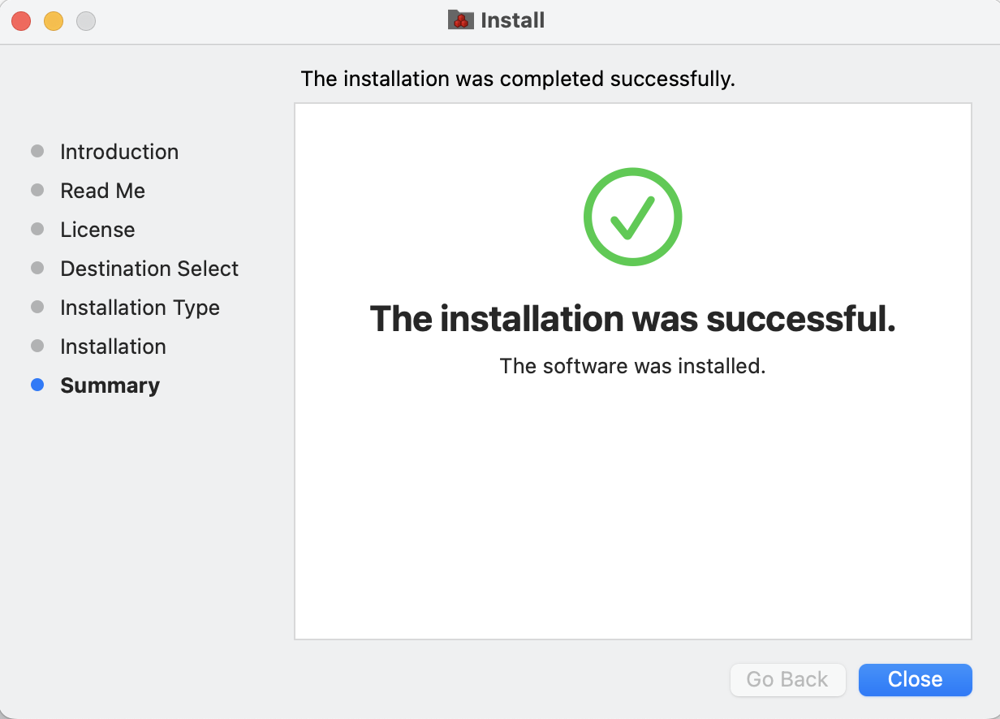
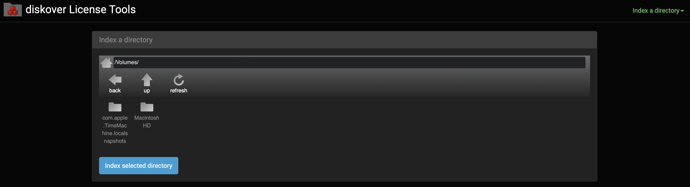
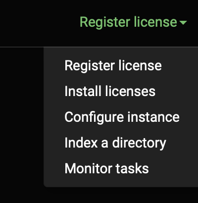
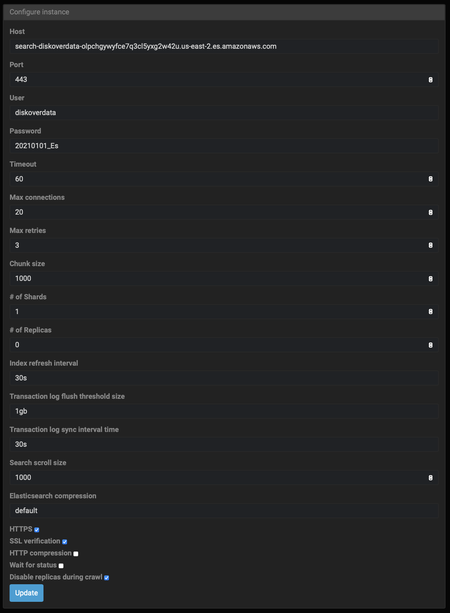

___
### Install Diskover Indexers for Mac | Using Installer 🚧

🚧 &nbsp;**NOT AVAILABLE YET**

The following outlines:
 - Installing the dependencies for the Diskover indexer on MacOS using an installer.
 - How to get/install the license
 - Launching your first scan using the Diskover web Indexing Tool.

#### Download the Installation Package

🔴 &nbsp;Use the url link you received to download the `Diskover Amazon Indexer_vx.dmg` package > click on the url link and it will open a tab in your default browser, then click **Download**:
 


 > 🔴 &nbsp;If you get the following message, select **Download anyway**:
 >
 > 

🔴 &nbsp;The `Diskover Amazon Indexer_vx.dmg` package will go to your **Downloads** folder. Wait for the file to finish downloading and then double click the icon/file to launch the Diskover Mac Installer:


 > **⚠️ Possible Security Warnings**
 >
 > _Note:_ These security warnings are more common for older MacOS installations.
 > 
 > 🔴 &nbsp;If the following safety message appears, click **OK**:
 >
 > 
 >
 > 🔴 &nbsp;Open **Apple** > **System Preferences**:
 >
 > 
 >
 > 🔴 &nbsp;Select **Security & Privacy**:
 >
 > 
 >
 > 🔴 &nbsp;Click **Open Anyway**:
 >
 > 
 >
 > 🔴 &nbsp;If you get this final security warning, click **Open**:
 >
 > 


#### Dependencies Installation

>_Note:_ You can print and/or save the text content at each step of the installation using the **Print** and **Save** buttons located at the bottom of the installation window. You can also go back one step at a time by clicking the **Go Back** button.

##### Introduction

🔴 &nbsp;Click **Continue**:


##### Read Me

🔴 &nbsp;Take the time to read these basic instructions, then click **Continue**:



##### License

🔴 &nbsp;Read, save, and/or print the license agreement, then click **Continue**:



🔴 &nbsp;You will be prompted to **Agree** to resume the installation. I you select **Disagree**, the installation process will stop before any files are installed:


##### Destination Selection

🔴 &nbsp;Select the disk/volume for the installation of the files and then click **Continue**:


##### Installation type

🔴 &nbsp;This step will confirm the space required and disk/volume you selected for the installation. If you want to change the selection by default, either select **Change Install Location** or **Go Back**. If you are satisfied with your selection, click **Install** to launch the final step of the process:


🔴 &nbsp;Depending on your setup, you may be requested to type your password or use your Touch ID.


##### Installation

🔴 &nbsp;You can see the status of the installation via the progress bar:


##### Summary

🔴 &nbsp;You should see **The installation was successfull**, you can copy the following link and paste in a web browser: [http://localhost:8080/index/](http://localhost:8080/index/):



> If you get the message **The installation failed**, please consider these possible issues:
>
> 
>
>	- The selected disk might be full.
>	- If none of the above issues apply to your situation, please send the "zip 2 log directories" to [support@diskoverdata.com](mailto:support@diskoverdata.com)
>	- Contact the [Diskover support team](https://diskoverdata.com/support/).

##### Closing of the installer

🔴 &nbsp;When closing the installer, you'll be prompted to either **Keep** the installation package or **Move to Trash**:


#### Diskover License Tools

##### Open The Diskover License Tools in a Browser

🔴 &nbsp;Type or copy/paste the following address in any web browser:
```
http://localhost:8080/index/
```



The following sections will discuss each of these options in the drop-down list located at the top right corner:



##### Register License

The very first thing you need to do is request a license and then install the license file in order to index your first directory. 

🔴 &nbsp;Select **Register license** in the drop-down list menu. This page will open. 

🔴 &nbsp;Click on **Get hardware ID and installed version** to automatically pre-populate those fields:


🔴 &nbsp;Fill out your **Email Address** and add **Notes** if desired, then click **Send email**. You can also copy your **Hardware ID** for future reference by clicking **Copy to clipboard**:


##### Install License

🔴 &nbsp;You will receive your license key via email, the file name will be **diskover.lic**. Save that file on your system, then select **Install license** in the drop-down list. Click **Choose File** and select the **diskover.lic** file on your system, and then click **Install**:


##### Index a Directory

After the license is installed, you are now ready to index/scan your first directory/volume.

🔴 &nbsp;Select **Index a directory** from the drop-down list, then select your root volume or browse to index a particular directory, then click **Index selected directory**. _Redo this step as many times as needed to index/scan all your desired directories_:


🔴 &nbsp;The diskover indexer will start scanning in the background. This might take a few minutes depending on the amount of data contained in that directory. You can monitor the status of a scan by selecting **Monitor tasks** in the drop-down list:


> If you get a **FAILURE** status, please consider these possible issues:
>	- Did you install the license prior to launching your first index?
>	- Did you move the directory being indexed while the indexing what still running?
>	- If none of the above issues apply to your situation, please contact the [Diskover support team](https://diskoverdata.com/support/).

##### Configure Instance

🔴 &nbsp;You can configure the Elasticsearch host by selecting **Configure instance** in the drop-down list. 

> _Note:_ Changing most of these parameters can have serious negative effects on Diskover running smoothly.



> _Note:_ Elasticsearch is abbreviated to ES below.

**Host** > The host address should be automatically populated, if not, set host to your ES hostname or IP, when using AWS ES, set to your endpoint name without `http://` or `https://`

**Port** > The port should be automatically populated and this allows access to remote host, if field is empty, set port to your ES port, default is 9200 for local and 443 or 80 for AWS ES.
> You need to check **SSL verification** at the bottom of this page if port **443** is used.

**User** > Modify the username as needed.

**Password** > Modify the password as needed.

**Timeout** > Timeout for connection to ES, recommended default is 60 seconds (format in field **60**).

**Max connections** > Number of connections kept open to ES when crawling, recommended default is 20 (format in field **20**).

**Max retries** > Maximum retries for ES operations, recommended default is 3 (format in field **3**).

**Chunk size** > Chunk size for ES bulk operations, recommended default is 1,000 (format in field **1000**).

**# of Shards** > Number of shards for index, recommended default is 1 (format in field **1**).

**# of Replicas** > Number of replicas for index, recommended default is 0 (format in field **0**).

>_Note:_ The following settings are to optimize ES for crawling.

**Index refresh interval** > Refresh interval during crawls, recommended default is 30 seconds (format in field **30s**).

**Transaction log flush threshold size** > What?, recommended default is 1 GB (format in field **1gb**)

**Transaction log sync interval time** > What?, recommended default is 30 seconds (format in field **30s**)

**Search scroll size** > Number of documents per scroll, recommended default is 1,000 (format in field **1000**)

**Elasticsearch compression** > Use **default**, you can change for **best_compression** to reduce the size of your indices but it can decrease indexing and search performance.

**HTTPS** > Details to come.

**SSL verification** > Details to come.

**HTTP compression** > Details to come.

**Wait for status** > Details to come.

**Disable replicas during crawl** > Details to come.

🔴 &nbsp;Click **Update** if you've made any changes to this page.

#### See Directory/ies in Diskover Software

🔴 &nbsp;Once you get a successful scan, load up the Diskover software by using the url link you were given.

🔴 &nbsp;Your indexed directory should now be visible and ready to use within the Diskover software.


🔴 &nbsp;You can also see and uniquely select the desired indices by clicking on the **gear icon** at the top right corner, then select **Indices**.

🔴 &nbsp;You can schedule regular scans of your index/indices as well as other parameters by clicking on on the **gear icon** at the top right corner,  select **Task Panel**, then follow [these configuration instructions](https://docs.diskoverdata.com/diskover_configuration_and_administration_guide/#task-configuration-files).

#### Configure Your Indices

Please refer to the [Diskover Configuration and Administration Guide](https://docs.diskoverdata.com/diskover_configuration_and_administration_guide/) to configure and maintain Diskover once installed.

#### Software Updates for Mac

Please refer to our [Software Update Installation for Mac](https://docs.diskoverdata.com/diskover_installation_guide/#software-update-for-mac) chapter.

#### Uninstall Diskover for Mac

Please refer to our [Software Update Installation for Mac](https://docs.diskoverdata.com/diskover_installation_guide/#uninstall-diskover-on-mac) chapter.
