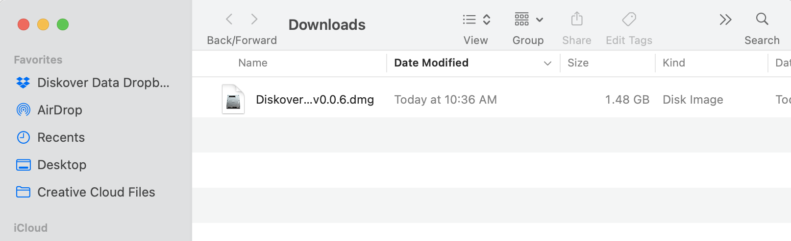

___
### Install Diskover Indexers for Mac | Using Installer 🚧

🚧  **NOT AVAILABLE YET**

The following outlines:
 - Installing the dependencies for the Diskover indexer on MacOS using an installer.
 - How to get/install the license
 - Launching your first scan using the Diskover web Indexing Tool.

#### Download the Installation Package

🔴  Use the url link you received to download the **Diskover Amazon Indexer_vx.dmg** package > click on the url link and it will open a tab in your default browser, then click **Download**:
 


🔴  If you get the following message, select **Download anyway**:


🔴  The **Diskover Amazon Indexer_vx.dmg** package will go to your **Downloads** folder. Wait for the file to finish downloading and then double-click the icon/file to launch the Diskover Mac Installer:



> **⚠️ Possible Security Warnings**
>
> _Note:_ These security warnings are more common for older MacOS installations.
> 
> 🔴  If the following safety message appears, click **OK**:
>
> 
>
> 🔴  Open **Apple** > **System Preferences**:
>
> 
>
> 🔴  Select **Security & Privacy**:
>
> 
>
> 🔴  Click **Open Anyway**:
>
> 
>
> 🔴  If you get this final security warning, click **Open**:
>
> 

🔴  The following window will open with the installer **Diskover-Indexer.pkg** and a utilities folder **Utils**. Click on the **Diskover-Indexer.pkg** to launch the installer:


#### Dependencies Installation

>_Note:_ You can print and/or save the text content at each step of the installation using the **Print** and **Save** buttons located at the bottom of the installation window. You can also go back one step at a time by clicking the **Go Back** button.

##### Introduction

🔴  Click **Continue**:


##### Read Me

🔴  Take the time to read this basic information, plus you might want to **save** or **print** for future reference, then click **Continue**:


##### License

🔴  Read, save, and/or print the license agreement, then click **Continue**:


🔴  You will be prompted to **Agree** to resume the installation. If you select **Disagree**, the installation process will stop before any files are installed:


##### Destination Selection

🔴  Select the disk/volume for the installation of the files and then click **Continue**:


##### Installation Type

🔴  This step will confirm the space required and the disk/volume you selected for the installation. If you want to change the selection by default, either select **Change Install Location** or **Go Back**. Once you are satisfied with your selection, click **Install** to launch the final step of the process:


🔴  Depending on your Mac settings, you may be requested to **type your password** or use your **Touch ID**.


##### Installation

🔴  You can see the status of the installation via the progress bar. This process takes about 6 minutes in general depending on your hardware and MacOS:


##### Summary

🔴  You should see **Success!** At this point, a web browser should open automatically with the **Diskover Indexing Tool**. If it doesn't, copy this address http://localhost:8080/index/ and paste it in a browser of your choice _OR_ click the following link [http://localhost:8080/index/](http://localhost:8080/index/) to open the **Diskover Indexing Tool** in your default browser:


⚠️ If you get the message **The installation failed**, please consider these possible issues:


- The selected disk might be full.
- The installer package **Diskover Amazon Indexer_vx.dmg** was moved from the **Downloads** folder to another location during the installation.
- The installer package **Diskover Amazon Indexer_vx.dmg** was deleted during the installation.
- If none of the above issues apply to your situation:
	- Go back to your finder with the **Utils** folder:

	
	   
	- Double-click the **Utils** folder:
	- A new finder window will open, double-click on **GatherLogs.command**

	

	- This will create a zip file on your desktop **diskover-tools-logs-_time stamp_.zip**

	

	- Email that zip file to [support@diskoverdata.com](mailto:support@diskoverdata.com) with a description of your problem.
	- For any other questions, please contact the [Diskover support team](https://diskoverdata.com/support/).

##### Closing of the installer

🔴  When closing the installer, you'll be prompted to either **Keep** the installation package or **Move to Trash**. We recommend you **Keep** the installer in case you need 


#### Diskover Indexing Tool

##### Open The Diskover Indexing Tool in a Browser

🔴  If a web browser didn't open automatically with the **Diskover Indexing Tool** as described in the last section, copy this address and paste it in a browser:
```
http://localhost:8080/index/
```


The following sections will discuss each of these options in the drop-down list located at the top right corner:


##### Request License

The very first thing you need to do is request a license and then install the license file in order to index your first directory. 

🔴  Select **Request license** in the drop-down list menu. 


🔴 Click **Get hardware ID and installed version** to automatically pre-populate these fields:


🔴  Fill out your **Email Address** and add **Notes** if desired, then click **Send email**. You can also copy your **Hardware ID** for future references by clicking **Copy to clipboard** and then paste in a safe location:


##### Install License

🔴  You will receive your license key via email, the file name will be **diskover.lic**. Save that file on your system. Go back to the **Diskover Indexing Tool** and select **Install license** in the drop-down list. 


🔴  Click **Choose File** and select the **diskover.lic** file on your system, and then click **Install**:


##### Index a Directory

After the license is installed, you are now ready to index/scan your first directory/volume.

🔴  Select **Index a directory** from the drop-down list:


🔴  Select your root volume or browse to index a particular directory, then click **Index selected directory**.

	- Redo this step as many times as needed to index/scan all your desired directories.
	- Diskover scans in parallel, so you don't have to wait for a scan to be finished to start another one.


> ⚠️ If the user see's the following error mesasge when trying to browse to a directory to index, it means that the installed version of Python needs to be given full-disk-access in System Preferences.
> 
>
> 🔴  Start by opening **System Preferences** to the **Security & Privacy** tab and select **Full Disk Access** in the left pane.
>
> 
>
> 🔴  Open the Finder application by clicking on the icon in the dock OR just click anywhere on your desktop and hit COMMAND + SHIFT + G. 
>
> 
>
> 🔴  This will open a Finder window with a bar on it which you can paste a path into.
>
> 
>
> 🔴  Click on a bar to edit it and paste the following path into that bar and hit return. The finder window will then change to that directory:
> ```
> /Library/Frameworks/Python.framework/Versions/3.11/bin
> ```
>
> 🔴  _If you are running the latest OS version:_ Go back to your **System Preferences** and **Privacy & Security**. Click the **+** at the bottom of the window, you may need to type your desktop password. A finder window will open, select the directory **Library > Frameworks > Python.fremework > Versions > 3.11 > bin**, then select **python3.11** which will then be added to your **Full Disk Access** list. Toggle the button **on** to allow full access.
>
> 
> 
> 🔴  _If you are running an older OS version:_ Locate the file in that directory named **python3.11** and drag it into **Full Disk Access** window on **System Preferences** as shown below where it says **Allow the applications below…**. Make sure there is a check mark next to it so it is enabled. 
>
> 
>
> 🔴  Now you can either **restart** your computer or for the more technically inclined users, you can execute the two following commands.
>```
> sudo systemctl unload /Library/LaunchDaemons/com.diskoverdata.diskover-tools.plist
> sudo systemctl load -w /Library/LaunchDaemons/com.diskoverdata.diskover-tools.plist
> ```

🔴  The diskover indexer will start scanning in the background. This might take a few seconds to some minutes depending on the amount of data contained in that directory. You can monitor the status of a scan by selecting **Monitor tasks** in the drop-down list:


🔴  Check the **Status** column for the result of your scan(s):


> If you get a **FAILURE** status, please consider these possible issues:
>	- Did you install the license before launching your first index?
>	- Did you move the directory being indexed while the indexing task what still running?
>	- If none of the above issues apply to your situation:
>		- From the **Monitor tasks** window above, click on **View log** in line with the failed indexing job.
>		- From your browser's top menu, select **File**, **Save As** and choose a readable/shareable **Format**.
>		- Email that **output** file to [support@diskoverdata.com](mailto:support@diskoverdata.com) with a description of your problem.
>		- For any other questions, please contact the [Diskover support team](https://diskoverdata.com/support/).

##### Configure Instance

🔴  You can configure the Elasticsearch host by selecting **Configure instance** in the drop-down list. 


🔴  Note that changing most of these parameters can have _serious negative effects_ on Diskover running smoothly. All the fields are explained after the image.

> _Note:_ Elasticsearch is abbreviated to ES below.


| FIELD | COMMENTS |
| --- | --- |
| **Host** | The host address should be automatically populated, if not, set host to your ES hostname or IP, when using AWS ES, set to your endpoint name without `http://` or `https://` |
| **Port** | The port should be automatically populated and this allows access to remote host, if field is empty, set port to your ES port, default is 9200 for local and 443 or 80 for AWS ES. You need to check **SSL verification** at the bottom of this page if port **443** is used |
| **User** | Modify the username as needed using ES http auth or leave blank/empty if no user |
| **Password** | Modify the password as needed using ES http auth or leave blank/empty if no user |
| **Timeout** | Timeout for connection to ES > 60 seconds recommended > format to use in field is **60** (original default is 10) |
| **Max connections** | Number of connections kept open to ES when crawling > 20 is recommended > format to use in field is **20** (original default is 10) |
| **Max retries** | Maximum retries for ES operations > 3 is recommended > format to use in field is **3** (original default is 0) |
| **Chunk size** | Chunk size for ES bulk operations > 1,000 is recommended > format to use in field is **1000** (original default is 500) |
| **# of Shards** | Number of shards for index > 1 is recommended > format to use in field is **1** (original default is 1) |
| **# of Replicas** | Number of replicas for index > 0 is recommended > format to use in field is **0** (original default is 1) |

**The following settings are to optimize ES for crawling.**

| FIELD | COMMENTS |
| --- | --- |
| **Index refresh interval** | Index refresh interval > 30 seconds is recommended > format to use in field is **30s** (original default is 1s, set to -1 to disable refresh during crawl - fastest performance but no index searches - after crawl is set back to 1s) |
| **Transaction log flush threshold size** | Transaction log flush threshold size > 1 GB is recommended > format to use in field is **1gb** (original default is 512mb) |
| **Transaction log sync interval time** | Transaction log sync interval time > 30 seconds is recommended > format to use in field is **30s** (original default is 5s) |
| **Search scroll size** | Search scroll size > 1,000 docs is recommended > format to use in field is **1000** (original default is 100) |
| **Elasticsearch compression** | ES compression > use **default** (set to **default** (LZ4) or **best_compression** (DEFLATE), using **best_compression** can reduce the size of your indices but can decrease indexing and search performance) |

**For the following fields: True = Checked ✅  and False = Unchecked ⬛️**

| FIELD | COMMENTS |
| --- | --- |
| **HTTPS** | Set to **true**  if using HTTP TLS/SSL or **false** if using http for AWS ES, you will most likely want to set this to **true** |
| **SSL verification** | Set to **false** if you do not want to verify SSL or **true** to verify (default is true) |
| **HTTP compression** | Compress HTTP data > for AWS ES, you will most likely want to set this to **true** |
| **Wait for status** | Wait for at least yellow status before bulk uploading > set to **true** if you want to wait (default is **false**) |
| **Disable replicas during crawl** | Disable replicas during crawl > set to **true** to turn off replicas or **false** to keep on, after crawl is set back to replicas value above (default is **false** |

🔴  Click **Update** if you've made any changes to this page.

#### See Directory/ies in Diskover Software

🔴  Once you get a successful scan, load up the Diskover software by using the url link you were given.

🔴  Your indexed directory should now be visible and ready to use within the Diskover software.


🔴  You can also see and uniquely select the desired indices by clicking on the **gear icon** at the top right corner, then select [**Indices**](https://docs.diskoverdata.com/diskover_user_guide/#indices).

🔴  You can schedule regular scans of your index/indices as well as other parameters by clicking on the **gear icon** at the top right corner,  then select **Task Panel**, then follow [these configuration instructions](https://docs.diskoverdata.com/diskover_configuration_and_administration_guide/#task-configuration-files).

#### Configure Your Indices

Please refer to the [Diskover Configuration and Administration Guide](https://docs.diskoverdata.com/diskover_configuration_and_administration_guide/) to configure and maintain Diskover once installed.

#### Software Updates for Mac

Please refer to our [Software Update Installation for Mac](https://docs.diskoverdata.com/diskover_installation_guide/#software-update-for-mac) chapter.

#### Uninstall Diskover for Mac

🔴  Open the **Utils** folder:


🔴  Double-click on **Uninstall**:


> **⚠️ Possible Security Warnings**
>
> You may get the following message, click **OK**:
>
> 
>
> 🔴  Open **Apple** > **System Preferences**:
>
> 
>
> 🔴  Select **Security & Privacy**:
>
> 
>
> 🔴  Click **Open Anyway**:
>
> 
>
> 🔴  If you get this final security warning, click **Open**:
>
> 

🔴  You will be prompted to enter your **password**:


🔴  You will receive a confirmation message:


