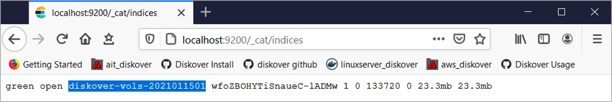

### Install Diskover Indexer(s) for Windows

The following outlines installing the Diskover indexer on Windows.

#### Install Python

🔴 &nbsp;Get **Python** **3.7 or greater** from Windows Store and install.

#### Install Diskover Indexer

🔴 &nbsp;Extract **diskover** folder.

🔴 &nbsp;Copy **diskover** folder to **Program Files**:

```
Xcopy C:\tmp\diskover "C:\Program Files\" /E /H /C /I
```

🔴 &nbsp;Install Python dependencies required by Diskover. Open a command prompt and run as administrator:

```
pip3 install pywin32
pip3 install requests
pip3 install psutil
pip3 install -r requirements.txt
```
```
mkdir %APPDATA%\diskover\
```
```
mkdir %APPDATA%\diskover_autotag\
```
```
mkdir %APPDATA%\diskover_dupesfinder\
```
```
copy "C:\Program Files\diskover\configs\diskover\config.yaml" %APPDATA%\diskover\
```
```
copy "C:\Program Files\diskover\configs\diskover_autotag\config.yaml" %APPDATA%\diskover_autotag\
```
```
copy "C:\Program Files\diskover\configs\diskover_dupesfinder\config.yaml" %APPDATA%\diskover_dupesfinder\
```

🔴 &nbsp;Setup Diskover configuration file. Use Notepad to open the following configuration file:

```
%APPDATA%\diskover\config.yaml
```

🔴 &nbsp;Setup Elasticsearch **host** information:

```
host: localhost
```

🔴 &nbsp;Set Elasticsearch **port** information:

```
port: 9200
```

🔴 &nbsp;Configure **username**:

```
user: myusername
```

🔴 &nbsp;Configure **password**:

```
password: changeme
```

🔴 &nbsp;Set **replacepaths** in Windows to **True**:

```
replace: True
```

🔴 &nbsp;Generate an index/scan. Open command prompt or Windows PowerShell as administrator:

```
cd 'C:\Program Files\Diskover\'
python3 diskover.py -i diskover-vols-2021011501 C:\Users\paulh
```

#### Tips for Windows Drive Mapping

If you open a command shell or PowerShell as administrator and the mounted filesystems are not present.

🔴 &nbsp;To mount them:

```
PS C:\Windows\system32> net use p: \\172.19.19.6\SMBshare
The command completed successfully.
```

```
PS C:\Windows\system32> net use x: \\172.19.19.6\P01_S99
The command completed successfully.
```

```
PS C:\Windows\system32> net use  
New connections will be remembered.
```

```
Status      Local      	Remote				Network
-------------------------------------------------------------------------------
OK	    P:		\\172.19.19.6/SMBshare		Microsoft Windows Network
OK	    X:		\\172.19.19.6/P01_S99		Microsoft Windows Network
OK			\\172.19.19.6\SMBshare		Microsoft Windows Network
			\\TSCLIENT\C			Microsoft Terminal Services
The command completed successfully.
```

#### Verify Index Creation

🔴 &nbsp;Open a Web browser to: <a href=“http://localhost:9200/_cat/indices”>http://localhost:9200/_cat/indices</a>


