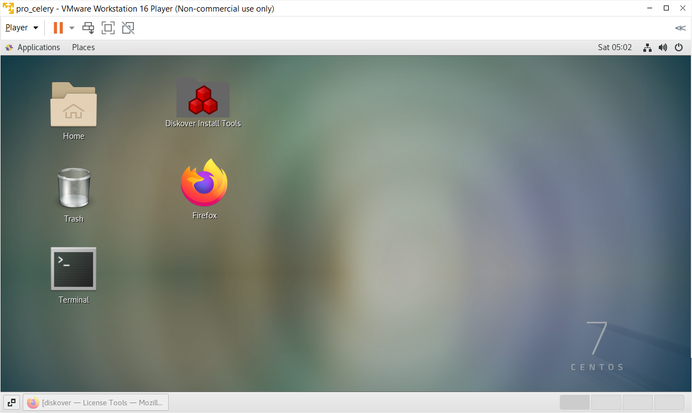
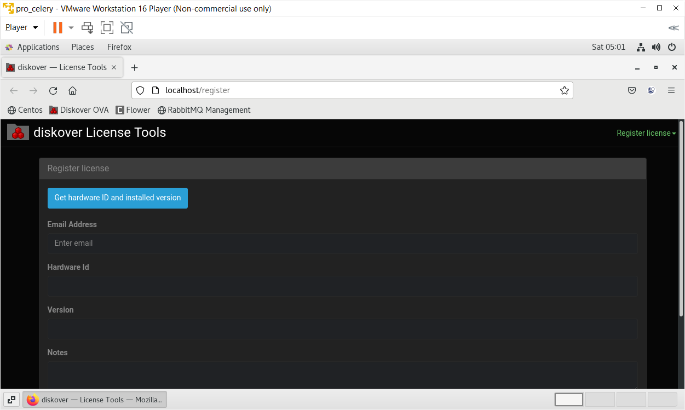

___
## OVA Installation
___

This section contains instructions to quickly get up and running with Diskover using OVA (Open Virtual Appliance) on VMware.

### Features
- Diskover and dependencies already installed.
- Diskover is configured to start at boot.
- Hostname set to `diskover`
- DHCP enabled
- CentOS 7.x

### Understand the Network

Understand the networking architecture of the site you will be deploying into. If the site has DHCP already configured,
the virtual machine will acquire an IP address from the offered range. Ensure the offered IP address will route to the
clients who will use the service. The file systems to be scanned must also be reachable from offered DHCP range.

For clients to access the service, they will need to route to the hostname provided in the license file. The hostname
in the license file must match the hostname on the Linux host. It is recommended that DNS be used to resolve the
service.

### Requirements

The OVA is designed to run on VMware hypervisors and includes _VMware Tools_ already installed into the OVA. The OVA has been tested on the following VMware hypervisors:

- VMware Workstation Pro for Windows
- VMware Player for Windows
- VMware vSphere

### Size the Instance

Before you begin, ensure there is sufficient memory and disk resources for the OVA:

- Memory 32GB RAM
- Disk:
  - Media & Entertainment workflows: 256GB fast disk/SSD
  - Life Science, EDA, etc. workflows: 512GB fast disk/SSD

🔴 To Expand the root partition and filesystem:

```
sudo -s
```
```
yum install cloud-utils-growpart-0.27-10.el7.x86_64
```

🔴 To grow the sda3 partition:

```
growpart /dev/sda 3
```

🔴 To grow the root filesystem:

```
xfs_growfs -d /
```

### How to Install OVA

🔴  To obtain the Diskover OVA software:

1. If you are new to the **Diskover Download Portal**, you will fist need to [create an account](https://download.diskoverdata.com/register.php).
2. Once your account is approved, you'll receive a confirmation email.
3. You can then log in and download the software at [https://download.diskoverdata.com/](https://download.diskoverdata.com/)


🔴  Linux Login:

User: **diskover**

Password: **darkdata**

🔴  You can elevate yourself via:
```
sudo -s
```

🔴  Diskover Login:

User: **admin**

Password: **darkdata**

🔴 Request a license by sending us your [hardware ID](https://docs.diskoverdata.com/diskover_installation_guide/#generating-a-hardware-id) so we can generate a license. 

- First, you can click on the **Diskover Install Tools** icon on the desktop to open the **Diskover License Tools** application.



- Select **Register license** in the drop-down list located at the upper right corner, and then click on **Get hardware ID and installed version** to get your hardware ID number:



🔴  Install your license files as explained in the [software activation chapter](https://docs.diskoverdata.com/diskover_installation_guide/#software_activation).

🔴  You will need to mount the file system(s) of interest to the virtual machine then start indexing. You can create a [scheduled index task by following these instructions](https://docs.diskoverdata.com/diskover_configuration_and_administration_guide/#managing-diskover-tasks-via-the-task-panel).

🔴  Or you can manually initiate an index:

1. To run the Diskover indexing process from a shell prompt:
```
cd /opt/diskover
```
2. Start your first crawl:
```
python3 diskover.py -i diskover-<indexname> <storage_top_dir>
```
